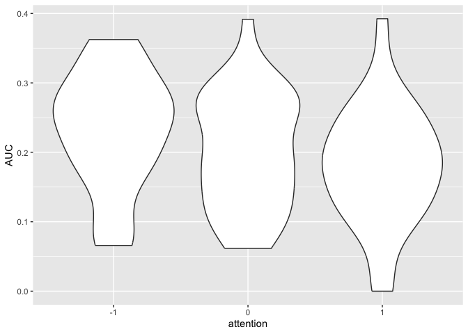

ANOVA_parameters
================
Karen Tian
2024-10-29

AUCs from KT pipeline

## AUC

``` r
dP <- data %>% filter(expt==1)
ggplot(dP, aes(x=attention, y=AUC)) + geom_violin() 
```

<!-- -->

``` r
# fill=name allow to automatically dedicate a color for each group
```

## AUC

``` r
# m_anova = ezANOVA(
#   data = data,
#   dv = .(lambdaA),
#   wid = .(subjectID), 
#   within = .(attention),
#   between = .(site,stimulus,task),
#   detailed = TRUE,
#   )
# knitr::kable(m_anova)
```
