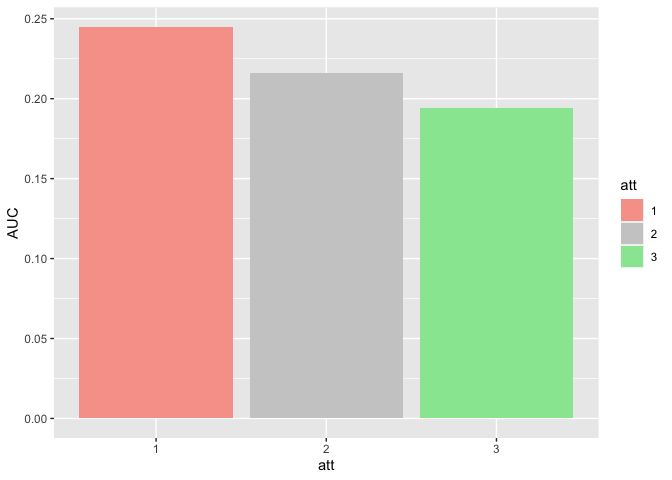
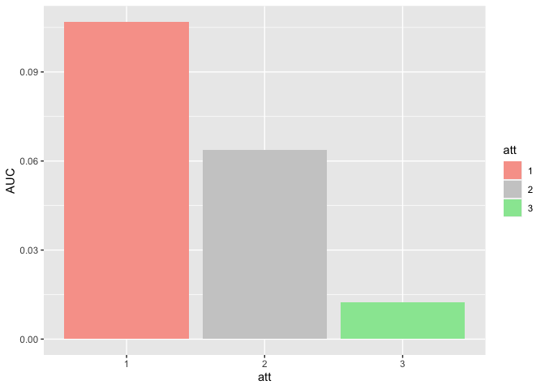
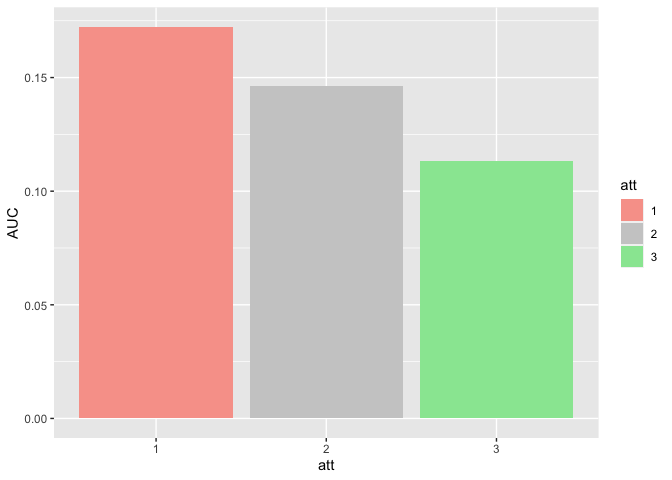
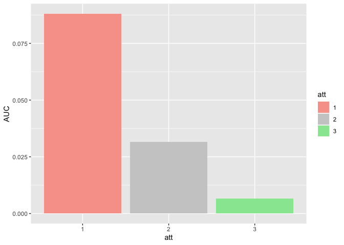

TWCF FOHO BigANOVA1
================
Karen Tian
2024-02-21

## AUC of orientation discrimination vs overall visibility report

``` r
m_anova = ezANOVA(
  data = data,
  dv = .(AUC),
  wid = .(subject),
  within = .(att),
  between = .(site,stimulus,task),
  detailed = TRUE,
  )
knitr::kable(m_anova)
```

<table class="kable_wrapper">
<tbody>
<tr>
<td>
<table>
<thead>
<tr>
<th style="text-align:left;">
</th>
<th style="text-align:left;">
Effect
</th>
<th style="text-align:right;">
DFn
</th>
<th style="text-align:right;">
DFd
</th>
<th style="text-align:right;">
SSn
</th>
<th style="text-align:right;">
SSd
</th>
<th style="text-align:right;">
F
</th>
<th style="text-align:right;">
p
</th>
<th style="text-align:left;">
p\<.05
</th>
<th style="text-align:right;">
ges
</th>
</tr>
</thead>
<tbody>
<tr>
<td style="text-align:left;">
1
</td>
<td style="text-align:left;">
(Intercept)
</td>
<td style="text-align:right;">
1
</td>
<td style="text-align:right;">
111
</td>
<td style="text-align:right;">
4.8747483
</td>
<td style="text-align:right;">
1.336936
</td>
<td style="text-align:right;">
404.7293755
</td>
<td style="text-align:right;">
0.0000000
</td>
<td style="text-align:left;">

- </td>
  <td style="text-align:right;">
  0.7515843
  </td>
  </tr>
  <tr>
  <td style="text-align:left;">
  2
  </td>
  <td style="text-align:left;">
  site
  </td>
  <td style="text-align:right;">
  1
  </td>
  <td style="text-align:right;">
  111
  </td>
  <td style="text-align:right;">
  0.0205653
  </td>
  <td style="text-align:right;">
  1.336936
  </td>
  <td style="text-align:right;">
  1.7074462
  </td>
  <td style="text-align:right;">
  0.1940179
  </td>
  <td style="text-align:left;">
  </td>
  <td style="text-align:right;">
  0.0126030
  </td>
  </tr>
  <tr>
  <td style="text-align:left;">
  3
  </td>
  <td style="text-align:left;">
  stimulus
  </td>
  <td style="text-align:right;">
  1
  </td>
  <td style="text-align:right;">
  111
  </td>
  <td style="text-align:right;">
  0.1963186
  </td>
  <td style="text-align:right;">
  1.336936
  </td>
  <td style="text-align:right;">
  16.2994891
  </td>
  <td style="text-align:right;">
  0.0000998
  </td>
  <td style="text-align:left;">

  - </td>
    <td style="text-align:right;">
    0.1086113
    </td>
    </tr>
    <tr>
    <td style="text-align:left;">
    4
    </td>
    <td style="text-align:left;">
    task
    </td>
    <td style="text-align:right;">
    1
    </td>
    <td style="text-align:right;">
    111
    </td>
    <td style="text-align:right;">
    1.4932472
    </td>
    <td style="text-align:right;">
    1.336936
    </td>
    <td style="text-align:right;">
    123.9778906
    </td>
    <td style="text-align:right;">
    0.0000000
    </td>
    <td style="text-align:left;">

    - </td>
      <td style="text-align:right;">
      0.4810002
      </td>
      </tr>
      <tr>
      <td style="text-align:left;">
      9
      </td>
      <td style="text-align:left;">
      att
      </td>
      <td style="text-align:right;">
      2
      </td>
      <td style="text-align:right;">
      222
      </td>
      <td style="text-align:right;">
      0.3024265
      </td>
      <td style="text-align:right;">
      0.274280
      </td>
      <td style="text-align:right;">
      122.3908087
      </td>
      <td style="text-align:right;">
      0.0000000
      </td>
      <td style="text-align:left;">

      - </td>
        <td style="text-align:right;">
        0.1580372
        </td>
        </tr>
        <tr>
        <td style="text-align:left;">
        5
        </td>
        <td style="text-align:left;">
        site:stimulus
        </td>
        <td style="text-align:right;">
        1
        </td>
        <td style="text-align:right;">
        111
        </td>
        <td style="text-align:right;">
        0.0526898
        </td>
        <td style="text-align:right;">
        1.336936
        </td>
        <td style="text-align:right;">
        4.3746034
        </td>
        <td style="text-align:right;">
        0.0387595
        </td>
        <td style="text-align:left;">

        - </td>
          <td style="text-align:right;">
          0.0316663
          </td>
          </tr>
          <tr>
          <td style="text-align:left;">
          6
          </td>
          <td style="text-align:left;">
          site:task
          </td>
          <td style="text-align:right;">
          1
          </td>
          <td style="text-align:right;">
          111
          </td>
          <td style="text-align:right;">
          0.0123321
          </td>
          <td style="text-align:right;">
          1.336936
          </td>
          <td style="text-align:right;">
          1.0238782
          </td>
          <td style="text-align:right;">
          0.3138015
          </td>
          <td style="text-align:left;">
          </td>
          <td style="text-align:right;">
          0.0075958
          </td>
          </tr>
          <tr>
          <td style="text-align:left;">
          7
          </td>
          <td style="text-align:left;">
          stimulus:task
          </td>
          <td style="text-align:right;">
          1
          </td>
          <td style="text-align:right;">
          111
          </td>
          <td style="text-align:right;">
          0.0677974
          </td>
          <td style="text-align:right;">
          1.336936
          </td>
          <td style="text-align:right;">
          5.6289232
          </td>
          <td style="text-align:right;">
          0.0193869
          </td>
          <td style="text-align:left;">

          - </td>
            <td style="text-align:right;">
            0.0403793
            </td>
            </tr>
            <tr>
            <td style="text-align:left;">
            10
            </td>
            <td style="text-align:left;">
            site:att
            </td>
            <td style="text-align:right;">
            2
            </td>
            <td style="text-align:right;">
            222
            </td>
            <td style="text-align:right;">
            0.0022628
            </td>
            <td style="text-align:right;">
            0.274280
            </td>
            <td style="text-align:right;">
            0.9157503
            </td>
            <td style="text-align:right;">
            0.4017226
            </td>
            <td style="text-align:left;">
            </td>
            <td style="text-align:right;">
            0.0014024
            </td>
            </tr>
            <tr>
            <td style="text-align:left;">
            11
            </td>
            <td style="text-align:left;">
            stimulus:att
            </td>
            <td style="text-align:right;">
            2
            </td>
            <td style="text-align:right;">
            222
            </td>
            <td style="text-align:right;">
            0.0008848
            </td>
            <td style="text-align:right;">
            0.274280
            </td>
            <td style="text-align:right;">
            0.3580753
            </td>
            <td style="text-align:right;">
            0.6994234
            </td>
            <td style="text-align:left;">
            </td>
            <td style="text-align:right;">
            0.0005488
            </td>
            </tr>
            <tr>
            <td style="text-align:left;">
            12
            </td>
            <td style="text-align:left;">
            task:att
            </td>
            <td style="text-align:right;">
            2
            </td>
            <td style="text-align:right;">
            222
            </td>
            <td style="text-align:right;">
            0.0169413
            </td>
            <td style="text-align:right;">
            0.274280
            </td>
            <td style="text-align:right;">
            6.8560629
            </td>
            <td style="text-align:right;">
            0.0012906
            </td>
            <td style="text-align:left;">

            - </td>
              <td style="text-align:right;">
              0.0104052
              </td>
              </tr>
              <tr>
              <td style="text-align:left;">
              8
              </td>
              <td style="text-align:left;">
              site:stimulus:task
              </td>
              <td style="text-align:right;">
              1
              </td>
              <td style="text-align:right;">
              111
              </td>
              <td style="text-align:right;">
              0.0837813
              </td>
              <td style="text-align:right;">
              1.336936
              </td>
              <td style="text-align:right;">
              6.9559982
              </td>
              <td style="text-align:right;">
              0.0095521
              </td>
              <td style="text-align:left;">

              - </td>
                <td style="text-align:right;">
                0.0494286
                </td>
                </tr>
                <tr>
                <td style="text-align:left;">
                13
                </td>
                <td style="text-align:left;">
                site:stimulus:att
                </td>
                <td style="text-align:right;">
                2
                </td>
                <td style="text-align:right;">
                222
                </td>
                <td style="text-align:right;">
                0.0009288
                </td>
                <td style="text-align:right;">
                0.274280
                </td>
                <td style="text-align:right;">
                0.3758846
                </td>
                <td style="text-align:right;">
                0.6871178
                </td>
                <td style="text-align:left;">
                </td>
                <td style="text-align:right;">
                0.0005761
                </td>
                </tr>
                <tr>
                <td style="text-align:left;">
                14
                </td>
                <td style="text-align:left;">
                site:task:att
                </td>
                <td style="text-align:right;">
                2
                </td>
                <td style="text-align:right;">
                222
                </td>
                <td style="text-align:right;">
                0.0004820
                </td>
                <td style="text-align:right;">
                0.274280
                </td>
                <td style="text-align:right;">
                0.1950753
                </td>
                <td style="text-align:right;">
                0.8229136
                </td>
                <td style="text-align:left;">
                </td>
                <td style="text-align:right;">
                0.0002991
                </td>
                </tr>
                <tr>
                <td style="text-align:left;">
                15
                </td>
                <td style="text-align:left;">
                stimulus:task:att
                </td>
                <td style="text-align:right;">
                2
                </td>
                <td style="text-align:right;">
                222
                </td>
                <td style="text-align:right;">
                0.0050848
                </td>
                <td style="text-align:right;">
                0.274280
                </td>
                <td style="text-align:right;">
                2.0578028
                </td>
                <td style="text-align:right;">
                0.1301639
                </td>
                <td style="text-align:left;">
                </td>
                <td style="text-align:right;">
                0.0031460
                </td>
                </tr>
                <tr>
                <td style="text-align:left;">
                16
                </td>
                <td style="text-align:left;">
                site:stimulus:task:att
                </td>
                <td style="text-align:right;">
                2
                </td>
                <td style="text-align:right;">
                222
                </td>
                <td style="text-align:right;">
                0.0062968
                </td>
                <td style="text-align:right;">
                0.274280
                </td>
                <td style="text-align:right;">
                2.5482716
                </td>
                <td style="text-align:right;">
                0.0805030
                </td>
                <td style="text-align:left;">
                </td>
                <td style="text-align:right;">
                0.0038929
                </td>
                </tr>
                </tbody>
                </table>

</td>
<td>
<table>
<thead>
<tr>
<th style="text-align:left;">
</th>
<th style="text-align:left;">
Effect
</th>
<th style="text-align:right;">
W
</th>
<th style="text-align:right;">
p
</th>
<th style="text-align:left;">
p\<.05
</th>
</tr>
</thead>
<tbody>
<tr>
<td style="text-align:left;">
9
</td>
<td style="text-align:left;">
att
</td>
<td style="text-align:right;">
0.804531
</td>
<td style="text-align:right;">
6.4e-06
</td>
<td style="text-align:left;">

- </td>
  </tr>
  <tr>
  <td style="text-align:left;">
  10
  </td>
  <td style="text-align:left;">
  site:att
  </td>
  <td style="text-align:right;">
  0.804531
  </td>
  <td style="text-align:right;">
  6.4e-06
  </td>
  <td style="text-align:left;">

  - </td>
    </tr>
    <tr>
    <td style="text-align:left;">
    11
    </td>
    <td style="text-align:left;">
    stimulus:att
    </td>
    <td style="text-align:right;">
    0.804531
    </td>
    <td style="text-align:right;">
    6.4e-06
    </td>
    <td style="text-align:left;">

    - </td>
      </tr>
      <tr>
      <td style="text-align:left;">
      12
      </td>
      <td style="text-align:left;">
      task:att
      </td>
      <td style="text-align:right;">
      0.804531
      </td>
      <td style="text-align:right;">
      6.4e-06
      </td>
      <td style="text-align:left;">

      - </td>
        </tr>
        <tr>
        <td style="text-align:left;">
        13
        </td>
        <td style="text-align:left;">
        site:stimulus:att
        </td>
        <td style="text-align:right;">
        0.804531
        </td>
        <td style="text-align:right;">
        6.4e-06
        </td>
        <td style="text-align:left;">

        - </td>
          </tr>
          <tr>
          <td style="text-align:left;">
          14
          </td>
          <td style="text-align:left;">
          site:task:att
          </td>
          <td style="text-align:right;">
          0.804531
          </td>
          <td style="text-align:right;">
          6.4e-06
          </td>
          <td style="text-align:left;">

          - </td>
            </tr>
            <tr>
            <td style="text-align:left;">
            15
            </td>
            <td style="text-align:left;">
            stimulus:task:att
            </td>
            <td style="text-align:right;">
            0.804531
            </td>
            <td style="text-align:right;">
            6.4e-06
            </td>
            <td style="text-align:left;">

            - </td>
              </tr>
              <tr>
              <td style="text-align:left;">
              16
              </td>
              <td style="text-align:left;">
              site:stimulus:task:att
              </td>
              <td style="text-align:right;">
              0.804531
              </td>
              <td style="text-align:right;">
              6.4e-06
              </td>
              <td style="text-align:left;">

              - </td>
                </tr>
                </tbody>
                </table>

</td>
<td>
<table>
<thead>
<tr>
<th style="text-align:left;">
</th>
<th style="text-align:left;">
Effect
</th>
<th style="text-align:right;">
GGe
</th>
<th style="text-align:right;">
p\[GG\]
</th>
<th style="text-align:left;">
p\[GG\]\<.05
</th>
<th style="text-align:right;">
HFe
</th>
<th style="text-align:right;">
p\[HF\]
</th>
<th style="text-align:left;">
p\[HF\]\<.05
</th>
</tr>
</thead>
<tbody>
<tr>
<td style="text-align:left;">
9
</td>
<td style="text-align:left;">
att
</td>
<td style="text-align:right;">
0.8364918
</td>
<td style="text-align:right;">
0.0000000
</td>
<td style="text-align:left;">

- </td>
  <td style="text-align:right;">
  0.8477967
  </td>
  <td style="text-align:right;">
  0.0000000
  </td>
  <td style="text-align:left;">

  - </td>
    </tr>
    <tr>
    <td style="text-align:left;">
    10
    </td>
    <td style="text-align:left;">
    site:att
    </td>
    <td style="text-align:right;">
    0.8364918
    </td>
    <td style="text-align:right;">
    0.3868468
    </td>
    <td style="text-align:left;">
    </td>
    <td style="text-align:right;">
    0.8477967
    </td>
    <td style="text-align:right;">
    0.3879857
    </td>
    <td style="text-align:left;">
    </td>
    </tr>
    <tr>
    <td style="text-align:left;">
    11
    </td>
    <td style="text-align:left;">
    stimulus:att
    </td>
    <td style="text-align:right;">
    0.8364918
    </td>
    <td style="text-align:right;">
    0.6612616
    </td>
    <td style="text-align:left;">
    </td>
    <td style="text-align:right;">
    0.8477967
    </td>
    <td style="text-align:right;">
    0.6641437
    </td>
    <td style="text-align:left;">
    </td>
    </tr>
    <tr>
    <td style="text-align:left;">
    12
    </td>
    <td style="text-align:left;">
    task:att
    </td>
    <td style="text-align:right;">
    0.8364918
    </td>
    <td style="text-align:right;">
    0.0025186
    </td>
    <td style="text-align:left;">

    - </td>
      <td style="text-align:right;">
      0.8477967
      </td>
      <td style="text-align:right;">
      0.0024046
      </td>
      <td style="text-align:left;">

      - </td>
        </tr>
        <tr>
        <td style="text-align:left;">
        13
        </td>
        <td style="text-align:left;">
        site:stimulus:att
        </td>
        <td style="text-align:right;">
        0.8364918
        </td>
        <td style="text-align:right;">
        0.6494862
        </td>
        <td style="text-align:left;">
        </td>
        <td style="text-align:right;">
        0.8477967
        </td>
        <td style="text-align:right;">
        0.6523239
        </td>
        <td style="text-align:left;">
        </td>
        </tr>
        <tr>
        <td style="text-align:left;">
        14
        </td>
        <td style="text-align:left;">
        site:task:att
        </td>
        <td style="text-align:right;">
        0.8364918
        </td>
        <td style="text-align:right;">
        0.7836361
        </td>
        <td style="text-align:left;">
        </td>
        <td style="text-align:right;">
        0.8477967
        </td>
        <td style="text-align:right;">
        0.7866804
        </td>
        <td style="text-align:left;">
        </td>
        </tr>
        <tr>
        <td style="text-align:left;">
        15
        </td>
        <td style="text-align:left;">
        stimulus:task:att
        </td>
        <td style="text-align:right;">
        0.8364918
        </td>
        <td style="text-align:right;">
        0.1387632
        </td>
        <td style="text-align:left;">
        </td>
        <td style="text-align:right;">
        0.8477967
        </td>
        <td style="text-align:right;">
        0.1381708
        </td>
        <td style="text-align:left;">
        </td>
        </tr>
        <tr>
        <td style="text-align:left;">
        16
        </td>
        <td style="text-align:left;">
        site:stimulus:task:att
        </td>
        <td style="text-align:right;">
        0.8364918
        </td>
        <td style="text-align:right;">
        0.0905779
        </td>
        <td style="text-align:left;">
        </td>
        <td style="text-align:right;">
        0.8477967
        </td>
        <td style="text-align:right;">
        0.0898508
        </td>
        <td style="text-align:left;">
        </td>
        </tr>
        </tbody>
        </table>

</td>
</tr>
</tbody>
</table>

## Detection (Experiments 1 & 3)

``` r
d <- data %>% filter(task=="1")
m_anova = ezANOVA(
  data = d,
  dv = .(AUC),
  wid = .(subject),
  within = .(att),
  between = .(site,stimulus),
  detailed = TRUE,
  )
knitr::kable(m_anova)
```

<table class="kable_wrapper">
<tbody>
<tr>
<td>
<table>
<thead>
<tr>
<th style="text-align:left;">
</th>
<th style="text-align:left;">
Effect
</th>
<th style="text-align:right;">
DFn
</th>
<th style="text-align:right;">
DFd
</th>
<th style="text-align:right;">
SSn
</th>
<th style="text-align:right;">
SSd
</th>
<th style="text-align:right;">
F
</th>
<th style="text-align:right;">
p
</th>
<th style="text-align:left;">
p\<.05
</th>
<th style="text-align:right;">
ges
</th>
</tr>
</thead>
<tbody>
<tr>
<td style="text-align:left;">
1
</td>
<td style="text-align:left;">
(Intercept)
</td>
<td style="text-align:right;">
1
</td>
<td style="text-align:right;">
56
</td>
<td style="text-align:right;">
5.9121087
</td>
<td style="text-align:right;">
1.1439205
</td>
<td style="text-align:right;">
289.4240239
</td>
<td style="text-align:right;">
0.0000000
</td>
<td style="text-align:left;">

- </td>
  <td style="text-align:right;">
  0.8227970
  </td>
  </tr>
  <tr>
  <td style="text-align:left;">
  2
  </td>
  <td style="text-align:left;">
  site
  </td>
  <td style="text-align:right;">
  1
  </td>
  <td style="text-align:right;">
  56
  </td>
  <td style="text-align:right;">
  0.0319017
  </td>
  <td style="text-align:right;">
  1.1439205
  </td>
  <td style="text-align:right;">
  1.5617319
  </td>
  <td style="text-align:right;">
  0.2166096
  </td>
  <td style="text-align:left;">
  </td>
  <td style="text-align:right;">
  0.0244425
  </td>
  </tr>
  <tr>
  <td style="text-align:left;">
  3
  </td>
  <td style="text-align:left;">
  stimulus
  </td>
  <td style="text-align:right;">
  1
  </td>
  <td style="text-align:right;">
  56
  </td>
  <td style="text-align:right;">
  0.2494018
  </td>
  <td style="text-align:right;">
  1.1439205
  </td>
  <td style="text-align:right;">
  12.2093292
  </td>
  <td style="text-align:right;">
  0.0009369
  </td>
  <td style="text-align:left;">

  - </td>
    <td style="text-align:right;">
    0.1637921
    </td>
    </tr>
    <tr>
    <td style="text-align:left;">
    5
    </td>
    <td style="text-align:left;">
    att
    </td>
    <td style="text-align:right;">
    2
    </td>
    <td style="text-align:right;">
    112
    </td>
    <td style="text-align:right;">
    0.0903328
    </td>
    <td style="text-align:right;">
    0.1293504
    </td>
    <td style="text-align:right;">
    39.1080240
    </td>
    <td style="text-align:right;">
    0.0000000
    </td>
    <td style="text-align:left;">

    - </td>
      <td style="text-align:right;">
      0.0662457
      </td>
      </tr>
      <tr>
      <td style="text-align:left;">
      4
      </td>
      <td style="text-align:left;">
      site:stimulus
      </td>
      <td style="text-align:right;">
      1
      </td>
      <td style="text-align:right;">
      56
      </td>
      <td style="text-align:right;">
      0.1345364
      </td>
      <td style="text-align:right;">
      1.1439205
      </td>
      <td style="text-align:right;">
      6.5861551
      </td>
      <td style="text-align:right;">
      0.0129792
      </td>
      <td style="text-align:left;">

      - </td>
        <td style="text-align:right;">
        0.0955645
        </td>
        </tr>
        <tr>
        <td style="text-align:left;">
        6
        </td>
        <td style="text-align:left;">
        site:att
        </td>
        <td style="text-align:right;">
        2
        </td>
        <td style="text-align:right;">
        112
        </td>
        <td style="text-align:right;">
        0.0021828
        </td>
        <td style="text-align:right;">
        0.1293504
        </td>
        <td style="text-align:right;">
        0.9449997
        </td>
        <td style="text-align:right;">
        0.3917565
        </td>
        <td style="text-align:left;">
        </td>
        <td style="text-align:right;">
        0.0017114
        </td>
        </tr>
        <tr>
        <td style="text-align:left;">
        7
        </td>
        <td style="text-align:left;">
        stimulus:att
        </td>
        <td style="text-align:right;">
        2
        </td>
        <td style="text-align:right;">
        112
        </td>
        <td style="text-align:right;">
        0.0009428
        </td>
        <td style="text-align:right;">
        0.1293504
        </td>
        <td style="text-align:right;">
        0.4081835
        </td>
        <td style="text-align:right;">
        0.6658419
        </td>
        <td style="text-align:left;">
        </td>
        <td style="text-align:right;">
        0.0007399
        </td>
        </tr>
        <tr>
        <td style="text-align:left;">
        8
        </td>
        <td style="text-align:left;">
        site:stimulus:att
        </td>
        <td style="text-align:right;">
        2
        </td>
        <td style="text-align:right;">
        112
        </td>
        <td style="text-align:right;">
        0.0059286
        </td>
        <td style="text-align:right;">
        0.1293504
        </td>
        <td style="text-align:right;">
        2.5666980
        </td>
        <td style="text-align:right;">
        0.0812995
        </td>
        <td style="text-align:left;">
        </td>
        <td style="text-align:right;">
        0.0046346
        </td>
        </tr>
        </tbody>
        </table>

</td>
<td>
<table>
<thead>
<tr>
<th style="text-align:left;">
</th>
<th style="text-align:left;">
Effect
</th>
<th style="text-align:right;">
W
</th>
<th style="text-align:right;">
p
</th>
<th style="text-align:left;">
p\<.05
</th>
</tr>
</thead>
<tbody>
<tr>
<td style="text-align:left;">
5
</td>
<td style="text-align:left;">
att
</td>
<td style="text-align:right;">
0.9117507
</td>
<td style="text-align:right;">
0.0788121
</td>
<td style="text-align:left;">
</td>
</tr>
<tr>
<td style="text-align:left;">
6
</td>
<td style="text-align:left;">
site:att
</td>
<td style="text-align:right;">
0.9117507
</td>
<td style="text-align:right;">
0.0788121
</td>
<td style="text-align:left;">
</td>
</tr>
<tr>
<td style="text-align:left;">
7
</td>
<td style="text-align:left;">
stimulus:att
</td>
<td style="text-align:right;">
0.9117507
</td>
<td style="text-align:right;">
0.0788121
</td>
<td style="text-align:left;">
</td>
</tr>
<tr>
<td style="text-align:left;">
8
</td>
<td style="text-align:left;">
site:stimulus:att
</td>
<td style="text-align:right;">
0.9117507
</td>
<td style="text-align:right;">
0.0788121
</td>
<td style="text-align:left;">
</td>
</tr>
</tbody>
</table>
</td>
<td>
<table>
<thead>
<tr>
<th style="text-align:left;">
</th>
<th style="text-align:left;">
Effect
</th>
<th style="text-align:right;">
GGe
</th>
<th style="text-align:right;">
p\[GG\]
</th>
<th style="text-align:left;">
p\[GG\]\<.05
</th>
<th style="text-align:right;">
HFe
</th>
<th style="text-align:right;">
p\[HF\]
</th>
<th style="text-align:left;">
p\[HF\]\<.05
</th>
</tr>
</thead>
<tbody>
<tr>
<td style="text-align:left;">
5
</td>
<td style="text-align:left;">
att
</td>
<td style="text-align:right;">
0.9189071
</td>
<td style="text-align:right;">
0.0000000
</td>
<td style="text-align:left;">

- </td>
  <td style="text-align:right;">
  0.9485899
  </td>
  <td style="text-align:right;">
  0.0000000
  </td>
  <td style="text-align:left;">

  - </td>
    </tr>
    <tr>
    <td style="text-align:left;">
    6
    </td>
    <td style="text-align:left;">
    site:att
    </td>
    <td style="text-align:right;">
    0.9189071
    </td>
    <td style="text-align:right;">
    0.3853938
    </td>
    <td style="text-align:left;">
    </td>
    <td style="text-align:right;">
    0.9485899
    </td>
    <td style="text-align:right;">
    0.3878033
    </td>
    <td style="text-align:left;">
    </td>
    </tr>
    <tr>
    <td style="text-align:left;">
    7
    </td>
    <td style="text-align:left;">
    stimulus:att
    </td>
    <td style="text-align:right;">
    0.9189071
    </td>
    <td style="text-align:right;">
    0.6486271
    </td>
    <td style="text-align:left;">
    </td>
    <td style="text-align:right;">
    0.9485899
    </td>
    <td style="text-align:right;">
    0.6551017
    </td>
    <td style="text-align:left;">
    </td>
    </tr>
    <tr>
    <td style="text-align:left;">
    8
    </td>
    <td style="text-align:left;">
    site:stimulus:att
    </td>
    <td style="text-align:right;">
    0.9189071
    </td>
    <td style="text-align:right;">
    0.0862533
    </td>
    <td style="text-align:left;">
    </td>
    <td style="text-align:right;">
    0.9485899
    </td>
    <td style="text-align:right;">
    0.0844104
    </td>
    <td style="text-align:left;">
    </td>
    </tr>
    </tbody>
    </table>

</td>
</tr>
</tbody>
</table>

## Discrimination (Experiments 2 & 4)

``` r
d <- data %>% filter(task=="2")
m_anova = ezANOVA(
  data = d,
  dv = .(AUC),
  wid = .(subject),
  within = .(att),
  between = .(site,stimulus),
  detailed = TRUE,
  )
knitr::kable(m_anova)
```

<table class="kable_wrapper">
<tbody>
<tr>
<td>
<table>
<thead>
<tr>
<th style="text-align:left;">
</th>
<th style="text-align:left;">
Effect
</th>
<th style="text-align:right;">
DFn
</th>
<th style="text-align:right;">
DFd
</th>
<th style="text-align:right;">
SSn
</th>
<th style="text-align:right;">
SSd
</th>
<th style="text-align:right;">
F
</th>
<th style="text-align:right;">
p
</th>
<th style="text-align:left;">
p\<.05
</th>
<th style="text-align:right;">
ges
</th>
</tr>
</thead>
<tbody>
<tr>
<td style="text-align:left;">
1
</td>
<td style="text-align:left;">
(Intercept)
</td>
<td style="text-align:right;">
1
</td>
<td style="text-align:right;">
55
</td>
<td style="text-align:right;">
0.4673350
</td>
<td style="text-align:right;">
0.1930149
</td>
<td style="text-align:right;">
133.1680584
</td>
<td style="text-align:right;">
0.0000000
</td>
<td style="text-align:left;">

- </td>
  <td style="text-align:right;">
  0.5803389
  </td>
  </tr>
  <tr>
  <td style="text-align:left;">
  2
  </td>
  <td style="text-align:left;">
  site
  </td>
  <td style="text-align:right;">
  1
  </td>
  <td style="text-align:right;">
  55
  </td>
  <td style="text-align:right;">
  0.0005534
  </td>
  <td style="text-align:right;">
  0.1930149
  </td>
  <td style="text-align:right;">
  0.1576825
  </td>
  <td style="text-align:right;">
  0.6928360
  </td>
  <td style="text-align:left;">
  </td>
  <td style="text-align:right;">
  0.0016348
  </td>
  </tr>
  <tr>
  <td style="text-align:left;">
  3
  </td>
  <td style="text-align:left;">
  stimulus
  </td>
  <td style="text-align:right;">
  1
  </td>
  <td style="text-align:right;">
  55
  </td>
  <td style="text-align:right;">
  0.0157721
  </td>
  <td style="text-align:right;">
  0.1930149
  </td>
  <td style="text-align:right;">
  4.4942791
  </td>
  <td style="text-align:right;">
  0.0385351
  </td>
  <td style="text-align:left;">

  - </td>
    <td style="text-align:right;">
    0.0445895
    </td>
    </tr>
    <tr>
    <td style="text-align:left;">
    5
    </td>
    <td style="text-align:left;">
    att
    </td>
    <td style="text-align:right;">
    2
    </td>
    <td style="text-align:right;">
    110
    </td>
    <td style="text-align:right;">
    0.2290265
    </td>
    <td style="text-align:right;">
    0.1449296
    </td>
    <td style="text-align:right;">
    86.9143299
    </td>
    <td style="text-align:right;">
    0.0000000
    </td>
    <td style="text-align:left;">

    - </td>
      <td style="text-align:right;">
      0.4039474
      </td>
      </tr>
      <tr>
      <td style="text-align:left;">
      4
      </td>
      <td style="text-align:left;">
      site:stimulus
      </td>
      <td style="text-align:right;">
      1
      </td>
      <td style="text-align:right;">
      55
      </td>
      <td style="text-align:right;">
      0.0019346
      </td>
      <td style="text-align:right;">
      0.1930149
      </td>
      <td style="text-align:right;">
      0.5512757
      </td>
      <td style="text-align:right;">
      0.4609563
      </td>
      <td style="text-align:left;">
      </td>
      <td style="text-align:right;">
      0.0056921
      </td>
      </tr>
      <tr>
      <td style="text-align:left;">
      6
      </td>
      <td style="text-align:left;">
      site:att
      </td>
      <td style="text-align:right;">
      2
      </td>
      <td style="text-align:right;">
      110
      </td>
      <td style="text-align:right;">
      0.0005673
      </td>
      <td style="text-align:right;">
      0.1449296
      </td>
      <td style="text-align:right;">
      0.2152706
      </td>
      <td style="text-align:right;">
      0.8066621
      </td>
      <td style="text-align:left;">
      </td>
      <td style="text-align:right;">
      0.0016757
      </td>
      </tr>
      <tr>
      <td style="text-align:left;">
      7
      </td>
      <td style="text-align:left;">
      stimulus:att
      </td>
      <td style="text-align:right;">
      2
      </td>
      <td style="text-align:right;">
      110
      </td>
      <td style="text-align:right;">
      0.0050249
      </td>
      <td style="text-align:right;">
      0.1449296
      </td>
      <td style="text-align:right;">
      1.9069273
      </td>
      <td style="text-align:right;">
      0.1534141
      </td>
      <td style="text-align:left;">
      </td>
      <td style="text-align:right;">
      0.0146512
      </td>
      </tr>
      <tr>
      <td style="text-align:left;">
      8
      </td>
      <td style="text-align:left;">
      site:stimulus:att
      </td>
      <td style="text-align:right;">
      2
      </td>
      <td style="text-align:right;">
      110
      </td>
      <td style="text-align:right;">
      0.0012969
      </td>
      <td style="text-align:right;">
      0.1449296
      </td>
      <td style="text-align:right;">
      0.4921783
      </td>
      <td style="text-align:right;">
      0.6126330
      </td>
      <td style="text-align:left;">
      </td>
      <td style="text-align:right;">
      0.0038230
      </td>
      </tr>
      </tbody>
      </table>

</td>
<td>
<table>
<thead>
<tr>
<th style="text-align:left;">
</th>
<th style="text-align:left;">
Effect
</th>
<th style="text-align:right;">
W
</th>
<th style="text-align:right;">
p
</th>
<th style="text-align:left;">
p\<.05
</th>
</tr>
</thead>
<tbody>
<tr>
<td style="text-align:left;">
5
</td>
<td style="text-align:left;">
att
</td>
<td style="text-align:right;">
0.5810815
</td>
<td style="text-align:right;">
4e-07
</td>
<td style="text-align:left;">

- </td>
  </tr>
  <tr>
  <td style="text-align:left;">
  6
  </td>
  <td style="text-align:left;">
  site:att
  </td>
  <td style="text-align:right;">
  0.5810815
  </td>
  <td style="text-align:right;">
  4e-07
  </td>
  <td style="text-align:left;">

  - </td>
    </tr>
    <tr>
    <td style="text-align:left;">
    7
    </td>
    <td style="text-align:left;">
    stimulus:att
    </td>
    <td style="text-align:right;">
    0.5810815
    </td>
    <td style="text-align:right;">
    4e-07
    </td>
    <td style="text-align:left;">

    - </td>
      </tr>
      <tr>
      <td style="text-align:left;">
      8
      </td>
      <td style="text-align:left;">
      site:stimulus:att
      </td>
      <td style="text-align:right;">
      0.5810815
      </td>
      <td style="text-align:right;">
      4e-07
      </td>
      <td style="text-align:left;">

      - </td>
        </tr>
        </tbody>
        </table>

</td>
<td>
<table>
<thead>
<tr>
<th style="text-align:left;">
</th>
<th style="text-align:left;">
Effect
</th>
<th style="text-align:right;">
GGe
</th>
<th style="text-align:right;">
p\[GG\]
</th>
<th style="text-align:left;">
p\[GG\]\<.05
</th>
<th style="text-align:right;">
HFe
</th>
<th style="text-align:right;">
p\[HF\]
</th>
<th style="text-align:left;">
p\[HF\]\<.05
</th>
</tr>
</thead>
<tbody>
<tr>
<td style="text-align:left;">
5
</td>
<td style="text-align:left;">
att
</td>
<td style="text-align:right;">
0.7047621
</td>
<td style="text-align:right;">
0.0000000
</td>
<td style="text-align:left;">

- </td>
  <td style="text-align:right;">
  0.7177895
  </td>
  <td style="text-align:right;">
  0.0000000
  </td>
  <td style="text-align:left;">

  - </td>
    </tr>
    <tr>
    <td style="text-align:left;">
    6
    </td>
    <td style="text-align:left;">
    site:att
    </td>
    <td style="text-align:right;">
    0.7047621
    </td>
    <td style="text-align:right;">
    0.7273600
    </td>
    <td style="text-align:left;">
    </td>
    <td style="text-align:right;">
    0.7177895
    </td>
    <td style="text-align:right;">
    0.7316805
    </td>
    <td style="text-align:left;">
    </td>
    </tr>
    <tr>
    <td style="text-align:left;">
    7
    </td>
    <td style="text-align:left;">
    stimulus:att
    </td>
    <td style="text-align:right;">
    0.7047621
    </td>
    <td style="text-align:right;">
    0.1665870
    </td>
    <td style="text-align:left;">
    </td>
    <td style="text-align:right;">
    0.7177895
    </td>
    <td style="text-align:right;">
    0.1660644
    </td>
    <td style="text-align:left;">
    </td>
    </tr>
    <tr>
    <td style="text-align:left;">
    8
    </td>
    <td style="text-align:left;">
    site:stimulus:att
    </td>
    <td style="text-align:right;">
    0.7047621
    </td>
    <td style="text-align:right;">
    0.5480564
    </td>
    <td style="text-align:left;">
    </td>
    <td style="text-align:right;">
    0.7177895
    </td>
    <td style="text-align:right;">
    0.5514108
    </td>
    <td style="text-align:left;">
    </td>
    </tr>
    </tbody>
    </table>

</td>
</tr>
</tbody>
</table>

## Texture-defined figure-ground ovals (Experiments 1 & 2)

``` r
d <- data %>% filter(stimulus=="1")
m_anova = ezANOVA(
  data = d,
  dv = .(AUC),
  wid = .(subject),
  within = .(att),
  between = .(site,task),
  detailed = TRUE,
  )
knitr::kable(m_anova)
```

<table class="kable_wrapper">
<tbody>
<tr>
<td>
<table>
<thead>
<tr>
<th style="text-align:left;">
</th>
<th style="text-align:left;">
Effect
</th>
<th style="text-align:right;">
DFn
</th>
<th style="text-align:right;">
DFd
</th>
<th style="text-align:right;">
SSn
</th>
<th style="text-align:right;">
SSd
</th>
<th style="text-align:right;">
F
</th>
<th style="text-align:right;">
p
</th>
<th style="text-align:left;">
p\<.05
</th>
<th style="text-align:right;">
ges
</th>
</tr>
</thead>
<tbody>
<tr>
<td style="text-align:left;">
1
</td>
<td style="text-align:left;">
(Intercept)
</td>
<td style="text-align:right;">
1
</td>
<td style="text-align:right;">
55
</td>
<td style="text-align:right;">
3.5224594
</td>
<td style="text-align:right;">
0.5613156
</td>
<td style="text-align:right;">
345.1450067
</td>
<td style="text-align:right;">
0.0000000
</td>
<td style="text-align:left;">

- </td>
  <td style="text-align:right;">
  0.8304486
  </td>
  </tr>
  <tr>
  <td style="text-align:left;">
  2
  </td>
  <td style="text-align:left;">
  site
  </td>
  <td style="text-align:right;">
  1
  </td>
  <td style="text-align:right;">
  55
  </td>
  <td style="text-align:right;">
  0.0037661
  </td>
  <td style="text-align:right;">
  0.5613156
  </td>
  <td style="text-align:right;">
  0.3690134
  </td>
  <td style="text-align:right;">
  0.5460426
  </td>
  <td style="text-align:left;">
  </td>
  <td style="text-align:right;">
  0.0052094
  </td>
  </tr>
  <tr>
  <td style="text-align:left;">
  3
  </td>
  <td style="text-align:left;">
  task
  </td>
  <td style="text-align:right;">
  1
  </td>
  <td style="text-align:right;">
  55
  </td>
  <td style="text-align:right;">
  1.0939538
  </td>
  <td style="text-align:right;">
  0.5613156
  </td>
  <td style="text-align:right;">
  107.1900728
  </td>
  <td style="text-align:right;">
  0.0000000
  </td>
  <td style="text-align:left;">

  - </td>
    <td style="text-align:right;">
    0.6033514
    </td>
    </tr>
    <tr>
    <td style="text-align:left;">
    5
    </td>
    <td style="text-align:left;">
    att
    </td>
    <td style="text-align:right;">
    2
    </td>
    <td style="text-align:right;">
    110
    </td>
    <td style="text-align:right;">
    0.1539891
    </td>
    <td style="text-align:right;">
    0.1578593
    </td>
    <td style="text-align:right;">
    53.6515737
    </td>
    <td style="text-align:right;">
    0.0000000
    </td>
    <td style="text-align:left;">

    - </td>
      <td style="text-align:right;">
      0.1763576
      </td>
      </tr>
      <tr>
      <td style="text-align:left;">
      4
      </td>
      <td style="text-align:left;">
      site:task
      </td>
      <td style="text-align:right;">
      1
      </td>
      <td style="text-align:right;">
      55
      </td>
      <td style="text-align:right;">
      0.0162307
      </td>
      <td style="text-align:right;">
      0.5613156
      </td>
      <td style="text-align:right;">
      1.5903511
      </td>
      <td style="text-align:right;">
      0.2125991
      </td>
      <td style="text-align:left;">
      </td>
      <td style="text-align:right;">
      0.0220704
      </td>
      </tr>
      <tr>
      <td style="text-align:left;">
      6
      </td>
      <td style="text-align:left;">
      site:att
      </td>
      <td style="text-align:right;">
      2
      </td>
      <td style="text-align:right;">
      110
      </td>
      <td style="text-align:right;">
      0.0012485
      </td>
      <td style="text-align:right;">
      0.1578593
      </td>
      <td style="text-align:right;">
      0.4350068
      </td>
      <td style="text-align:right;">
      0.6483688
      </td>
      <td style="text-align:left;">
      </td>
      <td style="text-align:right;">
      0.0017331
      </td>
      </tr>
      <tr>
      <td style="text-align:left;">
      7
      </td>
      <td style="text-align:left;">
      task:att
      </td>
      <td style="text-align:right;">
      2
      </td>
      <td style="text-align:right;">
      110
      </td>
      <td style="text-align:right;">
      0.0144708
      </td>
      <td style="text-align:right;">
      0.1578593
      </td>
      <td style="text-align:right;">
      5.0417785
      </td>
      <td style="text-align:right;">
      0.0080353
      </td>
      <td style="text-align:left;">

      - </td>
        <td style="text-align:right;">
        0.0197244
        </td>
        </tr>
        <tr>
        <td style="text-align:left;">
        8
        </td>
        <td style="text-align:left;">
        site:task:att
        </td>
        <td style="text-align:right;">
        2
        </td>
        <td style="text-align:right;">
        110
        </td>
        <td style="text-align:right;">
        0.0037495
        </td>
        <td style="text-align:right;">
        0.1578593
        </td>
        <td style="text-align:right;">
        1.3063651
        </td>
        <td style="text-align:right;">
        0.2749703
        </td>
        <td style="text-align:left;">
        </td>
        <td style="text-align:right;">
        0.0051866
        </td>
        </tr>
        </tbody>
        </table>

</td>
<td>
<table>
<thead>
<tr>
<th style="text-align:left;">
</th>
<th style="text-align:left;">
Effect
</th>
<th style="text-align:right;">
W
</th>
<th style="text-align:right;">
p
</th>
<th style="text-align:left;">
p\<.05
</th>
</tr>
</thead>
<tbody>
<tr>
<td style="text-align:left;">
5
</td>
<td style="text-align:left;">
att
</td>
<td style="text-align:right;">
0.9095621
</td>
<td style="text-align:right;">
0.0773524
</td>
<td style="text-align:left;">
</td>
</tr>
<tr>
<td style="text-align:left;">
6
</td>
<td style="text-align:left;">
site:att
</td>
<td style="text-align:right;">
0.9095621
</td>
<td style="text-align:right;">
0.0773524
</td>
<td style="text-align:left;">
</td>
</tr>
<tr>
<td style="text-align:left;">
7
</td>
<td style="text-align:left;">
task:att
</td>
<td style="text-align:right;">
0.9095621
</td>
<td style="text-align:right;">
0.0773524
</td>
<td style="text-align:left;">
</td>
</tr>
<tr>
<td style="text-align:left;">
8
</td>
<td style="text-align:left;">
site:task:att
</td>
<td style="text-align:right;">
0.9095621
</td>
<td style="text-align:right;">
0.0773524
</td>
<td style="text-align:left;">
</td>
</tr>
</tbody>
</table>
</td>
<td>
<table>
<thead>
<tr>
<th style="text-align:left;">
</th>
<th style="text-align:left;">
Effect
</th>
<th style="text-align:right;">
GGe
</th>
<th style="text-align:right;">
p\[GG\]
</th>
<th style="text-align:left;">
p\[GG\]\<.05
</th>
<th style="text-align:right;">
HFe
</th>
<th style="text-align:right;">
p\[HF\]
</th>
<th style="text-align:left;">
p\[HF\]\<.05
</th>
</tr>
</thead>
<tbody>
<tr>
<td style="text-align:left;">
5
</td>
<td style="text-align:left;">
att
</td>
<td style="text-align:right;">
0.9170628
</td>
<td style="text-align:right;">
0.0000000
</td>
<td style="text-align:left;">

- </td>
  <td style="text-align:right;">
  0.9471398
  </td>
  <td style="text-align:right;">
  0.0000000
  </td>
  <td style="text-align:left;">

  - </td>
    </tr>
    <tr>
    <td style="text-align:left;">
    6
    </td>
    <td style="text-align:left;">
    site:att
    </td>
    <td style="text-align:right;">
    0.9170628
    </td>
    <td style="text-align:right;">
    0.6312108
    </td>
    <td style="text-align:left;">
    </td>
    <td style="text-align:right;">
    0.9471398
    </td>
    <td style="text-align:right;">
    0.6376058
    </td>
    <td style="text-align:left;">
    </td>
    </tr>
    <tr>
    <td style="text-align:left;">
    7
    </td>
    <td style="text-align:left;">
    task:att
    </td>
    <td style="text-align:right;">
    0.9170628
    </td>
    <td style="text-align:right;">
    0.0099231
    </td>
    <td style="text-align:left;">

    - </td>
      <td style="text-align:right;">
      0.9471398
      </td>
      <td style="text-align:right;">
      0.0091914
      </td>
      <td style="text-align:left;">

      - </td>
        </tr>
        <tr>
        <td style="text-align:left;">
        8
        </td>
        <td style="text-align:left;">
        site:task:att
        </td>
        <td style="text-align:right;">
        0.9170628
        </td>
        <td style="text-align:right;">
        0.2740871
        </td>
        <td style="text-align:left;">
        </td>
        <td style="text-align:right;">
        0.9471398
        </td>
        <td style="text-align:right;">
        0.2744592
        </td>
        <td style="text-align:left;">
        </td>
        </tr>
        </tbody>
        </table>

</td>
</tr>
</tbody>
</table>

## Contrast-defined gratings (Experiments 3 & 4)

``` r
d <- data %>% filter(stimulus=="2")
m_anova = ezANOVA(
  data = d,
  dv = .(AUC),
  wid = .(subject),
  within = .(att),
  between = .(site,task),
  detailed = TRUE,
  )
knitr::kable(m_anova)
```

<table class="kable_wrapper">
<tbody>
<tr>
<td>
<table>
<thead>
<tr>
<th style="text-align:left;">
</th>
<th style="text-align:left;">
Effect
</th>
<th style="text-align:right;">
DFn
</th>
<th style="text-align:right;">
DFd
</th>
<th style="text-align:right;">
SSn
</th>
<th style="text-align:right;">
SSd
</th>
<th style="text-align:right;">
F
</th>
<th style="text-align:right;">
p
</th>
<th style="text-align:left;">
p\<.05
</th>
<th style="text-align:right;">
ges
</th>
</tr>
</thead>
<tbody>
<tr>
<td style="text-align:left;">
1
</td>
<td style="text-align:left;">
(Intercept)
</td>
<td style="text-align:right;">
1
</td>
<td style="text-align:right;">
56
</td>
<td style="text-align:right;">
1.5581664
</td>
<td style="text-align:right;">
0.7756199
</td>
<td style="text-align:right;">
112.5001036
</td>
<td style="text-align:right;">
0.0000000
</td>
<td style="text-align:left;">

- </td>
  <td style="text-align:right;">
  0.6359326
  </td>
  </tr>
  <tr>
  <td style="text-align:left;">
  2
  </td>
  <td style="text-align:left;">
  site
  </td>
  <td style="text-align:right;">
  1
  </td>
  <td style="text-align:right;">
  56
  </td>
  <td style="text-align:right;">
  0.0690467
  </td>
  <td style="text-align:right;">
  0.7756199
  </td>
  <td style="text-align:right;">
  4.9851961
  </td>
  <td style="text-align:right;">
  0.0295805
  </td>
  <td style="text-align:left;">

  - </td>
    <td style="text-align:right;">
    0.0718423
    </td>
    </tr>
    <tr>
    <td style="text-align:left;">
    3
    </td>
    <td style="text-align:left;">
    task
    </td>
    <td style="text-align:right;">
    1
    </td>
    <td style="text-align:right;">
    56
    </td>
    <td style="text-align:right;">
    0.4676043
    </td>
    <td style="text-align:right;">
    0.7756199
    </td>
    <td style="text-align:right;">
    33.7611762
    </td>
    <td style="text-align:right;">
    0.0000003
    </td>
    <td style="text-align:left;">

    - </td>
      <td style="text-align:right;">
      0.3439165
      </td>
      </tr>
      <tr>
      <td style="text-align:left;">
      5
      </td>
      <td style="text-align:left;">
      att
      </td>
      <td style="text-align:right;">
      2
      </td>
      <td style="text-align:right;">
      112
      </td>
      <td style="text-align:right;">
      0.1493286
      </td>
      <td style="text-align:right;">
      0.1164207
      </td>
      <td style="text-align:right;">
      71.8291788
      </td>
      <td style="text-align:right;">
      0.0000000
      </td>
      <td style="text-align:left;">

      - </td>
        <td style="text-align:right;">
        0.1433964
        </td>
        </tr>
        <tr>
        <td style="text-align:left;">
        4
        </td>
        <td style="text-align:left;">
        site:task
        </td>
        <td style="text-align:right;">
        1
        </td>
        <td style="text-align:right;">
        56
        </td>
        <td style="text-align:right;">
        0.0798826
        </td>
        <td style="text-align:right;">
        0.7756199
        </td>
        <td style="text-align:right;">
        5.7675506
        </td>
        <td style="text-align:right;">
        0.0196684
        </td>
        <td style="text-align:left;">

        - </td>
          <td style="text-align:right;">
          0.0821903
          </td>
          </tr>
          <tr>
          <td style="text-align:left;">
          6
          </td>
          <td style="text-align:left;">
          site:att
          </td>
          <td style="text-align:right;">
          2
          </td>
          <td style="text-align:right;">
          112
          </td>
          <td style="text-align:right;">
          0.0019483
          </td>
          <td style="text-align:right;">
          0.1164207
          </td>
          <td style="text-align:right;">
          0.9371494
          </td>
          <td style="text-align:right;">
          0.3947928
          </td>
          <td style="text-align:left;">
          </td>
          <td style="text-align:right;">
          0.0021793
          </td>
          </tr>
          <tr>
          <td style="text-align:left;">
          7
          </td>
          <td style="text-align:left;">
          task:att
          </td>
          <td style="text-align:right;">
          2
          </td>
          <td style="text-align:right;">
          112
          </td>
          <td style="text-align:right;">
          0.0075318
          </td>
          <td style="text-align:right;">
          0.1164207
          </td>
          <td style="text-align:right;">
          3.6228927
          </td>
          <td style="text-align:right;">
          0.0298813
          </td>
          <td style="text-align:left;">

          - </td>
            <td style="text-align:right;">
            0.0083726
            </td>
            </tr>
            <tr>
            <td style="text-align:left;">
            8
            </td>
            <td style="text-align:left;">
            site:task:att
            </td>
            <td style="text-align:right;">
            2
            </td>
            <td style="text-align:right;">
            112
            </td>
            <td style="text-align:right;">
            0.0030293
            </td>
            <td style="text-align:right;">
            0.1164207
            </td>
            <td style="text-align:right;">
            1.4571344
            </td>
            <td style="text-align:right;">
            0.2372835
            </td>
            <td style="text-align:left;">
            </td>
            <td style="text-align:right;">
            0.0033844
            </td>
            </tr>
            </tbody>
            </table>

</td>
<td>
<table>
<thead>
<tr>
<th style="text-align:left;">
</th>
<th style="text-align:left;">
Effect
</th>
<th style="text-align:right;">
W
</th>
<th style="text-align:right;">
p
</th>
<th style="text-align:left;">
p\<.05
</th>
</tr>
</thead>
<tbody>
<tr>
<td style="text-align:left;">
5
</td>
<td style="text-align:left;">
att
</td>
<td style="text-align:right;">
0.5897608
</td>
<td style="text-align:right;">
5e-07
</td>
<td style="text-align:left;">

- </td>
  </tr>
  <tr>
  <td style="text-align:left;">
  6
  </td>
  <td style="text-align:left;">
  site:att
  </td>
  <td style="text-align:right;">
  0.5897608
  </td>
  <td style="text-align:right;">
  5e-07
  </td>
  <td style="text-align:left;">

  - </td>
    </tr>
    <tr>
    <td style="text-align:left;">
    7
    </td>
    <td style="text-align:left;">
    task:att
    </td>
    <td style="text-align:right;">
    0.5897608
    </td>
    <td style="text-align:right;">
    5e-07
    </td>
    <td style="text-align:left;">

    - </td>
      </tr>
      <tr>
      <td style="text-align:left;">
      8
      </td>
      <td style="text-align:left;">
      site:task:att
      </td>
      <td style="text-align:right;">
      0.5897608
      </td>
      <td style="text-align:right;">
      5e-07
      </td>
      <td style="text-align:left;">

      - </td>
        </tr>
        </tbody>
        </table>

</td>
<td>
<table>
<thead>
<tr>
<th style="text-align:left;">
</th>
<th style="text-align:left;">
Effect
</th>
<th style="text-align:right;">
GGe
</th>
<th style="text-align:right;">
p\[GG\]
</th>
<th style="text-align:left;">
p\[GG\]\<.05
</th>
<th style="text-align:right;">
HFe
</th>
<th style="text-align:right;">
p\[HF\]
</th>
<th style="text-align:left;">
p\[HF\]\<.05
</th>
</tr>
</thead>
<tbody>
<tr>
<td style="text-align:left;">
5
</td>
<td style="text-align:left;">
att
</td>
<td style="text-align:right;">
0.7090995
</td>
<td style="text-align:right;">
0.0000000
</td>
<td style="text-align:left;">

- </td>
  <td style="text-align:right;">
  0.7221945
  </td>
  <td style="text-align:right;">
  0.0000000
  </td>
  <td style="text-align:left;">

  - </td>
    </tr>
    <tr>
    <td style="text-align:left;">
    6
    </td>
    <td style="text-align:left;">
    site:att
    </td>
    <td style="text-align:right;">
    0.7090995
    </td>
    <td style="text-align:right;">
    0.3674305
    </td>
    <td style="text-align:left;">
    </td>
    <td style="text-align:right;">
    0.7221945
    </td>
    <td style="text-align:right;">
    0.3689481
    </td>
    <td style="text-align:left;">
    </td>
    </tr>
    <tr>
    <td style="text-align:left;">
    7
    </td>
    <td style="text-align:left;">
    task:att
    </td>
    <td style="text-align:right;">
    0.7090995
    </td>
    <td style="text-align:right;">
    0.0459249
    </td>
    <td style="text-align:left;">

    - </td>
      <td style="text-align:right;">
      0.7221945
      </td>
      <td style="text-align:right;">
      0.0450491
      </td>
      <td style="text-align:left;">

      - </td>
        </tr>
        <tr>
        <td style="text-align:left;">
        8
        </td>
        <td style="text-align:left;">
        site:task:att
        </td>
        <td style="text-align:right;">
        0.7090995
        </td>
        <td style="text-align:right;">
        0.2380254
        </td>
        <td style="text-align:left;">
        </td>
        <td style="text-align:right;">
        0.7221945
        </td>
        <td style="text-align:right;">
        0.2381451
        </td>
        <td style="text-align:left;">
        </td>
        </tr>
        </tbody>
        </table>

</td>
</tr>
</tbody>
</table>

## Experiment 1

``` r
d <- data %>% filter(stimulus=="1",task=="1",AUCMeasure=="1")
m_anova = ezANOVA(
  data = d,
  dv = .(AUC),
  wid = .(subject),
  within = .(att),
  between = .(site),
  detailed = TRUE,
  )
knitr::kable(m_anova)
```

<table class="kable_wrapper">
<tbody>
<tr>
<td>
<table>
<thead>
<tr>
<th style="text-align:left;">
Effect
</th>
<th style="text-align:right;">
DFn
</th>
<th style="text-align:right;">
DFd
</th>
<th style="text-align:right;">
SSn
</th>
<th style="text-align:right;">
SSd
</th>
<th style="text-align:right;">
F
</th>
<th style="text-align:right;">
p
</th>
<th style="text-align:left;">
p\<.05
</th>
<th style="text-align:right;">
ges
</th>
</tr>
</thead>
<tbody>
<tr>
<td style="text-align:left;">
(Intercept)
</td>
<td style="text-align:right;">
1
</td>
<td style="text-align:right;">
28
</td>
<td style="text-align:right;">
4.2950413
</td>
<td style="text-align:right;">
0.4655536
</td>
<td style="text-align:right;">
258.318590
</td>
<td style="text-align:right;">
0.0000000
</td>
<td style="text-align:left;">

- </td>
  <td style="text-align:right;">
  0.8863286
  </td>
  </tr>
  <tr>
  <td style="text-align:left;">
  site
  </td>
  <td style="text-align:right;">
  1
  </td>
  <td style="text-align:right;">
  28
  </td>
  <td style="text-align:right;">
  0.0177061
  </td>
  <td style="text-align:right;">
  0.4655536
  </td>
  <td style="text-align:right;">
  1.064908
  </td>
  <td style="text-align:right;">
  0.3109302
  </td>
  <td style="text-align:left;">
  </td>
  <td style="text-align:right;">
  0.0311429
  </td>
  </tr>
  <tr>
  <td style="text-align:left;">
  att
  </td>
  <td style="text-align:right;">
  2
  </td>
  <td style="text-align:right;">
  56
  </td>
  <td style="text-align:right;">
  0.0389284
  </td>
  <td style="text-align:right;">
  0.0852842
  </td>
  <td style="text-align:right;">
  12.780758
  </td>
  <td style="text-align:right;">
  0.0000268
  </td>
  <td style="text-align:left;">

  - </td>
    <td style="text-align:right;">
    0.0660066
    </td>
    </tr>
    <tr>
    <td style="text-align:left;">
    site:att
    </td>
    <td style="text-align:right;">
    2
    </td>
    <td style="text-align:right;">
    56
    </td>
    <td style="text-align:right;">
    0.0032984
    </td>
    <td style="text-align:right;">
    0.0852842
    </td>
    <td style="text-align:right;">
    1.082902
    </td>
    <td style="text-align:right;">
    0.3455956
    </td>
    <td style="text-align:left;">
    </td>
    <td style="text-align:right;">
    0.0059523
    </td>
    </tr>
    </tbody>
    </table>

</td>
<td>
<table>
<thead>
<tr>
<th style="text-align:left;">
</th>
<th style="text-align:left;">
Effect
</th>
<th style="text-align:right;">
W
</th>
<th style="text-align:right;">
p
</th>
<th style="text-align:left;">
p\<.05
</th>
</tr>
</thead>
<tbody>
<tr>
<td style="text-align:left;">
3
</td>
<td style="text-align:left;">
att
</td>
<td style="text-align:right;">
0.9731593
</td>
<td style="text-align:right;">
0.692601
</td>
<td style="text-align:left;">
</td>
</tr>
<tr>
<td style="text-align:left;">
4
</td>
<td style="text-align:left;">
site:att
</td>
<td style="text-align:right;">
0.9731593
</td>
<td style="text-align:right;">
0.692601
</td>
<td style="text-align:left;">
</td>
</tr>
</tbody>
</table>
</td>
<td>
<table>
<thead>
<tr>
<th style="text-align:left;">
</th>
<th style="text-align:left;">
Effect
</th>
<th style="text-align:right;">
GGe
</th>
<th style="text-align:right;">
p\[GG\]
</th>
<th style="text-align:left;">
p\[GG\]\<.05
</th>
<th style="text-align:right;">
HFe
</th>
<th style="text-align:right;">
p\[HF\]
</th>
<th style="text-align:left;">
p\[HF\]\<.05
</th>
</tr>
</thead>
<tbody>
<tr>
<td style="text-align:left;">
3
</td>
<td style="text-align:left;">
att
</td>
<td style="text-align:right;">
0.9738609
</td>
<td style="text-align:right;">
0.0000327
</td>
<td style="text-align:left;">

- </td>
  <td style="text-align:right;">
  1.045665
  </td>
  <td style="text-align:right;">
  0.0000268
  </td>
  <td style="text-align:left;">

  - </td>
    </tr>
    <tr>
    <td style="text-align:left;">
    4
    </td>
    <td style="text-align:left;">
    site:att
    </td>
    <td style="text-align:right;">
    0.9738609
    </td>
    <td style="text-align:right;">
    0.3444052
    </td>
    <td style="text-align:left;">
    </td>
    <td style="text-align:right;">
    1.045665
    </td>
    <td style="text-align:right;">
    0.3455956
    </td>
    <td style="text-align:left;">
    </td>
    </tr>
    </tbody>
    </table>

</td>
</tr>
</tbody>
</table>

``` r
# Bar plots of AUC by att for overall vs feature visibility
ggplot(data=d, aes(x=att, y=AUC, fill=att)) + scale_fill_manual(values=colors) +
  geom_bar(position="dodge", na.rm = TRUE, fun = "mean", stat="summary") 
```

<!-- -->

## Experiment 2

``` r
d <- data %>% filter(stimulus=="1",task=="2")
m_anova = ezANOVA(
  data = d,
  dv = .(AUC),
  wid = .(subject),
  within = .(att),
  between = .(site),
  detailed = TRUE,
  )
knitr::kable(m_anova)
```

<table class="kable_wrapper">
<tbody>
<tr>
<td>
<table>
<thead>
<tr>
<th style="text-align:left;">
Effect
</th>
<th style="text-align:right;">
DFn
</th>
<th style="text-align:right;">
DFd
</th>
<th style="text-align:right;">
SSn
</th>
<th style="text-align:right;">
SSd
</th>
<th style="text-align:right;">
F
</th>
<th style="text-align:right;">
p
</th>
<th style="text-align:left;">
p\<.05
</th>
<th style="text-align:right;">
ges
</th>
</tr>
</thead>
<tbody>
<tr>
<td style="text-align:left;">
(Intercept)
</td>
<td style="text-align:right;">
1
</td>
<td style="text-align:right;">
27
</td>
<td style="text-align:right;">
0.3239123
</td>
<td style="text-align:right;">
0.0957619
</td>
<td style="text-align:right;">
91.3267883
</td>
<td style="text-align:right;">
0.0000000
</td>
<td style="text-align:left;">

- </td>
  <td style="text-align:right;">
  0.6580248
  </td>
  </tr>
  <tr>
  <td style="text-align:left;">
  site
  </td>
  <td style="text-align:right;">
  1
  </td>
  <td style="text-align:right;">
  27
  </td>
  <td style="text-align:right;">
  0.0022906
  </td>
  <td style="text-align:right;">
  0.0957619
  </td>
  <td style="text-align:right;">
  0.6458409
  </td>
  <td style="text-align:right;">
  0.4286225
  </td>
  <td style="text-align:left;">
  </td>
  <td style="text-align:right;">
  0.0134247
  </td>
  </tr>
  <tr>
  <td style="text-align:left;">
  att
  </td>
  <td style="text-align:right;">
  2
  </td>
  <td style="text-align:right;">
  54
  </td>
  <td style="text-align:right;">
  0.1295838
  </td>
  <td style="text-align:right;">
  0.0725751
  </td>
  <td style="text-align:right;">
  48.2088514
  </td>
  <td style="text-align:right;">
  0.0000000
  </td>
  <td style="text-align:left;">

  - </td>
    <td style="text-align:right;">
    0.4349605
    </td>
    </tr>
    <tr>
    <td style="text-align:left;">
    site:att
    </td>
    <td style="text-align:right;">
    2
    </td>
    <td style="text-align:right;">
    54
    </td>
    <td style="text-align:right;">
    0.0016997
    </td>
    <td style="text-align:right;">
    0.0725751
    </td>
    <td style="text-align:right;">
    0.6323219
    </td>
    <td style="text-align:right;">
    0.5352447
    </td>
    <td style="text-align:left;">
    </td>
    <td style="text-align:right;">
    0.0099958
    </td>
    </tr>
    </tbody>
    </table>

</td>
<td>
<table>
<thead>
<tr>
<th style="text-align:left;">
</th>
<th style="text-align:left;">
Effect
</th>
<th style="text-align:right;">
W
</th>
<th style="text-align:right;">
p
</th>
<th style="text-align:left;">
p\<.05
</th>
</tr>
</thead>
<tbody>
<tr>
<td style="text-align:left;">
3
</td>
<td style="text-align:left;">
att
</td>
<td style="text-align:right;">
0.6549388
</td>
<td style="text-align:right;">
0.0040795
</td>
<td style="text-align:left;">

- </td>
  </tr>
  <tr>
  <td style="text-align:left;">
  4
  </td>
  <td style="text-align:left;">
  site:att
  </td>
  <td style="text-align:right;">
  0.6549388
  </td>
  <td style="text-align:right;">
  0.0040795
  </td>
  <td style="text-align:left;">

  - </td>
    </tr>
    </tbody>
    </table>

</td>
<td>
<table>
<thead>
<tr>
<th style="text-align:left;">
</th>
<th style="text-align:left;">
Effect
</th>
<th style="text-align:right;">
GGe
</th>
<th style="text-align:right;">
p\[GG\]
</th>
<th style="text-align:left;">
p\[GG\]\<.05
</th>
<th style="text-align:right;">
HFe
</th>
<th style="text-align:right;">
p\[HF\]
</th>
<th style="text-align:left;">
p\[HF\]\<.05
</th>
</tr>
</thead>
<tbody>
<tr>
<td style="text-align:left;">
3
</td>
<td style="text-align:left;">
att
</td>
<td style="text-align:right;">
0.7434606
</td>
<td style="text-align:right;">
0.0000000
</td>
<td style="text-align:left;">

- </td>
  <td style="text-align:right;">
  0.7767348
  </td>
  <td style="text-align:right;">
  0.0000000
  </td>
  <td style="text-align:left;">

  - </td>
    </tr>
    <tr>
    <td style="text-align:left;">
    4
    </td>
    <td style="text-align:left;">
    site:att
    </td>
    <td style="text-align:right;">
    0.7434606
    </td>
    <td style="text-align:right;">
    0.4913681
    </td>
    <td style="text-align:left;">
    </td>
    <td style="text-align:right;">
    0.7767348
    </td>
    <td style="text-align:right;">
    0.4978158
    </td>
    <td style="text-align:left;">
    </td>
    </tr>
    </tbody>
    </table>

</td>
</tr>
</tbody>
</table>

``` r
ggplot(data=d, aes(x=att, y=AUC, fill=att)) + scale_fill_manual(values=colors) +
  geom_bar(position="dodge", na.rm = TRUE, fun = "mean", stat="summary") 
```

<!-- -->

## Experiment 3

``` r
d <- data %>% filter(stimulus=="2",task=="1")
m_anova = ezANOVA(
  data = d,
  dv = .(AUC),
  wid = .(subject),
  within = .(att),
  between = .(site),
  detailed = TRUE,
  )
knitr::kable(m_anova)
```

<table class="kable_wrapper">
<tbody>
<tr>
<td>
<table>
<thead>
<tr>
<th style="text-align:left;">
Effect
</th>
<th style="text-align:right;">
DFn
</th>
<th style="text-align:right;">
DFd
</th>
<th style="text-align:right;">
SSn
</th>
<th style="text-align:right;">
SSd
</th>
<th style="text-align:right;">
F
</th>
<th style="text-align:right;">
p
</th>
<th style="text-align:left;">
p\<.05
</th>
<th style="text-align:right;">
ges
</th>
</tr>
</thead>
<tbody>
<tr>
<td style="text-align:left;">
(Intercept)
</td>
<td style="text-align:right;">
1
</td>
<td style="text-align:right;">
28
</td>
<td style="text-align:right;">
1.8664692
</td>
<td style="text-align:right;">
0.6783669
</td>
<td style="text-align:right;">
77.039631
</td>
<td style="text-align:right;">
0.0000000
</td>
<td style="text-align:left;">

- </td>
  <td style="text-align:right;">
  0.7209500
  </td>
  </tr>
  <tr>
  <td style="text-align:left;">
  site
  </td>
  <td style="text-align:right;">
  1
  </td>
  <td style="text-align:right;">
  28
  </td>
  <td style="text-align:right;">
  0.1487320
  </td>
  <td style="text-align:right;">
  0.6783669
  </td>
  <td style="text-align:right;">
  6.139002
  </td>
  <td style="text-align:right;">
  0.0195233
  </td>
  <td style="text-align:left;">

  - </td>
    <td style="text-align:right;">
    0.1707277
    </td>
    </tr>
    <tr>
    <td style="text-align:left;">
    att
    </td>
    <td style="text-align:right;">
    2
    </td>
    <td style="text-align:right;">
    56
    </td>
    <td style="text-align:right;">
    0.0523472
    </td>
    <td style="text-align:right;">
    0.0440662
    </td>
    <td style="text-align:right;">
    33.261805
    </td>
    <td style="text-align:right;">
    0.0000000
    </td>
    <td style="text-align:left;">

    - </td>
      <td style="text-align:right;">
      0.0675639
      </td>
      </tr>
      <tr>
      <td style="text-align:left;">
      site:att
      </td>
      <td style="text-align:right;">
      2
      </td>
      <td style="text-align:right;">
      56
      </td>
      <td style="text-align:right;">
      0.0048130
      </td>
      <td style="text-align:right;">
      0.0440662
      </td>
      <td style="text-align:right;">
      3.058246
      </td>
      <td style="text-align:right;">
      0.0548872
      </td>
      <td style="text-align:left;">
      </td>
      <td style="text-align:right;">
      0.0066182
      </td>
      </tr>
      </tbody>
      </table>

</td>
<td>
<table>
<thead>
<tr>
<th style="text-align:left;">
</th>
<th style="text-align:left;">
Effect
</th>
<th style="text-align:right;">
W
</th>
<th style="text-align:right;">
p
</th>
<th style="text-align:left;">
p\<.05
</th>
</tr>
</thead>
<tbody>
<tr>
<td style="text-align:left;">
3
</td>
<td style="text-align:left;">
att
</td>
<td style="text-align:right;">
0.6076477
</td>
<td style="text-align:right;">
0.0012003
</td>
<td style="text-align:left;">

- </td>
  </tr>
  <tr>
  <td style="text-align:left;">
  4
  </td>
  <td style="text-align:left;">
  site:att
  </td>
  <td style="text-align:right;">
  0.6076477
  </td>
  <td style="text-align:right;">
  0.0012003
  </td>
  <td style="text-align:left;">

  - </td>
    </tr>
    </tbody>
    </table>

</td>
<td>
<table>
<thead>
<tr>
<th style="text-align:left;">
</th>
<th style="text-align:left;">
Effect
</th>
<th style="text-align:right;">
GGe
</th>
<th style="text-align:right;">
p\[GG\]
</th>
<th style="text-align:left;">
p\[GG\]\<.05
</th>
<th style="text-align:right;">
HFe
</th>
<th style="text-align:right;">
p\[HF\]
</th>
<th style="text-align:left;">
p\[HF\]\<.05
</th>
</tr>
</thead>
<tbody>
<tr>
<td style="text-align:left;">
3
</td>
<td style="text-align:left;">
att
</td>
<td style="text-align:right;">
0.7182091
</td>
<td style="text-align:right;">
0.0000001
</td>
<td style="text-align:left;">

- </td>
  <td style="text-align:right;">
  0.7464378
  </td>
  <td style="text-align:right;">
  0.000000
  </td>
  <td style="text-align:left;">

  - </td>
    </tr>
    <tr>
    <td style="text-align:left;">
    4
    </td>
    <td style="text-align:left;">
    site:att
    </td>
    <td style="text-align:right;">
    0.7182091
    </td>
    <td style="text-align:right;">
    0.0734941
    </td>
    <td style="text-align:left;">
    </td>
    <td style="text-align:right;">
    0.7464378
    </td>
    <td style="text-align:right;">
    0.071397
    </td>
    <td style="text-align:left;">
    </td>
    </tr>
    </tbody>
    </table>

</td>
</tr>
</tbody>
</table>

``` r
ggplot(data=d, aes(x=att, y=AUC, fill=att)) + scale_fill_manual(values=colors) +
  geom_bar(position="dodge", na.rm = TRUE, fun = "mean", stat="summary") 
```

<!-- -->

## Experiment 4

``` r
d <- data %>% filter(stimulus=="2",task=="2")
m_anova = ezANOVA(
  data = d,
  dv = .(AUC),
  wid = .(subject),
  within = .(att),
  between = .(site),
  detailed = TRUE,
  )
knitr::kable(m_anova)
```

<table class="kable_wrapper">
<tbody>
<tr>
<td>
<table>
<thead>
<tr>
<th style="text-align:left;">
Effect
</th>
<th style="text-align:right;">
DFn
</th>
<th style="text-align:right;">
DFd
</th>
<th style="text-align:right;">
SSn
</th>
<th style="text-align:right;">
SSd
</th>
<th style="text-align:right;">
F
</th>
<th style="text-align:right;">
p
</th>
<th style="text-align:left;">
p\<.05
</th>
<th style="text-align:right;">
ges
</th>
</tr>
</thead>
<tbody>
<tr>
<td style="text-align:left;">
(Intercept)
</td>
<td style="text-align:right;">
1
</td>
<td style="text-align:right;">
28
</td>
<td style="text-align:right;">
0.1593016
</td>
<td style="text-align:right;">
0.0972530
</td>
<td style="text-align:right;">
45.8643303
</td>
<td style="text-align:right;">
0.0000002
</td>
<td style="text-align:left;">

- </td>
  <td style="text-align:right;">
  0.4843332
  </td>
  </tr>
  <tr>
  <td style="text-align:left;">
  site
  </td>
  <td style="text-align:right;">
  1
  </td>
  <td style="text-align:right;">
  28
  </td>
  <td style="text-align:right;">
  0.0001974
  </td>
  <td style="text-align:right;">
  0.0972530
  </td>
  <td style="text-align:right;">
  0.0568224
  </td>
  <td style="text-align:right;">
  0.8133266
  </td>
  <td style="text-align:left;">
  </td>
  <td style="text-align:right;">
  0.0011623
  </td>
  </tr>
  <tr>
  <td style="text-align:left;">
  att
  </td>
  <td style="text-align:right;">
  2
  </td>
  <td style="text-align:right;">
  56
  </td>
  <td style="text-align:right;">
  0.1045132
  </td>
  <td style="text-align:right;">
  0.0723545
  </td>
  <td style="text-align:right;">
  40.4448980
  </td>
  <td style="text-align:right;">
  0.0000000
  </td>
  <td style="text-align:left;">

  - </td>
    <td style="text-align:right;">
    0.3812671
    </td>
    </tr>
    <tr>
    <td style="text-align:left;">
    site:att
    </td>
    <td style="text-align:right;">
    2
    </td>
    <td style="text-align:right;">
    56
    </td>
    <td style="text-align:right;">
    0.0001645
    </td>
    <td style="text-align:right;">
    0.0723545
    </td>
    <td style="text-align:right;">
    0.0636688
    </td>
    <td style="text-align:right;">
    0.9383835
    </td>
    <td style="text-align:left;">
    </td>
    <td style="text-align:right;">
    0.0009691
    </td>
    </tr>
    </tbody>
    </table>

</td>
<td>
<table>
<thead>
<tr>
<th style="text-align:left;">
</th>
<th style="text-align:left;">
Effect
</th>
<th style="text-align:right;">
W
</th>
<th style="text-align:right;">
p
</th>
<th style="text-align:left;">
p\<.05
</th>
</tr>
</thead>
<tbody>
<tr>
<td style="text-align:left;">
3
</td>
<td style="text-align:left;">
att
</td>
<td style="text-align:right;">
0.4918949
</td>
<td style="text-align:right;">
6.92e-05
</td>
<td style="text-align:left;">

- </td>
  </tr>
  <tr>
  <td style="text-align:left;">
  4
  </td>
  <td style="text-align:left;">
  site:att
  </td>
  <td style="text-align:right;">
  0.4918949
  </td>
  <td style="text-align:right;">
  6.92e-05
  </td>
  <td style="text-align:left;">

  - </td>
    </tr>
    </tbody>
    </table>

</td>
<td>
<table>
<thead>
<tr>
<th style="text-align:left;">
</th>
<th style="text-align:left;">
Effect
</th>
<th style="text-align:right;">
GGe
</th>
<th style="text-align:right;">
p\[GG\]
</th>
<th style="text-align:left;">
p\[GG\]\<.05
</th>
<th style="text-align:right;">
HFe
</th>
<th style="text-align:right;">
p\[HF\]
</th>
<th style="text-align:left;">
p\[HF\]\<.05
</th>
</tr>
</thead>
<tbody>
<tr>
<td style="text-align:left;">
3
</td>
<td style="text-align:left;">
att
</td>
<td style="text-align:right;">
0.6630838
</td>
<td style="text-align:right;">
0.0000000
</td>
<td style="text-align:left;">

- </td>
  <td style="text-align:right;">
  0.68342
  </td>
  <td style="text-align:right;">
  0.000000
  </td>
  <td style="text-align:left;">

  - </td>
    </tr>
    <tr>
    <td style="text-align:left;">
    4
    </td>
    <td style="text-align:left;">
    site:att
    </td>
    <td style="text-align:right;">
    0.6630838
    </td>
    <td style="text-align:right;">
    0.8672087
    </td>
    <td style="text-align:left;">
    </td>
    <td style="text-align:right;">
    0.68342
    </td>
    <td style="text-align:right;">
    0.873434
    </td>
    <td style="text-align:left;">
    </td>
    </tr>
    </tbody>
    </table>

</td>
</tr>
</tbody>
</table>

``` r
ggplot(data=d, aes(x=att, y=AUC, fill=att)) + scale_fill_manual(values=colors) +
  geom_bar(position="dodge", na.rm = TRUE, fun = "mean", stat="summary") 
```

<!-- -->
