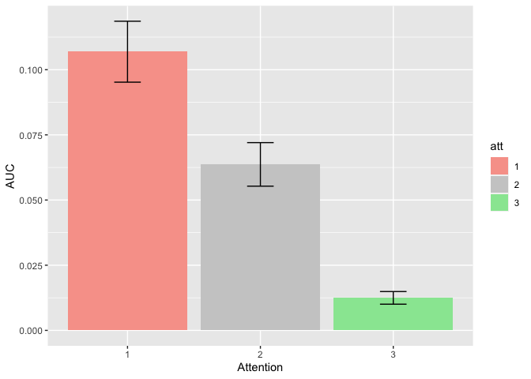
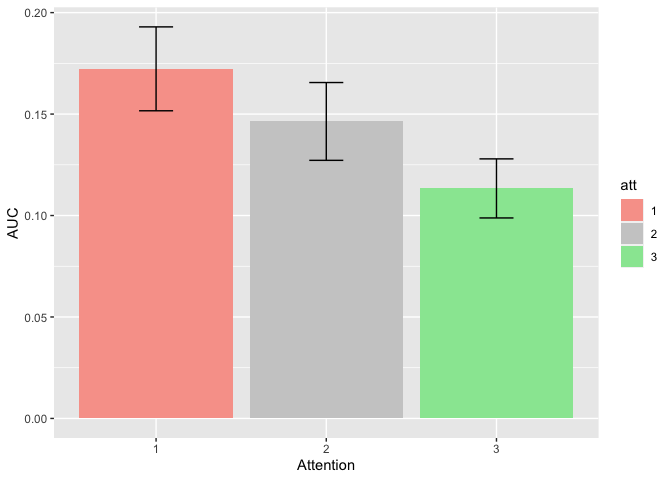
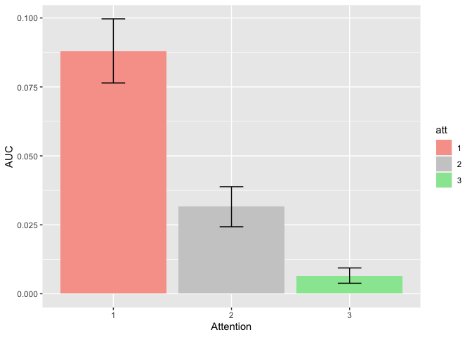

TWCF FOHO BigANOVA1
================
Karen Tian
2024-02-21

## AUC of orientation discrimination vs overall visibility report

``` r
m_anova = ezANOVA(
  data = data,
  dv = .(AUC),
  wid = .(subject),
  within = .(att),
  between = .(site,stimulus,task),
  detailed = TRUE,
  )
knitr::kable(m_anova)
```

<table class="kable_wrapper">
<tbody>
<tr>
<td>

|     | Effect                 | DFn | DFd |       SSn |      SSd |           F |         p | p\<.05 |       ges |
|:----|:-----------------------|----:|----:|----------:|---------:|------------:|----------:|:-------|----------:|
| 1   | (Intercept)            |   1 | 111 | 4.8747483 | 1.336936 | 404.7293755 | 0.0000000 | \*     | 0.7515843 |
| 2   | site                   |   1 | 111 | 0.0205653 | 1.336936 |   1.7074462 | 0.1940179 |        | 0.0126030 |
| 3   | stimulus               |   1 | 111 | 0.1963186 | 1.336936 |  16.2994891 | 0.0000998 | \*     | 0.1086113 |
| 4   | task                   |   1 | 111 | 1.4932472 | 1.336936 | 123.9778906 | 0.0000000 | \*     | 0.4810002 |
| 9   | att                    |   2 | 222 | 0.3024265 | 0.274280 | 122.3908087 | 0.0000000 | \*     | 0.1580372 |
| 5   | site:stimulus          |   1 | 111 | 0.0526898 | 1.336936 |   4.3746034 | 0.0387595 | \*     | 0.0316663 |
| 6   | site:task              |   1 | 111 | 0.0123321 | 1.336936 |   1.0238782 | 0.3138015 |        | 0.0075958 |
| 7   | stimulus:task          |   1 | 111 | 0.0677974 | 1.336936 |   5.6289232 | 0.0193869 | \*     | 0.0403793 |
| 10  | site:att               |   2 | 222 | 0.0022628 | 0.274280 |   0.9157503 | 0.4017226 |        | 0.0014024 |
| 11  | stimulus:att           |   2 | 222 | 0.0008848 | 0.274280 |   0.3580753 | 0.6994234 |        | 0.0005488 |
| 12  | task:att               |   2 | 222 | 0.0169413 | 0.274280 |   6.8560629 | 0.0012906 | \*     | 0.0104052 |
| 8   | site:stimulus:task     |   1 | 111 | 0.0837813 | 1.336936 |   6.9559982 | 0.0095521 | \*     | 0.0494286 |
| 13  | site:stimulus:att      |   2 | 222 | 0.0009288 | 0.274280 |   0.3758846 | 0.6871178 |        | 0.0005761 |
| 14  | site:task:att          |   2 | 222 | 0.0004820 | 0.274280 |   0.1950753 | 0.8229136 |        | 0.0002991 |
| 15  | stimulus:task:att      |   2 | 222 | 0.0050848 | 0.274280 |   2.0578028 | 0.1301639 |        | 0.0031460 |
| 16  | site:stimulus:task:att |   2 | 222 | 0.0062968 | 0.274280 |   2.5482716 | 0.0805030 |        | 0.0038929 |

</td>
<td>

|     | Effect                 |        W |       p | p\<.05 |
|:----|:-----------------------|---------:|--------:|:-------|
| 9   | att                    | 0.804531 | 6.4e-06 | \*     |
| 10  | site:att               | 0.804531 | 6.4e-06 | \*     |
| 11  | stimulus:att           | 0.804531 | 6.4e-06 | \*     |
| 12  | task:att               | 0.804531 | 6.4e-06 | \*     |
| 13  | site:stimulus:att      | 0.804531 | 6.4e-06 | \*     |
| 14  | site:task:att          | 0.804531 | 6.4e-06 | \*     |
| 15  | stimulus:task:att      | 0.804531 | 6.4e-06 | \*     |
| 16  | site:stimulus:task:att | 0.804531 | 6.4e-06 | \*     |

</td>
<td>

|     | Effect                 |       GGe |   p\[GG\] | p\[GG\]\<.05 |       HFe |   p\[HF\] | p\[HF\]\<.05 |
|:----|:-----------------------|----------:|----------:|:-------------|----------:|----------:|:-------------|
| 9   | att                    | 0.8364918 | 0.0000000 | \*           | 0.8477967 | 0.0000000 | \*           |
| 10  | site:att               | 0.8364918 | 0.3868468 |              | 0.8477967 | 0.3879857 |              |
| 11  | stimulus:att           | 0.8364918 | 0.6612616 |              | 0.8477967 | 0.6641437 |              |
| 12  | task:att               | 0.8364918 | 0.0025186 | \*           | 0.8477967 | 0.0024046 | \*           |
| 13  | site:stimulus:att      | 0.8364918 | 0.6494862 |              | 0.8477967 | 0.6523239 |              |
| 14  | site:task:att          | 0.8364918 | 0.7836361 |              | 0.8477967 | 0.7866804 |              |
| 15  | stimulus:task:att      | 0.8364918 | 0.1387632 |              | 0.8477967 | 0.1381708 |              |
| 16  | site:stimulus:task:att | 0.8364918 | 0.0905779 |              | 0.8477967 | 0.0898508 |              |

</td>
</tr>
</tbody>
</table>

## Detection (Experiments 1 & 3)

``` r
d <- data %>% filter(task=="1")
m_anova = ezANOVA(
  data = d,
  dv = .(AUC),
  wid = .(subject),
  within = .(att),
  between = .(site,stimulus),
  detailed = TRUE,
  )
knitr::kable(m_anova)
```

<table class="kable_wrapper">
<tbody>
<tr>
<td>

|     | Effect            | DFn | DFd |       SSn |       SSd |           F |         p | p\<.05 |       ges |
|:----|:------------------|----:|----:|----------:|----------:|------------:|----------:|:-------|----------:|
| 1   | (Intercept)       |   1 |  56 | 5.9121087 | 1.1439205 | 289.4240239 | 0.0000000 | \*     | 0.8227970 |
| 2   | site              |   1 |  56 | 0.0319017 | 1.1439205 |   1.5617319 | 0.2166096 |        | 0.0244425 |
| 3   | stimulus          |   1 |  56 | 0.2494018 | 1.1439205 |  12.2093292 | 0.0009369 | \*     | 0.1637921 |
| 5   | att               |   2 | 112 | 0.0903328 | 0.1293504 |  39.1080240 | 0.0000000 | \*     | 0.0662457 |
| 4   | site:stimulus     |   1 |  56 | 0.1345364 | 1.1439205 |   6.5861551 | 0.0129792 | \*     | 0.0955645 |
| 6   | site:att          |   2 | 112 | 0.0021828 | 0.1293504 |   0.9449997 | 0.3917565 |        | 0.0017114 |
| 7   | stimulus:att      |   2 | 112 | 0.0009428 | 0.1293504 |   0.4081835 | 0.6658419 |        | 0.0007399 |
| 8   | site:stimulus:att |   2 | 112 | 0.0059286 | 0.1293504 |   2.5666980 | 0.0812995 |        | 0.0046346 |

</td>
<td>

|     | Effect            |         W |         p | p\<.05 |
|:----|:------------------|----------:|----------:|:-------|
| 5   | att               | 0.9117507 | 0.0788121 |        |
| 6   | site:att          | 0.9117507 | 0.0788121 |        |
| 7   | stimulus:att      | 0.9117507 | 0.0788121 |        |
| 8   | site:stimulus:att | 0.9117507 | 0.0788121 |        |

</td>
<td>

|     | Effect            |       GGe |   p\[GG\] | p\[GG\]\<.05 |       HFe |   p\[HF\] | p\[HF\]\<.05 |
|:----|:------------------|----------:|----------:|:-------------|----------:|----------:|:-------------|
| 5   | att               | 0.9189071 | 0.0000000 | \*           | 0.9485899 | 0.0000000 | \*           |
| 6   | site:att          | 0.9189071 | 0.3853938 |              | 0.9485899 | 0.3878033 |              |
| 7   | stimulus:att      | 0.9189071 | 0.6486271 |              | 0.9485899 | 0.6551017 |              |
| 8   | site:stimulus:att | 0.9189071 | 0.0862533 |              | 0.9485899 | 0.0844104 |              |

</td>
</tr>
</tbody>
</table>

## Discrimination (Experiments 2 & 4)

``` r
d <- data %>% filter(task=="2")
m_anova = ezANOVA(
  data = d,
  dv = .(AUC),
  wid = .(subject),
  within = .(att),
  between = .(site,stimulus),
  detailed = TRUE,
  )
knitr::kable(m_anova)
```

<table class="kable_wrapper">
<tbody>
<tr>
<td>

|     | Effect            | DFn | DFd |       SSn |       SSd |           F |         p | p\<.05 |       ges |
|:----|:------------------|----:|----:|----------:|----------:|------------:|----------:|:-------|----------:|
| 1   | (Intercept)       |   1 |  55 | 0.4673350 | 0.1930149 | 133.1680584 | 0.0000000 | \*     | 0.5803389 |
| 2   | site              |   1 |  55 | 0.0005534 | 0.1930149 |   0.1576825 | 0.6928360 |        | 0.0016348 |
| 3   | stimulus          |   1 |  55 | 0.0157721 | 0.1930149 |   4.4942791 | 0.0385351 | \*     | 0.0445895 |
| 5   | att               |   2 | 110 | 0.2290265 | 0.1449296 |  86.9143299 | 0.0000000 | \*     | 0.4039474 |
| 4   | site:stimulus     |   1 |  55 | 0.0019346 | 0.1930149 |   0.5512757 | 0.4609563 |        | 0.0056921 |
| 6   | site:att          |   2 | 110 | 0.0005673 | 0.1449296 |   0.2152706 | 0.8066621 |        | 0.0016757 |
| 7   | stimulus:att      |   2 | 110 | 0.0050249 | 0.1449296 |   1.9069273 | 0.1534141 |        | 0.0146512 |
| 8   | site:stimulus:att |   2 | 110 | 0.0012969 | 0.1449296 |   0.4921783 | 0.6126330 |        | 0.0038230 |

</td>
<td>

|     | Effect            |         W |     p | p\<.05 |
|:----|:------------------|----------:|------:|:-------|
| 5   | att               | 0.5810815 | 4e-07 | \*     |
| 6   | site:att          | 0.5810815 | 4e-07 | \*     |
| 7   | stimulus:att      | 0.5810815 | 4e-07 | \*     |
| 8   | site:stimulus:att | 0.5810815 | 4e-07 | \*     |

</td>
<td>

|     | Effect            |       GGe |   p\[GG\] | p\[GG\]\<.05 |       HFe |   p\[HF\] | p\[HF\]\<.05 |
|:----|:------------------|----------:|----------:|:-------------|----------:|----------:|:-------------|
| 5   | att               | 0.7047621 | 0.0000000 | \*           | 0.7177895 | 0.0000000 | \*           |
| 6   | site:att          | 0.7047621 | 0.7273600 |              | 0.7177895 | 0.7316805 |              |
| 7   | stimulus:att      | 0.7047621 | 0.1665870 |              | 0.7177895 | 0.1660644 |              |
| 8   | site:stimulus:att | 0.7047621 | 0.5480564 |              | 0.7177895 | 0.5514108 |              |

</td>
</tr>
</tbody>
</table>

## Texture-defined figure-ground ovals (Experiments 1 & 2)

``` r
d <- data %>% filter(stimulus=="1")
m_anova = ezANOVA(
  data = d,
  dv = .(AUC),
  wid = .(subject),
  within = .(att),
  between = .(site,task),
  detailed = TRUE,
  )
knitr::kable(m_anova)
```

<table class="kable_wrapper">
<tbody>
<tr>
<td>

|     | Effect        | DFn | DFd |       SSn |       SSd |           F |         p | p\<.05 |       ges |
|:----|:--------------|----:|----:|----------:|----------:|------------:|----------:|:-------|----------:|
| 1   | (Intercept)   |   1 |  55 | 3.5224594 | 0.5613156 | 345.1450067 | 0.0000000 | \*     | 0.8304486 |
| 2   | site          |   1 |  55 | 0.0037661 | 0.5613156 |   0.3690134 | 0.5460426 |        | 0.0052094 |
| 3   | task          |   1 |  55 | 1.0939538 | 0.5613156 | 107.1900728 | 0.0000000 | \*     | 0.6033514 |
| 5   | att           |   2 | 110 | 0.1539891 | 0.1578593 |  53.6515737 | 0.0000000 | \*     | 0.1763576 |
| 4   | site:task     |   1 |  55 | 0.0162307 | 0.5613156 |   1.5903511 | 0.2125991 |        | 0.0220704 |
| 6   | site:att      |   2 | 110 | 0.0012485 | 0.1578593 |   0.4350068 | 0.6483688 |        | 0.0017331 |
| 7   | task:att      |   2 | 110 | 0.0144708 | 0.1578593 |   5.0417785 | 0.0080353 | \*     | 0.0197244 |
| 8   | site:task:att |   2 | 110 | 0.0037495 | 0.1578593 |   1.3063651 | 0.2749703 |        | 0.0051866 |

</td>
<td>

|     | Effect        |         W |         p | p\<.05 |
|:----|:--------------|----------:|----------:|:-------|
| 5   | att           | 0.9095621 | 0.0773524 |        |
| 6   | site:att      | 0.9095621 | 0.0773524 |        |
| 7   | task:att      | 0.9095621 | 0.0773524 |        |
| 8   | site:task:att | 0.9095621 | 0.0773524 |        |

</td>
<td>

|     | Effect        |       GGe |   p\[GG\] | p\[GG\]\<.05 |       HFe |   p\[HF\] | p\[HF\]\<.05 |
|:----|:--------------|----------:|----------:|:-------------|----------:|----------:|:-------------|
| 5   | att           | 0.9170628 | 0.0000000 | \*           | 0.9471398 | 0.0000000 | \*           |
| 6   | site:att      | 0.9170628 | 0.6312108 |              | 0.9471398 | 0.6376058 |              |
| 7   | task:att      | 0.9170628 | 0.0099231 | \*           | 0.9471398 | 0.0091914 | \*           |
| 8   | site:task:att | 0.9170628 | 0.2740871 |              | 0.9471398 | 0.2744592 |              |

</td>
</tr>
</tbody>
</table>

## Contrast-defined gratings (Experiments 3 & 4)

``` r
d <- data %>% filter(stimulus=="2")
m_anova = ezANOVA(
  data = d,
  dv = .(AUC),
  wid = .(subject),
  within = .(att),
  between = .(site,task),
  detailed = TRUE,
  )
knitr::kable(m_anova)
```

<table class="kable_wrapper">
<tbody>
<tr>
<td>

|     | Effect        | DFn | DFd |       SSn |       SSd |           F |         p | p\<.05 |       ges |
|:----|:--------------|----:|----:|----------:|----------:|------------:|----------:|:-------|----------:|
| 1   | (Intercept)   |   1 |  56 | 1.5581664 | 0.7756199 | 112.5001036 | 0.0000000 | \*     | 0.6359326 |
| 2   | site          |   1 |  56 | 0.0690467 | 0.7756199 |   4.9851961 | 0.0295805 | \*     | 0.0718423 |
| 3   | task          |   1 |  56 | 0.4676043 | 0.7756199 |  33.7611762 | 0.0000003 | \*     | 0.3439165 |
| 5   | att           |   2 | 112 | 0.1493286 | 0.1164207 |  71.8291788 | 0.0000000 | \*     | 0.1433964 |
| 4   | site:task     |   1 |  56 | 0.0798826 | 0.7756199 |   5.7675506 | 0.0196684 | \*     | 0.0821903 |
| 6   | site:att      |   2 | 112 | 0.0019483 | 0.1164207 |   0.9371494 | 0.3947928 |        | 0.0021793 |
| 7   | task:att      |   2 | 112 | 0.0075318 | 0.1164207 |   3.6228927 | 0.0298813 | \*     | 0.0083726 |
| 8   | site:task:att |   2 | 112 | 0.0030293 | 0.1164207 |   1.4571344 | 0.2372835 |        | 0.0033844 |

</td>
<td>

|     | Effect        |         W |     p | p\<.05 |
|:----|:--------------|----------:|------:|:-------|
| 5   | att           | 0.5897608 | 5e-07 | \*     |
| 6   | site:att      | 0.5897608 | 5e-07 | \*     |
| 7   | task:att      | 0.5897608 | 5e-07 | \*     |
| 8   | site:task:att | 0.5897608 | 5e-07 | \*     |

</td>
<td>

|     | Effect        |       GGe |   p\[GG\] | p\[GG\]\<.05 |       HFe |   p\[HF\] | p\[HF\]\<.05 |
|:----|:--------------|----------:|----------:|:-------------|----------:|----------:|:-------------|
| 5   | att           | 0.7090995 | 0.0000000 | \*           | 0.7221945 | 0.0000000 | \*           |
| 6   | site:att      | 0.7090995 | 0.3674305 |              | 0.7221945 | 0.3689481 |              |
| 7   | task:att      | 0.7090995 | 0.0459249 | \*           | 0.7221945 | 0.0450491 | \*           |
| 8   | site:task:att | 0.7090995 | 0.2380254 |              | 0.7221945 | 0.2381451 |              |

</td>
</tr>
</tbody>
</table>

## Experiment 1

``` r
d <- data %>% filter(stimulus=="1",task=="1",AUCMeasure=="1")
m_anova = ezANOVA(
  data = d,
  dv = .(AUC),
  wid = .(subject),
  within = .(att),
  between = .(site),
  detailed = TRUE,
  )
knitr::kable(m_anova)
```

<table class="kable_wrapper">
<tbody>
<tr>
<td>

| Effect      | DFn | DFd |       SSn |       SSd |          F |         p | p\<.05 |       ges |
|:------------|----:|----:|----------:|----------:|-----------:|----------:|:-------|----------:|
| (Intercept) |   1 |  28 | 4.2950413 | 0.4655536 | 258.318590 | 0.0000000 | \*     | 0.8863286 |
| site        |   1 |  28 | 0.0177061 | 0.4655536 |   1.064908 | 0.3109302 |        | 0.0311429 |
| att         |   2 |  56 | 0.0389284 | 0.0852842 |  12.780758 | 0.0000268 | \*     | 0.0660066 |
| site:att    |   2 |  56 | 0.0032984 | 0.0852842 |   1.082902 | 0.3455956 |        | 0.0059523 |

</td>
<td>

|     | Effect   |         W |        p | p\<.05 |
|:----|:---------|----------:|---------:|:-------|
| 3   | att      | 0.9731593 | 0.692601 |        |
| 4   | site:att | 0.9731593 | 0.692601 |        |

</td>
<td>

|     | Effect   |       GGe |   p\[GG\] | p\[GG\]\<.05 |      HFe |   p\[HF\] | p\[HF\]\<.05 |
|:----|:---------|----------:|----------:|:-------------|---------:|----------:|:-------------|
| 3   | att      | 0.9738609 | 0.0000327 | \*           | 1.045665 | 0.0000268 | \*           |
| 4   | site:att | 0.9738609 | 0.3444052 |              | 1.045665 | 0.3455956 |              |

</td>
</tr>
</tbody>
</table>

``` r
# Calculates mean, sd, se
dsum <- d %>% group_by(att) %>% 
  summarise( 
    n=n(),
    mean=mean(AUC),
    sd=sd(AUC)
  ) %>%
  mutate( se=sd/sqrt(n))

# Bar plots of AUC by att for overall vs feature visibility
ggplot(data=dsum, aes(x=att, y=mean, fill=att)) + scale_fill_manual(values=colors) +
  geom_bar(position="dodge", na.rm = TRUE, stat="identity") +
  labs(x="Attention", y = "AUC") + 
  geom_errorbar(aes(ymin=mean-se, ymax=mean+se), width=0.2)
```


### Paired t-tests


## Experiment 2

``` r
d <- data %>% filter(stimulus=="1",task=="2")
m_anova = ezANOVA(
  data = d,
  dv = .(AUC),
  wid = .(subject),
  within = .(att),
  between = .(site),
  detailed = TRUE,
  )
knitr::kable(m_anova)
```

<table class="kable_wrapper">
<tbody>
<tr>
<td>

| Effect      | DFn | DFd |       SSn |       SSd |          F |         p | p\<.05 |       ges |
|:------------|----:|----:|----------:|----------:|-----------:|----------:|:-------|----------:|
| (Intercept) |   1 |  27 | 0.3239123 | 0.0957619 | 91.3267883 | 0.0000000 | \*     | 0.6580248 |
| site        |   1 |  27 | 0.0022906 | 0.0957619 |  0.6458409 | 0.4286225 |        | 0.0134247 |
| att         |   2 |  54 | 0.1295838 | 0.0725751 | 48.2088514 | 0.0000000 | \*     | 0.4349605 |
| site:att    |   2 |  54 | 0.0016997 | 0.0725751 |  0.6323219 | 0.5352447 |        | 0.0099958 |

</td>
<td>

|     | Effect   |         W |         p | p\<.05 |
|:----|:---------|----------:|----------:|:-------|
| 3   | att      | 0.6549388 | 0.0040795 | \*     |
| 4   | site:att | 0.6549388 | 0.0040795 | \*     |

</td>
<td>

|     | Effect   |       GGe |   p\[GG\] | p\[GG\]\<.05 |       HFe |   p\[HF\] | p\[HF\]\<.05 |
|:----|:---------|----------:|----------:|:-------------|----------:|----------:|:-------------|
| 3   | att      | 0.7434606 | 0.0000000 | \*           | 0.7767348 | 0.0000000 | \*           |
| 4   | site:att | 0.7434606 | 0.4913681 |              | 0.7767348 | 0.4978158 |              |

</td>
</tr>
</tbody>
</table>

``` r
# Calculates mean, sd, se
dsum <- d %>% group_by(att) %>% 
  summarise( 
    n=n(),
    mean=mean(AUC),
    sd=sd(AUC)
  ) %>%
  mutate( se=sd/sqrt(n))

# Bar plots of AUC by att for overall vs feature visibility
ggplot(data=dsum, aes(x=att, y=mean, fill=att)) + scale_fill_manual(values=colors) +
  geom_bar(position="dodge", na.rm = TRUE, stat="identity") +
  labs(x="Attention", y = "AUC") + 
  geom_errorbar(aes(ymin=mean-se, ymax=mean+se), width=0.2)
```

<!-- -->

### Paired t-tests


## Experiment 3

``` r
d <- data %>% filter(stimulus=="2",task=="1")
m_anova = ezANOVA(
  data = d,
  dv = .(AUC),
  wid = .(subject),
  within = .(att),
  between = .(site),
  detailed = TRUE,
  )
knitr::kable(m_anova)
```

<table class="kable_wrapper">
<tbody>
<tr>
<td>

| Effect      | DFn | DFd |       SSn |       SSd |         F |         p | p\<.05 |       ges |
|:------------|----:|----:|----------:|----------:|----------:|----------:|:-------|----------:|
| (Intercept) |   1 |  28 | 1.8664692 | 0.6783669 | 77.039631 | 0.0000000 | \*     | 0.7209500 |
| site        |   1 |  28 | 0.1487320 | 0.6783669 |  6.139002 | 0.0195233 | \*     | 0.1707277 |
| att         |   2 |  56 | 0.0523472 | 0.0440662 | 33.261805 | 0.0000000 | \*     | 0.0675639 |
| site:att    |   2 |  56 | 0.0048130 | 0.0440662 |  3.058246 | 0.0548872 |        | 0.0066182 |

</td>
<td>

|     | Effect   |         W |         p | p\<.05 |
|:----|:---------|----------:|----------:|:-------|
| 3   | att      | 0.6076477 | 0.0012003 | \*     |
| 4   | site:att | 0.6076477 | 0.0012003 | \*     |

</td>
<td>

|     | Effect   |       GGe |   p\[GG\] | p\[GG\]\<.05 |       HFe |  p\[HF\] | p\[HF\]\<.05 |
|:----|:---------|----------:|----------:|:-------------|----------:|---------:|:-------------|
| 3   | att      | 0.7182091 | 0.0000001 | \*           | 0.7464378 | 0.000000 | \*           |
| 4   | site:att | 0.7182091 | 0.0734941 |              | 0.7464378 | 0.071397 |              |

</td>
</tr>
</tbody>
</table>

``` r
# Calculates mean, sd, se
dsum <- d %>% group_by(att) %>% 
  summarise( 
    n=n(),
    mean=mean(AUC),
    sd=sd(AUC)
  ) %>%
  mutate( se=sd/sqrt(n))

# Bar plots of AUC by att for overall vs feature visibility
ggplot(data=dsum, aes(x=att, y=mean, fill=att)) + scale_fill_manual(values=colors) +
  geom_bar(position="dodge", na.rm = TRUE, stat="identity") +
  labs(x="Attention", y = "AUC") + 
  geom_errorbar(aes(ymin=mean-se, ymax=mean+se), width=0.2)
```

<!-- -->

### Paired t-tests


## Experiment 4

``` r
d <- data %>% filter(stimulus=="2",task=="2")
m_anova = ezANOVA(
  data = d,
  dv = .(AUC),
  wid = .(subject),
  within = .(att),
  between = .(site),
  detailed = TRUE,
  )
knitr::kable(m_anova)
```

<table class="kable_wrapper">
<tbody>
<tr>
<td>

| Effect      | DFn | DFd |       SSn |       SSd |          F |         p | p\<.05 |       ges |
|:------------|----:|----:|----------:|----------:|-----------:|----------:|:-------|----------:|
| (Intercept) |   1 |  28 | 0.1593016 | 0.0972530 | 45.8643303 | 0.0000002 | \*     | 0.4843332 |
| site        |   1 |  28 | 0.0001974 | 0.0972530 |  0.0568224 | 0.8133266 |        | 0.0011623 |
| att         |   2 |  56 | 0.1045132 | 0.0723545 | 40.4448980 | 0.0000000 | \*     | 0.3812671 |
| site:att    |   2 |  56 | 0.0001645 | 0.0723545 |  0.0636688 | 0.9383835 |        | 0.0009691 |

</td>
<td>

|     | Effect   |         W |        p | p\<.05 |
|:----|:---------|----------:|---------:|:-------|
| 3   | att      | 0.4918949 | 6.92e-05 | \*     |
| 4   | site:att | 0.4918949 | 6.92e-05 | \*     |

</td>
<td>

|     | Effect   |       GGe |   p\[GG\] | p\[GG\]\<.05 |     HFe |  p\[HF\] | p\[HF\]\<.05 |
|:----|:---------|----------:|----------:|:-------------|--------:|---------:|:-------------|
| 3   | att      | 0.6630838 | 0.0000000 | \*           | 0.68342 | 0.000000 | \*           |
| 4   | site:att | 0.6630838 | 0.8672087 |              | 0.68342 | 0.873434 |              |

</td>
</tr>
</tbody>
</table>

``` r
# Calculates mean, sd, se
dsum <- d %>% group_by(att) %>% 
  summarise( 
    n=n(),
    mean=mean(AUC),
    sd=sd(AUC)
  ) %>%
  mutate( se=sd/sqrt(n))

# Bar plots of AUC by att for overall vs feature visibility
ggplot(data=dsum, aes(x=att, y=mean, fill=att)) + scale_fill_manual(values=colors) +
  geom_bar(position="dodge", na.rm = TRUE, stat="identity") +
  labs(x="Attention", y = "AUC") + 
  geom_errorbar(aes(ymin=mean-se, ymax=mean+se), width=0.2)
```

<!-- -->

### Paired t-tests


