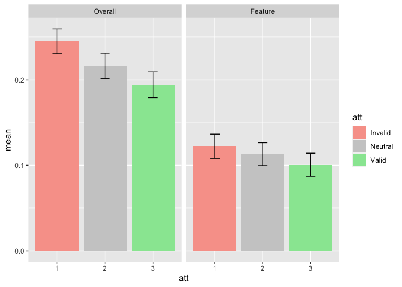
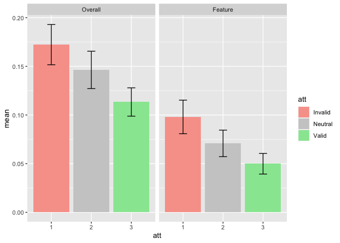
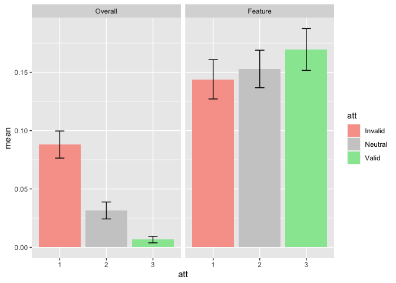

TWCF FOHO BigANOVAs
================
Karen Tian
2024-02-21

## ANOVA 2: AUC of orientation discrimination vs overall and task-relevant feature visibility report

``` r
m_anova = ezANOVA(
  data = data,
  dv = .(AUC),
  wid = .(subject),
  within = .(att,AUCMeasure),
  between = .(site,expt),
  detailed = TRUE,
  )
knitr::kable(m_anova)
```

<table class="kable_wrapper">
<tbody>
<tr>
<td>

|     | Effect                   | DFn | DFd |       SSn |       SSd |           F |         p | p\<.05 |       ges |
|:----|:-------------------------|----:|----:|----------:|----------:|------------:|----------:|:-------|----------:|
| 1   | (Intercept)              |   1 |  84 | 8.3226990 | 2.2001829 | 317.7493583 | 0.0000000 | \*     | 0.7278910 |
| 2   | site                     |   1 |  84 | 0.0491329 | 2.2001829 |   1.8758258 | 0.1744597 |        | 0.0155463 |
| 3   | expt                     |   2 |  84 | 0.4636700 | 2.2001829 |   8.8511450 | 0.0003250 | \*     | 0.1296993 |
| 5   | att                      |   2 | 168 | 0.1399608 | 0.3261065 |  36.0517345 | 0.0000000 | \*     | 0.0430483 |
| 9   | AUCMeasure               |   1 |  84 | 0.0618073 | 0.4910878 |  10.5720619 | 0.0016534 | \*     | 0.0194785 |
| 4   | site:expt                |   2 |  84 | 0.1628814 | 2.2001829 |   3.1092952 | 0.0498077 | \*     | 0.0497473 |
| 6   | site:att                 |   2 | 168 | 0.0017033 | 0.3261065 |   0.4387360 | 0.6455877 |        | 0.0005471 |
| 7   | expt:att                 |   4 | 168 | 0.0126749 | 0.3261065 |   1.6324313 | 0.1683583 |        | 0.0040573 |
| 10  | site:AUCMeasure          |   1 |  84 | 0.0007230 | 0.4910878 |   0.1236642 | 0.7259744 |        | 0.0002323 |
| 11  | expt:AUCMeasure          |   2 |  84 | 1.2542998 | 0.4910878 | 107.2732686 | 0.0000000 | \*     | 0.2873149 |
| 13  | att:AUCMeasure           |   2 | 168 | 0.0543753 | 0.0939150 |  48.6346765 | 0.0000000 | \*     | 0.0171766 |
| 8   | site:expt:att            |   4 | 168 | 0.0177065 | 0.3261065 |   2.2804605 | 0.0627372 |        | 0.0056588 |
| 12  | site:expt:AUCMeasure     |   2 |  84 | 0.0354106 | 0.4910878 |   3.0284703 | 0.0537042 |        | 0.0112532 |
| 14  | site:att:AUCMeasure      |   2 | 168 | 0.0011781 | 0.0939150 |   1.0537378 | 0.3509248 |        | 0.0003785 |
| 15  | expt:att:AUCMeasure      |   4 | 168 | 0.0409011 | 0.0939150 |  18.2915088 | 0.0000000 | \*     | 0.0129754 |
| 16  | site:expt:att:AUCMeasure |   4 | 168 | 0.0030445 | 0.0939150 |   1.3615617 | 0.2494276 |        | 0.0009776 |

</td>
<td>

|     | Effect                   |         W |       p | p\<.05 |
|:----|:-------------------------|----------:|--------:|:-------|
| 5   | att                      | 0.7433823 | 4.5e-06 | \*     |
| 6   | site:att                 | 0.7433823 | 4.5e-06 | \*     |
| 7   | expt:att                 | 0.7433823 | 4.5e-06 | \*     |
| 8   | site:expt:att            | 0.7433823 | 4.5e-06 | \*     |
| 13  | att:AUCMeasure           | 0.6733233 | 1.0e-07 | \*     |
| 14  | site:att:AUCMeasure      | 0.6733233 | 1.0e-07 | \*     |
| 15  | expt:att:AUCMeasure      | 0.6733233 | 1.0e-07 | \*     |
| 16  | site:expt:att:AUCMeasure | 0.6733233 | 1.0e-07 | \*     |

</td>
<td>

|     | Effect                   |       GGe |   p\[GG\] | p\[GG\]\<.05 |       HFe |   p\[HF\] | p\[HF\]\<.05 |
|:----|:-------------------------|----------:|----------:|:-------------|----------:|----------:|:-------------|
| 5   | att                      | 0.7957870 | 0.0000000 | \*           | 0.8086782 | 0.0000000 | \*           |
| 6   | site:att                 | 0.7957870 | 0.6003589 |              | 0.8086782 | 0.6035348 |              |
| 7   | expt:att                 | 0.7957870 | 0.1820569 |              | 0.8086782 | 0.1811764 |              |
| 8   | site:expt:att            | 0.7957870 | 0.0784659 |              | 0.8086782 | 0.0773608 |              |
| 13  | att:AUCMeasure           | 0.7537631 | 0.0000000 | \*           | 0.7645530 | 0.0000000 | \*           |
| 14  | site:att:AUCMeasure      | 0.7537631 | 0.3350071 |              | 0.7645530 | 0.3358667 |              |
| 15  | expt:att:AUCMeasure      | 0.7537631 | 0.0000000 | \*           | 0.7645530 | 0.0000000 | \*           |
| 16  | site:expt:att:AUCMeasure | 0.7537631 | 0.2575259 |              | 0.7645530 | 0.2572183 |              |

</td>
</tr>
</tbody>
</table>

## Experiment 1

``` r
d <- data %>% filter(expt=="1")
m_anova = ezANOVA(
  data = d,
  dv = .(AUC),
  wid = .(subject),
  within = .(att,AUCMeasure),
  between = .(site),
  detailed = TRUE,
  )
knitr::kable(m_anova)
```

<table class="kable_wrapper">
<tbody>
<tr>
<td>

|     | Effect              | DFn | DFd |       SSn |       SSd |           F |         p | p\<.05 |       ges |
|:----|:--------------------|----:|----:|----------:|----------:|------------:|----------:|:-------|----------:|
| 1   | (Intercept)         |   1 |  28 | 4.9127208 | 0.7421306 | 185.3530593 | 0.0000000 | \*     | 0.8254797 |
| 2   | site                |   1 |  28 | 0.0230375 | 0.7421306 |   0.8691879 | 0.3591502 |        | 0.0216994 |
| 3   | att                 |   2 |  56 | 0.0394130 | 0.1144692 |   9.6407142 | 0.0002524 | \*     | 0.0365597 |
| 5   | AUCMeasure          |   1 |  28 | 0.5103937 | 0.1653796 |  86.4134572 | 0.0000000 | \*     | 0.3294935 |
| 4   | site:att            |   2 |  56 | 0.0042733 | 0.1144692 |   1.0452803 | 0.3583512 |        | 0.0040975 |
| 6   | site:AUCMeasure     |   1 |  28 | 0.0013250 | 0.1653796 |   0.2243288 | 0.6394334 |        | 0.0012741 |
| 7   | att:AUCMeasure      |   2 |  56 | 0.0066100 | 0.0166521 |  11.1145379 | 0.0000861 | \*     | 0.0063239 |
| 8   | site:att:AUCMeasure |   2 |  56 | 0.0002561 | 0.0166521 |   0.4305786 | 0.6522669 |        | 0.0002465 |

</td>
<td>

|     | Effect              |         W |         p | p\<.05 |
|:----|:--------------------|----------:|----------:|:-------|
| 3   | att                 | 0.9169504 | 0.3102193 |        |
| 4   | site:att            | 0.9169504 | 0.3102193 |        |
| 7   | att:AUCMeasure      | 0.9797571 | 0.7587497 |        |
| 8   | site:att:AUCMeasure | 0.9797571 | 0.7587497 |        |

</td>
<td>

|     | Effect              |       GGe |   p\[GG\] | p\[GG\]\<.05 |       HFe |   p\[HF\] | p\[HF\]\<.05 |
|:----|:--------------------|----------:|----------:|:-------------|----------:|----------:|:-------------|
| 3   | att                 | 0.9233187 | 0.0003888 | \*           | 0.9855805 | 0.0002737 | \*           |
| 4   | site:att            | 0.9233187 | 0.3541195 |              | 0.9855805 | 0.3575950 |              |
| 7   | att:AUCMeasure      | 0.9801587 | 0.0000982 | \*           | 1.0531850 | 0.0000861 | \*           |
| 8   | site:att:AUCMeasure | 0.9801587 | 0.6483195 |              | 1.0531850 | 0.6522669 |              |

</td>
</tr>
</tbody>
</table>

<!-- -->

## Experiment 3

``` r
d <- data %>% filter(expt=="3")
m_anova = ezANOVA(
  data = d,
  dv = .(AUC),
  wid = .(subject),
  within = .(att,AUCMeasure),
  between = .(site),
  detailed = TRUE,
  )
knitr::kable(m_anova)
```

<table class="kable_wrapper">
<tbody>
<tr>
<td>

|     | Effect              | DFn | DFd |       SSn |       SSd |          F |         p | p\<.05 |       ges |
|:----|:--------------------|----:|----:|----------:|----------:|-----------:|----------:|:-------|----------:|
| 1   | (Intercept)         |   1 |  28 | 2.1180269 | 1.0071606 | 58.8831146 | 0.0000000 | \*     | 0.6396111 |
| 2   | site                |   1 |  28 | 0.1752771 | 1.0071606 |  4.8728662 | 0.0356455 | \*     | 0.1280629 |
| 3   | att                 |   2 |  56 | 0.0859280 | 0.1053627 | 22.8352435 | 0.0000001 | \*     | 0.0671664 |
| 5   | AUCMeasure          |   1 |  28 | 0.2272782 | 0.0654593 | 97.2175907 | 0.0000000 | \*     | 0.1599784 |
| 4   | site:att            |   2 |  56 | 0.0093110 | 0.1053627 |  2.4743851 | 0.0933784 |        | 0.0077417 |
| 6   | site:AUCMeasure     |   1 |  28 | 0.0160634 | 0.0654593 |  6.8710769 | 0.0140014 | \*     | 0.0132814 |
| 7   | att:AUCMeasure      |   2 |  56 | 0.0013272 | 0.0154197 |  2.4100578 | 0.0990700 |        | 0.0011109 |
| 8   | site:att:AUCMeasure |   2 |  56 | 0.0001312 | 0.0154197 |  0.2383126 | 0.7887514 |        | 0.0001100 |

</td>
<td>

|     | Effect              |         W |         p | p\<.05 |
|:----|:--------------------|----------:|----------:|:-------|
| 3   | att                 | 0.4421132 | 0.0000164 | \*     |
| 4   | site:att            | 0.4421132 | 0.0000164 | \*     |
| 7   | att:AUCMeasure      | 0.6398485 | 0.0024101 | \*     |
| 8   | site:att:AUCMeasure | 0.6398485 | 0.0024101 | \*     |

</td>
<td>

|     | Effect              |       GGe |   p\[GG\] | p\[GG\]\<.05 |       HFe |   p\[HF\] | p\[HF\]\<.05 |
|:----|:--------------------|----------:|----------:|:-------------|----------:|----------:|:-------------|
| 3   | att                 | 0.6418952 | 0.0000073 | \*           | 0.6593360 | 0.0000057 | \*           |
| 4   | site:att            | 0.6418952 | 0.1172215 |              | 0.6593360 | 0.1160020 |              |
| 7   | att:AUCMeasure      | 0.7352122 | 0.1161651 |              | 0.7659811 | 0.1140973 |              |
| 8   | site:att:AUCMeasure | 0.7352122 | 0.7198788 |              | 0.7659811 | 0.7293112 |              |

</td>
</tr>
</tbody>
</table>

<!-- -->

## Experiment 4

``` r
d <- data %>% filter(expt=="4")
m_anova = ezANOVA(
  data = d,
  dv = .(AUC),
  wid = .(subject),
  within = .(att,AUCMeasure),
  between = .(site),
  detailed = TRUE,
  )
knitr::kable(m_anova)
```

<table class="kable_wrapper">
<tbody>
<tr>
<td>

|     | Effect              | DFn | DFd |       SSn |       SSd |           F |         p | p\<.05 |       ges |
|:----|:--------------------|----:|----:|----------:|----------:|------------:|----------:|:-------|----------:|
| 1   | (Intercept)         |   1 |  28 | 1.7556213 | 0.4508917 | 109.0226216 | 0.0000000 | \*     | 0.6663004 |
| 2   | site                |   1 |  28 | 0.0136996 | 0.4508917 |   0.8507343 | 0.3642247 |        | 0.0153418 |
| 3   | att                 |   2 |  56 | 0.0272947 | 0.1062746 |   7.1912914 | 0.0016605 | \*     | 0.0301082 |
| 5   | AUCMeasure          |   1 |  28 | 0.5784351 | 0.2602489 |  62.2334307 | 0.0000000 | \*     | 0.3968153 |
| 4   | site:att            |   2 |  56 | 0.0058255 | 0.1062746 |   1.5348281 | 0.2244194 |        | 0.0065818 |
| 6   | site:AUCMeasure     |   1 |  28 | 0.0187452 | 0.2602489 |   2.0167802 | 0.1666084 |        | 0.0208743 |
| 7   | att:AUCMeasure      |   2 |  56 | 0.0873391 | 0.0618431 |  39.5435408 | 0.0000000 | \*     | 0.0903573 |
| 8   | site:att:AUCMeasure |   2 |  56 | 0.0038354 | 0.0618431 |   1.7364880 | 0.1854872 |        | 0.0043431 |

</td>
<td>

|     | Effect              |         W |         p | p\<.05 |
|:----|:--------------------|----------:|----------:|:-------|
| 3   | att                 | 0.5154259 | 0.0001301 | \*     |
| 4   | site:att            | 0.5154259 | 0.0001301 | \*     |
| 7   | att:AUCMeasure      | 0.3979374 | 0.0000040 | \*     |
| 8   | site:att:AUCMeasure | 0.3979374 | 0.0000040 | \*     |

</td>
<td>

|     | Effect              |       GGe |   p\[GG\] | p\[GG\]\<.05 |       HFe |   p\[HF\] | p\[HF\]\<.05 |
|:----|:--------------------|----------:|----------:|:-------------|----------:|----------:|:-------------|
| 3   | att                 | 0.6735939 | 0.0060627 | \*           | 0.6953946 | 0.0055574 | \*           |
| 4   | site:att            | 0.6735939 | 0.2282906 |              | 0.6953946 | 0.2282946 |              |
| 7   | att:AUCMeasure      | 0.6241953 | 0.0000001 | \*           | 0.6392761 | 0.0000000 | \*           |
| 8   | site:att:AUCMeasure | 0.6241953 | 0.1971051 |              | 0.6392761 | 0.1968180 |              |

</td>
</tr>
</tbody>
</table>

<!-- -->
