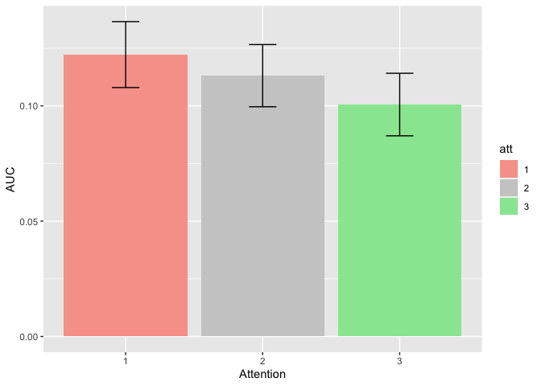
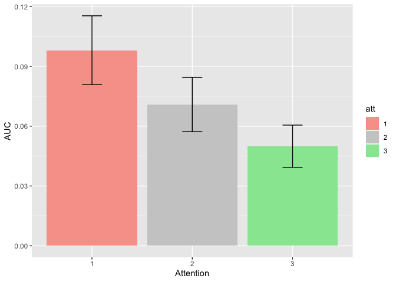
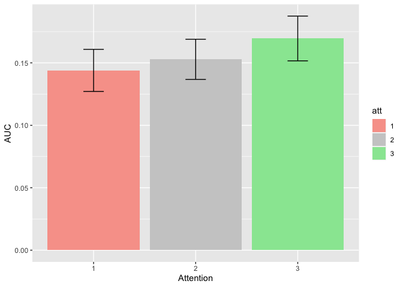

TWCF FOHO BigANOVA3
================
Karen Tian
2024-02-21

## ANOVA 3: AUC of orientation discrimination vs task-relevant feature visibility report

``` r
m_anova = ezANOVA(
  data = data,
  dv = .(AUC),
  wid = .(subject),
  within = .(att),
  between = .(site,expt),
  detailed = TRUE,
  )
knitr::kable(m_anova)
```

<table class="kable_wrapper">
<tbody>
<tr>
<td>

|     | Effect        | DFn | DFd |       SSn |       SSd |           F |         p | p\<.05 |       ges |
|:----|:--------------|----:|----:|----------:|----------:|------------:|----------:|:-------|----------:|
| 1   | (Intercept)   |   1 |  84 | 3.4750340 | 1.4500972 | 201.2988233 | 0.0000000 | \*     | 0.6756235 |
| 2   | site          |   1 |  84 | 0.0308879 | 1.4500972 |   1.7892503 | 0.1846280 |        | 0.0181768 |
| 3   | expt          |   2 |  84 | 0.3066300 | 1.4500972 |   8.8811009 | 0.0003170 | \*     | 0.1552522 |
| 5   | att           |   2 | 168 | 0.0099534 | 0.2183166 |   3.8297001 | 0.0236365 | \*     | 0.0059304 |
| 4   | site:expt     |   2 |  84 | 0.0506244 | 1.4500972 |   1.4662630 | 0.2366320 |        | 0.0294492 |
| 6   | site:att      |   2 | 168 | 0.0012471 | 0.2183166 |   0.4798481 | 0.6197229 |        | 0.0007469 |
| 7   | expt:att      |   4 | 168 | 0.0421698 | 0.2183166 |   8.1126805 | 0.0000053 | \*     | 0.0246523 |
| 8   | site:expt:att |   4 | 168 | 0.0141094 | 0.2183166 |   2.7143748 | 0.0316702 | \*     | 0.0083858 |

</td>
<td>

|     | Effect        |         W |   p | p\<.05 |
|:----|:--------------|----------:|----:|:-------|
| 5   | att           | 0.6021217 |   0 | \*     |
| 6   | site:att      | 0.6021217 |   0 | \*     |
| 7   | expt:att      | 0.6021217 |   0 | \*     |
| 8   | site:expt:att | 0.6021217 |   0 | \*     |

</td>
<td>

|     | Effect        |       GGe |   p\[GG\] | p\[GG\]\<.05 |       HFe |   p\[HF\] | p\[HF\]\<.05 |
|:----|:--------------|----------:|----------:|:-------------|----------:|----------:|:-------------|
| 5   | att           | 0.7153699 | 0.0378272 | \*           | 0.7243184 | 0.0372737 | \*           |
| 6   | site:att      | 0.7153699 | 0.5566397 |              | 0.7243184 | 0.5589651 |              |
| 7   | expt:att      | 0.7153699 | 0.0000770 | \*           | 0.7243184 | 0.0000707 | \*           |
| 8   | site:expt:att | 0.7153699 | 0.0504556 |              | 0.7243184 | 0.0497160 | \*           |

</td>
</tr>
</tbody>
</table>

## Task-relevant feature visibility: BU

``` r
d <- data %>% filter(site=="1")
m_anova = ezANOVA(
  data = d,
  dv = .(AUC),
  wid = .(subject),
  within = .(att),
  between = .(expt),
  detailed = TRUE,
  )
```

    ## Warning: You have removed one or more Ss from the analysis. Refactoring
    ## "subject" for ANOVA.

``` r
knitr::kable(m_anova)
```

<table class="kable_wrapper">
<tbody>
<tr>
<td>

| Effect      | DFn | DFd |       SSn |       SSd |         F |         p | p\<.05 |       ges |
|:------------|----:|----:|----------:|----------:|----------:|----------:|:-------|----------:|
| (Intercept) |   1 |  42 | 1.4253383 | 0.9185146 | 65.175018 | 0.0000000 | \*     | 0.5911536 |
| expt        |   2 |  42 | 0.1852453 | 0.9185146 |  4.235263 | 0.0211077 | \*     | 0.1581914 |
| att         |   2 |  84 | 0.0087910 | 0.0672603 |  5.489460 | 0.0057463 | \*     | 0.0088391 |
| expt:att    |   4 |  84 | 0.0046113 | 0.0672603 |  1.439729 | 0.2280611 |        | 0.0046560 |

</td>
<td>

|     | Effect   |         W |        p | p\<.05 |
|:----|:---------|----------:|---------:|:-------|
| 3   | att      | 0.6189135 | 5.35e-05 | \*     |
| 4   | expt:att | 0.6189135 | 5.35e-05 | \*     |

</td>
<td>

|     | Effect   |       GGe |   p\[GG\] | p\[GG\]\<.05 |       HFe |   p\[HF\] | p\[HF\]\<.05 |
|:----|:---------|----------:|----------:|:-------------|----------:|----------:|:-------------|
| 3   | att      | 0.7240676 | 0.0126146 | \*           | 0.7431201 | 0.0119455 | \*           |
| 4   | expt:att | 0.7240676 | 0.2407450 |              | 0.7431201 | 0.2399288 |              |

</td>
</tr>
</tbody>
</table>

## Task-relevant feature visibility: UCI

``` r
d <- data %>% filter(site=="0")
m_anova = ezANOVA(
  data = d,
  dv = .(AUC),
  wid = .(subject),
  within = .(att),
  between = .(expt),
  detailed = TRUE,
  )
```

    ## Warning: You have removed one or more Ss from the analysis. Refactoring
    ## "subject" for ANOVA.

``` r
knitr::kable(m_anova)
```

<table class="kable_wrapper">
<tbody>
<tr>
<td>

| Effect      | DFn | DFd |       SSn |       SSd |           F |         p | p\<.05 |       ges |
|:------------|----:|----:|----------:|----------:|------------:|----------:|:-------|----------:|
| (Intercept) |   1 |  42 | 2.0805837 | 0.5315826 | 164.3855940 | 0.0000000 | \*     | 0.7529555 |
| expt        |   2 |  42 | 0.1720091 | 0.5315826 |   6.7951637 | 0.0027749 | \*     | 0.2012631 |
| att         |   2 |  84 | 0.0024095 | 0.1510563 |   0.6699493 | 0.5144473 |        | 0.0035173 |
| expt:att    |   4 |  84 | 0.0516679 | 0.1510563 |   7.1829278 | 0.0000504 | \*     | 0.0703629 |

</td>
<td>

|     | Effect   |        W |       p | p\<.05 |
|:----|:---------|---------:|--------:|:-------|
| 3   | att      | 0.591262 | 2.1e-05 | \*     |
| 4   | expt:att | 0.591262 | 2.1e-05 | \*     |

</td>
<td>

|     | Effect   |       GGe |   p\[GG\] | p\[GG\]\<.05 |       HFe |   p\[HF\] | p\[HF\]\<.05 |
|:----|:---------|----------:|----------:|:-------------|----------:|----------:|:-------------|
| 3   | att      | 0.7098552 | 0.4664280 |              | 0.7275398 | 0.4698634 |              |
| 4   | expt:att | 0.7098552 | 0.0004298 | \*           | 0.7275398 | 0.0003768 | \*           |

</td>
</tr>
</tbody>
</table>

## Experiment 1: Task-relevant feature visibility

``` r
d <- data %>% filter(expt=="1")
m_anova = ezANOVA(
  data = d,
  dv = .(AUC),
  wid = .(subject),
  within = .(att),
  between = .(site),
  detailed = TRUE,
  )
```

    ## Warning: You have removed one or more Ss from the analysis. Refactoring
    ## "subject" for ANOVA.

``` r
knitr::kable(m_anova)
```

<table class="kable_wrapper">
<tbody>
<tr>
<td>

| Effect      | DFn | DFd |       SSn |       SSd |          F |         p | p\<.05 |       ges |
|:------------|----:|----:|----------:|----------:|-----------:|----------:|:-------|----------:|
| (Intercept) |   1 |  28 | 1.1280732 | 0.4419566 | 71.4686654 | 0.0000000 | \*     | 0.6981226 |
| site        |   1 |  28 | 0.0066564 | 0.4419566 |  0.4217126 | 0.5213757 |        | 0.0134622 |
| att         |   2 |  56 | 0.0070946 | 0.0458371 |  4.3337963 | 0.0177843 | \*     | 0.0143358 |
| site:att    |   2 |  56 | 0.0012310 | 0.0458371 |  0.7519681 | 0.4761378 |        | 0.0025173 |

</td>
<td>

|     | Effect   |         W |         p | p\<.05 |
|:----|:---------|----------:|----------:|:-------|
| 3   | att      | 0.8358401 | 0.0888512 |        |
| 4   | site:att | 0.8358401 | 0.0888512 |        |

</td>
<td>

|     | Effect   |       GGe |   p\[GG\] | p\[GG\]\<.05 |       HFe |   p\[HF\] | p\[HF\]\<.05 |
|:----|:---------|----------:|----------:|:-------------|----------:|----------:|:-------------|
| 3   | att      | 0.8589886 | 0.0233420 | \*           | 0.9097727 | 0.0211616 | \*           |
| 4   | site:att | 0.8589886 | 0.4580881 |              | 0.9097727 | 0.4649149 |              |

</td>
</tr>
</tbody>
</table>




## Experiment 3: Task-relevant feature visibility

``` r
d <- data %>% filter(expt=="3")
m_anova = ezANOVA(
  data = d,
  dv = .(AUC),
  wid = .(subject),
  within = .(att),
  between = .(site),
  detailed = TRUE,
  )
```

    ## Warning: You have removed one or more Ss from the analysis. Refactoring
    ## "subject" for ANOVA.

``` r
knitr::kable(m_anova)
```

<table class="kable_wrapper">
<tbody>
<tr>
<td>

| Effect      | DFn | DFd |       SSn |       SSd |         F |         p | p\<.05 |       ges |
|:------------|----:|----:|----------:|----------:|----------:|----------:|:-------|----------:|
| (Intercept) |   1 |  28 | 0.4788360 | 0.3942530 | 34.007122 | 0.0000029 | \*     | 0.5041413 |
| site        |   1 |  28 | 0.0426085 | 0.3942530 |  3.026073 | 0.0929198 |        | 0.0829641 |
| att         |   2 |  56 | 0.0349080 | 0.0767162 | 12.740763 | 0.0000275 | \*     | 0.0690048 |
| site:att    |   2 |  56 | 0.0046292 | 0.0767162 |  1.689568 | 0.1938726 |        | 0.0097334 |

</td>
<td>

|     | Effect   |         W |       p | p\<.05 |
|:----|:---------|----------:|--------:|:-------|
| 3   | att      | 0.3694011 | 1.4e-06 | \*     |
| 4   | site:att | 0.3694011 | 1.4e-06 | \*     |

</td>
<td>

|     | Effect   |       GGe |   p\[GG\] | p\[GG\]\<.05 |       HFe |   p\[HF\] | p\[HF\]\<.05 |
|:----|:---------|----------:|----------:|:-------------|----------:|----------:|:-------------|
| 3   | att      | 0.6132716 | 0.0005441 | \*           | 0.6269223 | 0.0004893 | \*           |
| 4   | site:att | 0.6132716 | 0.2039790 |              | 0.6269223 | 0.2038129 |              |

</td>
</tr>
</tbody>
</table>




## Experiment 4: Task-relevant feature visibility

``` r
d <- data %>% filter(expt=="4")
m_anova = ezANOVA(
  data = d,
  dv = .(AUC),
  wid = .(subject),
  within = .(att),
  between = .(site),
  detailed = TRUE,
  )
```

    ## Warning: You have removed one or more Ss from the analysis. Refactoring
    ## "subject" for ANOVA.

``` r
knitr::kable(m_anova)
```

<table class="kable_wrapper">
<tbody>
<tr>
<td>

| Effect      | DFn | DFd |       SSn |       SSd |         F |         p | p\<.05 |       ges |
|:------------|----:|----:|----------:|----------:|----------:|----------:|:-------|----------:|
| (Intercept) |   1 |  28 | 2.1747548 | 0.6138876 | 99.192642 | 0.0000000 | \*     | 0.7539698 |
| site        |   1 |  28 | 0.0322474 | 0.6138876 |  1.470836 | 0.2353472 |        | 0.0434661 |
| att         |   2 |  56 | 0.0101207 | 0.0957633 |  2.959163 | 0.0600243 |        | 0.0140610 |
| site:att    |   2 |  56 | 0.0094963 | 0.0957633 |  2.776600 | 0.0708348 |        | 0.0132049 |

</td>
<td>

|     | Effect   |         W |   p | p\<.05 |
|:----|:---------|----------:|----:|:-------|
| 3   | att      | 0.2834904 |   0 | \*     |
| 4   | site:att | 0.2834904 |   0 | \*     |

</td>
<td>

|     | Effect   |       GGe |   p\[GG\] | p\[GG\]\<.05 |       HFe |   p\[HF\] | p\[HF\]\<.05 |
|:----|:---------|----------:|----------:|:-------------|----------:|----------:|:-------------|
| 3   | att      | 0.5825776 | 0.0895472 |              | 0.5923176 | 0.0887495 |              |
| 4   | site:att | 0.5825776 | 0.1002745 |              | 0.5923176 | 0.0995082 |              |

</td>
</tr>
</tbody>
</table>




