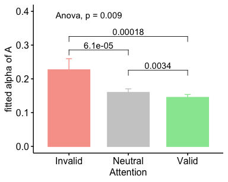

twcf\_expt1\_stats\_BU
================
Karen Tian
2023-02-07

## TWCF 1.1 Cue Tex Det Analysis

• [AUC](#AUC) • [alphaA](#alphaA)

### AUC

<table class="kable_wrapper">

<tbody>

<tr>

<td>

<table>

<thead>

<tr>

<th style="text-align:left;">

</th>

<th style="text-align:left;">

Effect

</th>

<th style="text-align:right;">

DFn

</th>

<th style="text-align:right;">

DFd

</th>

<th style="text-align:right;">

F

</th>

<th style="text-align:right;">

p

</th>

<th style="text-align:left;">

p\<.05

</th>

<th style="text-align:right;">

ges

</th>

</tr>

</thead>

<tbody>

<tr>

<td style="text-align:left;">

2

</td>

<td style="text-align:left;">

att

</td>

<td style="text-align:right;">

2

</td>

<td style="text-align:right;">

28

</td>

<td style="text-align:right;">

15.06003

</td>

<td style="text-align:right;">

3.63e-05

</td>

<td style="text-align:left;">

  - 
    
    </td>
    
    <td style="text-align:right;">
    
    0.0757676
    
    </td>
    
    </tr>
    
    </tbody>
    
    </table>

</td>

<td>

<table>

<thead>

<tr>

<th style="text-align:left;">

</th>

<th style="text-align:left;">

Effect

</th>

<th style="text-align:right;">

W

</th>

<th style="text-align:right;">

p

</th>

<th style="text-align:left;">

p\<.05

</th>

</tr>

</thead>

<tbody>

<tr>

<td style="text-align:left;">

2

</td>

<td style="text-align:left;">

att

</td>

<td style="text-align:right;">

0.9205779

</td>

<td style="text-align:right;">

0.5839741

</td>

<td style="text-align:left;">

</td>

</tr>

</tbody>

</table>

</td>

<td>

<table>

<thead>

<tr>

<th style="text-align:left;">

</th>

<th style="text-align:left;">

Effect

</th>

<th style="text-align:right;">

GGe

</th>

<th style="text-align:right;">

p\[GG\]

</th>

<th style="text-align:left;">

p\[GG\]\<.05

</th>

<th style="text-align:right;">

HFe

</th>

<th style="text-align:right;">

p\[HF\]

</th>

<th style="text-align:left;">

p\[HF\]\<.05

</th>

</tr>

</thead>

<tbody>

<tr>

<td style="text-align:left;">

2

</td>

<td style="text-align:left;">

att

</td>

<td style="text-align:right;">

0.9264217

</td>

<td style="text-align:right;">

6.34e-05

</td>

<td style="text-align:left;">

  - 
    
    </td>
    
    <td style="text-align:right;">
    
    1.061674
    
    </td>
    
    <td style="text-align:right;">
    
    3.63e-05
    
    </td>
    
    <td style="text-align:left;">
    
      - 
        
        </td>
        
        </tr>
        
        </tbody>
        
        </table>

</td>

</tr>

</tbody>

</table>

<table>

<thead>

<tr>

<th style="text-align:left;">

att

</th>

<th style="text-align:right;">

mean

</th>

<th style="text-align:right;">

sd

</th>

</tr>

</thead>

<tbody>

<tr>

<td style="text-align:left;">

\-1

</td>

<td style="text-align:right;">

0.2623057

</td>

<td style="text-align:right;">

0.0908048

</td>

</tr>

<tr>

<td style="text-align:left;">

0

</td>

<td style="text-align:right;">

0.2210933

</td>

<td style="text-align:right;">

0.0844532

</td>

</tr>

<tr>

<td style="text-align:left;">

1

</td>

<td style="text-align:right;">

0.2029487

</td>

<td style="text-align:right;">

0.0938347

</td>

</tr>

</tbody>

</table>

<!-- -->

### alphaA

<table class="kable_wrapper">

<tbody>

<tr>

<td>

<table>

<thead>

<tr>

<th style="text-align:left;">

</th>

<th style="text-align:left;">

Effect

</th>

<th style="text-align:right;">

DFn

</th>

<th style="text-align:right;">

DFd

</th>

<th style="text-align:right;">

F

</th>

<th style="text-align:right;">

p

</th>

<th style="text-align:left;">

p\<.05

</th>

<th style="text-align:right;">

ges

</th>

</tr>

</thead>

<tbody>

<tr>

<td style="text-align:left;">

2

</td>

<td style="text-align:left;">

att

</td>

<td style="text-align:right;">

2

</td>

<td style="text-align:right;">

28

</td>

<td style="text-align:right;">

9.082251

</td>

<td style="text-align:right;">

0.0009118

</td>

<td style="text-align:left;">

  - 
    
    </td>
    
    <td style="text-align:right;">
    
    0.1706006
    
    </td>
    
    </tr>
    
    </tbody>
    
    </table>

</td>

<td>

<table>

<thead>

<tr>

<th style="text-align:left;">

</th>

<th style="text-align:left;">

Effect

</th>

<th style="text-align:right;">

W

</th>

<th style="text-align:right;">

p

</th>

<th style="text-align:left;">

p\<.05

</th>

</tr>

</thead>

<tbody>

<tr>

<td style="text-align:left;">

2

</td>

<td style="text-align:left;">

att

</td>

<td style="text-align:right;">

0.053937

</td>

<td style="text-align:right;">

0

</td>

<td style="text-align:left;">

  - 
    
    </td>
    
    </tr>
    
    </tbody>
    
    </table>

</td>

<td>

<table>

<thead>

<tr>

<th style="text-align:left;">

</th>

<th style="text-align:left;">

Effect

</th>

<th style="text-align:right;">

GGe

</th>

<th style="text-align:right;">

p\[GG\]

</th>

<th style="text-align:left;">

p\[GG\]\<.05

</th>

<th style="text-align:right;">

HFe

</th>

<th style="text-align:right;">

p\[HF\]

</th>

<th style="text-align:left;">

p\[HF\]\<.05

</th>

</tr>

</thead>

<tbody>

<tr>

<td style="text-align:left;">

2

</td>

<td style="text-align:left;">

att

</td>

<td style="text-align:right;">

0.513858

</td>

<td style="text-align:right;">

0.0087095

</td>

<td style="text-align:left;">

  - 
    
    </td>
    
    <td style="text-align:right;">
    
    0.5170924
    
    </td>
    
    <td style="text-align:right;">
    
    0.0085781
    
    </td>
    
    <td style="text-align:left;">
    
      - 
        
        </td>
        
        </tr>
        
        </tbody>
        
        </table>

</td>

</tr>

</tbody>

</table>

<table>

<thead>

<tr>

<th style="text-align:left;">

att

</th>

<th style="text-align:right;">

mean

</th>

<th style="text-align:right;">

sd

</th>

</tr>

</thead>

<tbody>

<tr>

<td style="text-align:left;">

\-1

</td>

<td style="text-align:right;">

0.2263844

</td>

<td style="text-align:right;">

0.1292627

</td>

</tr>

<tr>

<td style="text-align:left;">

0

</td>

<td style="text-align:right;">

0.1593496

</td>

<td style="text-align:right;">

0.0432690

</td>

</tr>

<tr>

<td style="text-align:left;">

1

</td>

<td style="text-align:right;">

0.1446276

</td>

<td style="text-align:right;">

0.0346899

</td>

</tr>

</tbody>

</table>

<!-- -->
