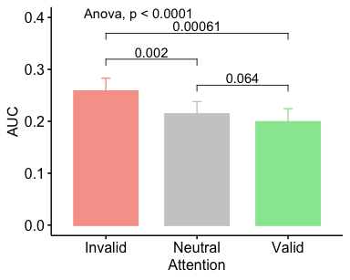

TWCF Expt 1 Stats BU
================
Karen Tian

## TWCF 1.1 Cue Tex Det Analysis

• [alphaA](#alphaa)

C1 p(responded saw shape or figure | figure present) v A p(correct
discrimination)  
• [AUC](#auc-of-c1va)  
• [alpha](#fitted-alpha-of-C1)

C3 p(responded saw shape or figure | figure present) v A p(correct
discrimination)  
• [AUC](#auc-of-c3va)  
•
[alpha](#fitted-alpha-of-C3)

### alphaA

<table class="kable_wrapper">

<tbody>

<tr>

<td>

<table>

<thead>

<tr>

<th style="text-align:left;">

</th>

<th style="text-align:left;">

Effect

</th>

<th style="text-align:right;">

DFn

</th>

<th style="text-align:right;">

DFd

</th>

<th style="text-align:right;">

F

</th>

<th style="text-align:right;">

p

</th>

<th style="text-align:left;">

p\<.05

</th>

<th style="text-align:right;">

ges

</th>

</tr>

</thead>

<tbody>

<tr>

<td style="text-align:left;">

2

</td>

<td style="text-align:left;">

att

</td>

<td style="text-align:right;">

2

</td>

<td style="text-align:right;">

28

</td>

<td style="text-align:right;">

9.082247

</td>

<td style="text-align:right;">

0.0009118

</td>

<td style="text-align:left;">

  - 
    
    </td>
    
    <td style="text-align:right;">
    
    0.1706005
    
    </td>
    
    </tr>
    
    </tbody>
    
    </table>

</td>

<td>

<table>

<thead>

<tr>

<th style="text-align:left;">

</th>

<th style="text-align:left;">

Effect

</th>

<th style="text-align:right;">

W

</th>

<th style="text-align:right;">

p

</th>

<th style="text-align:left;">

p\<.05

</th>

</tr>

</thead>

<tbody>

<tr>

<td style="text-align:left;">

2

</td>

<td style="text-align:left;">

att

</td>

<td style="text-align:right;">

0.053937

</td>

<td style="text-align:right;">

0

</td>

<td style="text-align:left;">

  - 
    
    </td>
    
    </tr>
    
    </tbody>
    
    </table>

</td>

<td>

<table>

<thead>

<tr>

<th style="text-align:left;">

</th>

<th style="text-align:left;">

Effect

</th>

<th style="text-align:right;">

GGe

</th>

<th style="text-align:right;">

p\[GG\]

</th>

<th style="text-align:left;">

p\[GG\]\<.05

</th>

<th style="text-align:right;">

HFe

</th>

<th style="text-align:right;">

p\[HF\]

</th>

<th style="text-align:left;">

p\[HF\]\<.05

</th>

</tr>

</thead>

<tbody>

<tr>

<td style="text-align:left;">

2

</td>

<td style="text-align:left;">

att

</td>

<td style="text-align:right;">

0.513858

</td>

<td style="text-align:right;">

0.0087096

</td>

<td style="text-align:left;">

  - 
    
    </td>
    
    <td style="text-align:right;">
    
    0.5170924
    
    </td>
    
    <td style="text-align:right;">
    
    0.0085781
    
    </td>
    
    <td style="text-align:left;">
    
      - 
        
        </td>
        
        </tr>
        
        </tbody>
        
        </table>

</td>

</tr>

</tbody>

</table>

    ## [1] FALSE

### AUC of C1vA

<table class="kable_wrapper">

<tbody>

<tr>

<td>

<table>

<thead>

<tr>

<th style="text-align:left;">

</th>

<th style="text-align:left;">

Effect

</th>

<th style="text-align:right;">

DFn

</th>

<th style="text-align:right;">

DFd

</th>

<th style="text-align:right;">

F

</th>

<th style="text-align:right;">

p

</th>

<th style="text-align:left;">

p\<.05

</th>

<th style="text-align:right;">

ges

</th>

</tr>

</thead>

<tbody>

<tr>

<td style="text-align:left;">

2

</td>

<td style="text-align:left;">

att

</td>

<td style="text-align:right;">

2

</td>

<td style="text-align:right;">

28

</td>

<td style="text-align:right;">

17.31772

</td>

<td style="text-align:right;">

1.27e-05

</td>

<td style="text-align:left;">

  - 
    
    </td>
    
    <td style="text-align:right;">
    
    0.0681751
    
    </td>
    
    </tr>
    
    </tbody>
    
    </table>

</td>

<td>

<table>

<thead>

<tr>

<th style="text-align:left;">

</th>

<th style="text-align:left;">

Effect

</th>

<th style="text-align:right;">

W

</th>

<th style="text-align:right;">

p

</th>

<th style="text-align:left;">

p\<.05

</th>

</tr>

</thead>

<tbody>

<tr>

<td style="text-align:left;">

2

</td>

<td style="text-align:left;">

att

</td>

<td style="text-align:right;">

0.834087

</td>

<td style="text-align:right;">

0.3075203

</td>

<td style="text-align:left;">

</td>

</tr>

</tbody>

</table>

</td>

<td>

<table>

<thead>

<tr>

<th style="text-align:left;">

</th>

<th style="text-align:left;">

Effect

</th>

<th style="text-align:right;">

GGe

</th>

<th style="text-align:right;">

p\[GG\]

</th>

<th style="text-align:left;">

p\[GG\]\<.05

</th>

<th style="text-align:right;">

HFe

</th>

<th style="text-align:right;">

p\[HF\]

</th>

<th style="text-align:left;">

p\[HF\]\<.05

</th>

</tr>

</thead>

<tbody>

<tr>

<td style="text-align:left;">

2

</td>

<td style="text-align:left;">

att

</td>

<td style="text-align:right;">

0.8576969

</td>

<td style="text-align:right;">

4.32e-05

</td>

<td style="text-align:left;">

  - 
    
    </td>
    
    <td style="text-align:right;">
    
    0.9658799
    
    </td>
    
    <td style="text-align:right;">
    
    1.7e-05
    
    </td>
    
    <td style="text-align:left;">
    
      - 
        
        </td>
        
        </tr>
        
        </tbody>
        
        </table>

</td>

</tr>

</tbody>

</table>

    ## [1] FALSE

### fitted alpha of C1

<table class="kable_wrapper">

<tbody>

<tr>

<td>

<table>

<thead>

<tr>

<th style="text-align:left;">

</th>

<th style="text-align:left;">

Effect

</th>

<th style="text-align:right;">

DFn

</th>

<th style="text-align:right;">

DFd

</th>

<th style="text-align:right;">

F

</th>

<th style="text-align:right;">

p

</th>

<th style="text-align:left;">

p\<.05

</th>

<th style="text-align:right;">

ges

</th>

</tr>

</thead>

<tbody>

<tr>

<td style="text-align:left;">

2

</td>

<td style="text-align:left;">

att

</td>

<td style="text-align:right;">

2

</td>

<td style="text-align:right;">

28

</td>

<td style="text-align:right;">

3.584562

</td>

<td style="text-align:right;">

0.0411103

</td>

<td style="text-align:left;">

  - 
    
    </td>
    
    <td style="text-align:right;">
    
    0.0133264
    
    </td>
    
    </tr>
    
    </tbody>
    
    </table>

</td>

<td>

<table>

<thead>

<tr>

<th style="text-align:left;">

</th>

<th style="text-align:left;">

Effect

</th>

<th style="text-align:right;">

W

</th>

<th style="text-align:right;">

p

</th>

<th style="text-align:left;">

p\<.05

</th>

</tr>

</thead>

<tbody>

<tr>

<td style="text-align:left;">

2

</td>

<td style="text-align:left;">

att

</td>

<td style="text-align:right;">

0.4387247

</td>

<td style="text-align:right;">

0.0047233

</td>

<td style="text-align:left;">

  - 
    
    </td>
    
    </tr>
    
    </tbody>
    
    </table>

</td>

<td>

<table>

<thead>

<tr>

<th style="text-align:left;">

</th>

<th style="text-align:left;">

Effect

</th>

<th style="text-align:right;">

GGe

</th>

<th style="text-align:right;">

p\[GG\]

</th>

<th style="text-align:left;">

p\[GG\]\<.05

</th>

<th style="text-align:right;">

HFe

</th>

<th style="text-align:right;">

p\[HF\]

</th>

<th style="text-align:left;">

p\[HF\]\<.05

</th>

</tr>

</thead>

<tbody>

<tr>

<td style="text-align:left;">

2

</td>

<td style="text-align:left;">

att

</td>

<td style="text-align:right;">

0.640502

</td>

<td style="text-align:right;">

0.0660072

</td>

<td style="text-align:left;">

</td>

<td style="text-align:right;">

0.6767461

</td>

<td style="text-align:right;">

0.062943

</td>

<td style="text-align:left;">

</td>

</tr>

</tbody>

</table>

</td>

</tr>

</tbody>

</table>

    ## [1] FALSE

### AUC of C3vA

<table class="kable_wrapper">

<tbody>

<tr>

<td>

<table>

<thead>

<tr>

<th style="text-align:left;">

</th>

<th style="text-align:left;">

Effect

</th>

<th style="text-align:right;">

DFn

</th>

<th style="text-align:right;">

DFd

</th>

<th style="text-align:right;">

F

</th>

<th style="text-align:right;">

p

</th>

<th style="text-align:left;">

p\<.05

</th>

<th style="text-align:right;">

ges

</th>

</tr>

</thead>

<tbody>

<tr>

<td style="text-align:left;">

2

</td>

<td style="text-align:left;">

att

</td>

<td style="text-align:right;">

2

</td>

<td style="text-align:right;">

28

</td>

<td style="text-align:right;">

7.932289

</td>

<td style="text-align:right;">

0.0018647

</td>

<td style="text-align:left;">

  - 
    
    </td>
    
    <td style="text-align:right;">
    
    0.0156619
    
    </td>
    
    </tr>
    
    </tbody>
    
    </table>

</td>

<td>

<table>

<thead>

<tr>

<th style="text-align:left;">

</th>

<th style="text-align:left;">

Effect

</th>

<th style="text-align:right;">

W

</th>

<th style="text-align:right;">

p

</th>

<th style="text-align:left;">

p\<.05

</th>

</tr>

</thead>

<tbody>

<tr>

<td style="text-align:left;">

2

</td>

<td style="text-align:left;">

att

</td>

<td style="text-align:right;">

0.8419144

</td>

<td style="text-align:right;">

0.3267696

</td>

<td style="text-align:left;">

</td>

</tr>

</tbody>

</table>

</td>

<td>

<table>

<thead>

<tr>

<th style="text-align:left;">

</th>

<th style="text-align:left;">

Effect

</th>

<th style="text-align:right;">

GGe

</th>

<th style="text-align:right;">

p\[GG\]

</th>

<th style="text-align:left;">

p\[GG\]\<.05

</th>

<th style="text-align:right;">

HFe

</th>

<th style="text-align:right;">

p\[HF\]

</th>

<th style="text-align:left;">

p\[HF\]\<.05

</th>

</tr>

</thead>

<tbody>

<tr>

<td style="text-align:left;">

2

</td>

<td style="text-align:left;">

att

</td>

<td style="text-align:right;">

0.8634941

</td>

<td style="text-align:right;">

0.0032

</td>

<td style="text-align:left;">

  - 
    
    </td>
    
    <td style="text-align:right;">
    
    0.9738776
    
    </td>
    
    <td style="text-align:right;">
    
    0.0020672
    
    </td>
    
    <td style="text-align:left;">
    
      - 
        
        </td>
        
        </tr>
        
        </tbody>
        
        </table>

</td>

</tr>

</tbody>

</table>

    ## [1] FALSE

### fitted alpha of C3

<table class="kable_wrapper">

<tbody>

<tr>

<td>

<table>

<thead>

<tr>

<th style="text-align:left;">

</th>

<th style="text-align:left;">

Effect

</th>

<th style="text-align:right;">

DFn

</th>

<th style="text-align:right;">

DFd

</th>

<th style="text-align:right;">

F

</th>

<th style="text-align:right;">

p

</th>

<th style="text-align:left;">

p\<.05

</th>

<th style="text-align:right;">

ges

</th>

</tr>

</thead>

<tbody>

<tr>

<td style="text-align:left;">

2

</td>

<td style="text-align:left;">

att

</td>

<td style="text-align:right;">

2

</td>

<td style="text-align:right;">

28

</td>

<td style="text-align:right;">

1.590969

</td>

<td style="text-align:right;">

0.2215996

</td>

<td style="text-align:left;">

</td>

<td style="text-align:right;">

0.0566039

</td>

</tr>

</tbody>

</table>

</td>

<td>

<table>

<thead>

<tr>

<th style="text-align:left;">

</th>

<th style="text-align:left;">

Effect

</th>

<th style="text-align:right;">

W

</th>

<th style="text-align:right;">

p

</th>

<th style="text-align:left;">

p\<.05

</th>

</tr>

</thead>

<tbody>

<tr>

<td style="text-align:left;">

2

</td>

<td style="text-align:left;">

att

</td>

<td style="text-align:right;">

0.0090852

</td>

<td style="text-align:right;">

0

</td>

<td style="text-align:left;">

  - 
    
    </td>
    
    </tr>
    
    </tbody>
    
    </table>

</td>

<td>

<table>

<thead>

<tr>

<th style="text-align:left;">

</th>

<th style="text-align:left;">

Effect

</th>

<th style="text-align:right;">

GGe

</th>

<th style="text-align:right;">

p\[GG\]

</th>

<th style="text-align:left;">

p\[GG\]\<.05

</th>

<th style="text-align:right;">

HFe

</th>

<th style="text-align:right;">

p\[HF\]

</th>

<th style="text-align:left;">

p\[HF\]\<.05

</th>

</tr>

</thead>

<tbody>

<tr>

<td style="text-align:left;">

2

</td>

<td style="text-align:left;">

att

</td>

<td style="text-align:right;">

0.5022817

</td>

<td style="text-align:right;">

0.2278426

</td>

<td style="text-align:left;">

</td>

<td style="text-align:right;">

0.5028092

</td>

<td style="text-align:right;">

0.227852

</td>

<td style="text-align:left;">

</td>

</tr>

</tbody>

</table>

</td>

</tr>

</tbody>

</table>

    ## [1] FALSE

