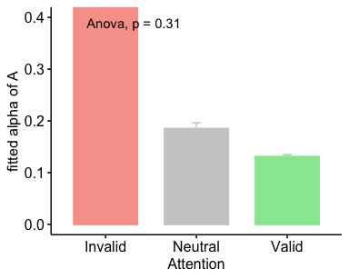
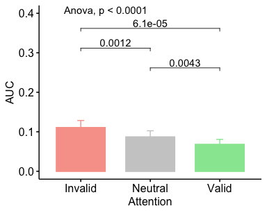
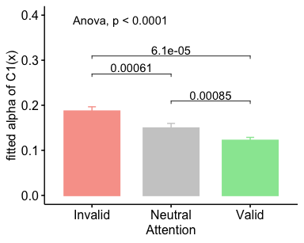
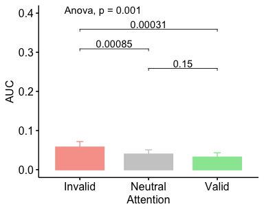
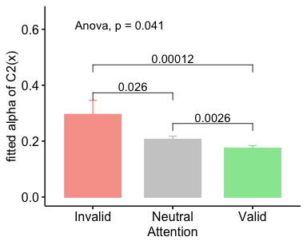

TWCF Expt 1.3 Stats BU
================
Karen Tian

## TWCF 1.1 Cue Gab Det Analysis

• [alphaA](#alphaa)

C1 p(saw grating | grating present) v A p(correct discrimination)  
• [AUC](#auc-of-c1va)  
• [alpha](#fitted-alpha-of-C1)

C2 p(saw orientation | grating present) v A p(correct discrimination)  
• [AUC](#auc-ofc2va)  
•
[alpha](#fitted-alpha-of-C2)

### alphaA

    ## [1] "1"

<table class="kable_wrapper">

<tbody>

<tr>

<td>

<table>

<thead>

<tr>

<th style="text-align:left;">

Effect

</th>

<th style="text-align:right;">

DFn

</th>

<th style="text-align:right;">

DFd

</th>

<th style="text-align:right;">

SSn

</th>

<th style="text-align:right;">

SSd

</th>

<th style="text-align:right;">

F

</th>

<th style="text-align:right;">

p

</th>

<th style="text-align:left;">

p\<.05

</th>

<th style="text-align:right;">

ges

</th>

</tr>

</thead>

<tbody>

<tr>

<td style="text-align:left;">

(Intercept)

</td>

<td style="text-align:right;">

1

</td>

<td style="text-align:right;">

14

</td>

<td style="text-align:right;">

16.04962

</td>

<td style="text-align:right;">

108.9396

</td>

<td style="text-align:right;">

2.062563

</td>

<td style="text-align:right;">

0.1729239

</td>

<td style="text-align:left;">

</td>

<td style="text-align:right;">

0.0469828

</td>

</tr>

<tr>

<td style="text-align:left;">

att

</td>

<td style="text-align:right;">

2

</td>

<td style="text-align:right;">

28

</td>

<td style="text-align:right;">

17.39276

</td>

<td style="text-align:right;">

216.6174

</td>

<td style="text-align:right;">

1.124095

</td>

<td style="text-align:right;">

0.3391726

</td>

<td style="text-align:left;">

</td>

<td style="text-align:right;">

0.0507152

</td>

</tr>

</tbody>

</table>

</td>

<td>

<table>

<thead>

<tr>

<th style="text-align:left;">

</th>

<th style="text-align:left;">

Effect

</th>

<th style="text-align:right;">

W

</th>

<th style="text-align:right;">

p

</th>

<th style="text-align:left;">

p\<.05

</th>

</tr>

</thead>

<tbody>

<tr>

<td style="text-align:left;">

2

</td>

<td style="text-align:left;">

att

</td>

<td style="text-align:right;">

0.0001629

</td>

<td style="text-align:right;">

0

</td>

<td style="text-align:left;">

  - 
    
    </td>
    
    </tr>
    
    </tbody>
    
    </table>

</td>

<td>

<table>

<thead>

<tr>

<th style="text-align:left;">

</th>

<th style="text-align:left;">

Effect

</th>

<th style="text-align:right;">

GGe

</th>

<th style="text-align:right;">

p\[GG\]

</th>

<th style="text-align:left;">

p\[GG\]\<.05

</th>

<th style="text-align:right;">

HFe

</th>

<th style="text-align:right;">

p\[HF\]

</th>

<th style="text-align:left;">

p\[HF\]\<.05

</th>

</tr>

</thead>

<tbody>

<tr>

<td style="text-align:left;">

2

</td>

<td style="text-align:left;">

att

</td>

<td style="text-align:right;">

0.5000407

</td>

<td style="text-align:right;">

0.3069925

</td>

<td style="text-align:left;">

</td>

<td style="text-align:right;">

0.5000501

</td>

<td style="text-align:right;">

0.3069936

</td>

<td style="text-align:left;">

</td>

</tr>

</tbody>

</table>

</td>

</tr>

</tbody>

</table>

<table>

<thead>

<tr>

<th style="text-align:left;">

att

</th>

<th style="text-align:right;">

mean

</th>

<th style="text-align:right;">

sd

</th>

<th style="text-align:right;">

sem

</th>

</tr>

</thead>

<tbody>

<tr>

<td style="text-align:left;">

\-1

</td>

<td style="text-align:right;">

1.4758614

</td>

<td style="text-align:right;">

4.8220200

</td>

<td style="text-align:right;">

1.2450402

</td>

</tr>

<tr>

<td style="text-align:left;">

0

</td>

<td style="text-align:right;">

0.1850057

</td>

<td style="text-align:right;">

0.0443572

</td>

<td style="text-align:right;">

0.0114530

</td>

</tr>

<tr>

<td style="text-align:left;">

1

</td>

<td style="text-align:right;">

0.1307592

</td>

<td style="text-align:right;">

0.0150165

</td>

<td style="text-align:right;">

0.0038772

</td>

</tr>

</tbody>

</table>

    ## [1] FALSE

### AUC of C1vA

    ## [1] "1"

<table class="kable_wrapper">

<tbody>

<tr>

<td>

<table>

<thead>

<tr>

<th style="text-align:left;">

Effect

</th>

<th style="text-align:right;">

DFn

</th>

<th style="text-align:right;">

DFd

</th>

<th style="text-align:right;">

SSn

</th>

<th style="text-align:right;">

SSd

</th>

<th style="text-align:right;">

F

</th>

<th style="text-align:right;">

p

</th>

<th style="text-align:left;">

p\<.05

</th>

<th style="text-align:right;">

ges

</th>

</tr>

</thead>

<tbody>

<tr>

<td style="text-align:left;">

(Intercept)

</td>

<td style="text-align:right;">

1

</td>

<td style="text-align:right;">

14

</td>

<td style="text-align:right;">

0.3511613

</td>

<td style="text-align:right;">

0.1490657

</td>

<td style="text-align:right;">

32.98047

</td>

<td style="text-align:right;">

5.09e-05

</td>

<td style="text-align:left;">

  - 
    
    </td>
    
    <td style="text-align:right;">
    
    0.6910725
    
    </td>
    
    </tr>
    
    <tr>
    
    <td style="text-align:left;">
    
    att
    
    </td>
    
    <td style="text-align:right;">
    
    2
    
    </td>
    
    <td style="text-align:right;">
    
    28
    
    </td>
    
    <td style="text-align:right;">
    
    0.0136766
    
    </td>
    
    <td style="text-align:right;">
    
    0.0079126
    
    </td>
    
    <td style="text-align:right;">
    
    24.19854
    
    </td>
    
    <td style="text-align:right;">
    
    8.00e-07
    
    </td>
    
    <td style="text-align:left;">
    
      - 
        
        </td>
        
        <td style="text-align:right;">
        
        0.0801419
        
        </td>
        
        </tr>
        
        </tbody>
        
        </table>

</td>

<td>

<table>

<thead>

<tr>

<th style="text-align:left;">

</th>

<th style="text-align:left;">

Effect

</th>

<th style="text-align:right;">

W

</th>

<th style="text-align:right;">

p

</th>

<th style="text-align:left;">

p\<.05

</th>

</tr>

</thead>

<tbody>

<tr>

<td style="text-align:left;">

2

</td>

<td style="text-align:left;">

att

</td>

<td style="text-align:right;">

0.9387639

</td>

<td style="text-align:right;">

0.6631574

</td>

<td style="text-align:left;">

</td>

</tr>

</tbody>

</table>

</td>

<td>

<table>

<thead>

<tr>

<th style="text-align:left;">

</th>

<th style="text-align:left;">

Effect

</th>

<th style="text-align:right;">

GGe

</th>

<th style="text-align:right;">

p\[GG\]

</th>

<th style="text-align:left;">

p\[GG\]\<.05

</th>

<th style="text-align:right;">

HFe

</th>

<th style="text-align:right;">

p\[HF\]

</th>

<th style="text-align:left;">

p\[HF\]\<.05

</th>

</tr>

</thead>

<tbody>

<tr>

<td style="text-align:left;">

2

</td>

<td style="text-align:left;">

att

</td>

<td style="text-align:right;">

0.9422974

</td>

<td style="text-align:right;">

1.5e-06

</td>

<td style="text-align:left;">

  - 
    
    </td>
    
    <td style="text-align:right;">
    
    1.084112
    
    </td>
    
    <td style="text-align:right;">
    
    8e-07
    
    </td>
    
    <td style="text-align:left;">
    
      - 
        
        </td>
        
        </tr>
        
        </tbody>
        
        </table>

</td>

</tr>

</tbody>

</table>

<table>

<thead>

<tr>

<th style="text-align:left;">

att

</th>

<th style="text-align:right;">

mean

</th>

<th style="text-align:right;">

sd

</th>

<th style="text-align:right;">

sem

</th>

</tr>

</thead>

<tbody>

<tr>

<td style="text-align:left;">

\-1

</td>

<td style="text-align:right;">

0.1104336

</td>

<td style="text-align:right;">

0.0703030

</td>

<td style="text-align:right;">

0.0181522

</td>

</tr>

<tr>

<td style="text-align:left;">

0

</td>

<td style="text-align:right;">

0.0867623

</td>

<td style="text-align:right;">

0.0612528

</td>

<td style="text-align:right;">

0.0158154

</td>

</tr>

<tr>

<td style="text-align:left;">

1

</td>

<td style="text-align:right;">

0.0678178

</td>

<td style="text-align:right;">

0.0501829

</td>

<td style="text-align:right;">

0.0129572

</td>

</tr>

</tbody>

</table>

    ## [1] FALSE

    ## [1] "cohen's d = 1.609716"

### fitted alpha of C1

    ## [1] "1"

<table class="kable_wrapper">

<tbody>

<tr>

<td>

<table>

<thead>

<tr>

<th style="text-align:left;">

Effect

</th>

<th style="text-align:right;">

DFn

</th>

<th style="text-align:right;">

DFd

</th>

<th style="text-align:right;">

SSn

</th>

<th style="text-align:right;">

SSd

</th>

<th style="text-align:right;">

F

</th>

<th style="text-align:right;">

p

</th>

<th style="text-align:left;">

p\<.05

</th>

<th style="text-align:right;">

ges

</th>

</tr>

</thead>

<tbody>

<tr>

<td style="text-align:left;">

(Intercept)

</td>

<td style="text-align:right;">

1

</td>

<td style="text-align:right;">

14

</td>

<td style="text-align:right;">

1.0494211

</td>

<td style="text-align:right;">

0.0389391

</td>

<td style="text-align:right;">

377.30439

</td>

<td style="text-align:right;">

0e+00

</td>

<td style="text-align:left;">

  - 
    
    </td>
    
    <td style="text-align:right;">
    
    0.9519075
    
    </td>
    
    </tr>
    
    <tr>
    
    <td style="text-align:left;">
    
    att
    
    </td>
    
    <td style="text-align:right;">
    
    2
    
    </td>
    
    <td style="text-align:right;">
    
    28
    
    </td>
    
    <td style="text-align:right;">
    
    0.0318913
    
    </td>
    
    <td style="text-align:right;">
    
    0.0140800
    
    </td>
    
    <td style="text-align:right;">
    
    31.71014
    
    </td>
    
    <td style="text-align:right;">
    
    1e-07
    
    </td>
    
    <td style="text-align:left;">
    
      - 
        
        </td>
        
        <td style="text-align:right;">
        
        0.3755877
        
        </td>
        
        </tr>
        
        </tbody>
        
        </table>

</td>

<td>

<table>

<thead>

<tr>

<th style="text-align:left;">

</th>

<th style="text-align:left;">

Effect

</th>

<th style="text-align:right;">

W

</th>

<th style="text-align:right;">

p

</th>

<th style="text-align:left;">

p\<.05

</th>

</tr>

</thead>

<tbody>

<tr>

<td style="text-align:left;">

2

</td>

<td style="text-align:left;">

att

</td>

<td style="text-align:right;">

0.732627

</td>

<td style="text-align:right;">

0.1323546

</td>

<td style="text-align:left;">

</td>

</tr>

</tbody>

</table>

</td>

<td>

<table>

<thead>

<tr>

<th style="text-align:left;">

</th>

<th style="text-align:left;">

Effect

</th>

<th style="text-align:right;">

GGe

</th>

<th style="text-align:right;">

p\[GG\]

</th>

<th style="text-align:left;">

p\[GG\]\<.05

</th>

<th style="text-align:right;">

HFe

</th>

<th style="text-align:right;">

p\[HF\]

</th>

<th style="text-align:left;">

p\[HF\]\<.05

</th>

</tr>

</thead>

<tbody>

<tr>

<td style="text-align:left;">

2

</td>

<td style="text-align:left;">

att

</td>

<td style="text-align:right;">

0.7890337

</td>

<td style="text-align:right;">

1.1e-06

</td>

<td style="text-align:left;">

  - 
    
    </td>
    
    <td style="text-align:right;">
    
    0.8722882
    
    </td>
    
    <td style="text-align:right;">
    
    4e-07
    
    </td>
    
    <td style="text-align:left;">
    
      - 
        
        </td>
        
        </tr>
        
        </tbody>
        
        </table>

</td>

</tr>

</tbody>

</table>

<table>

<thead>

<tr>

<th style="text-align:left;">

att

</th>

<th style="text-align:right;">

mean

</th>

<th style="text-align:right;">

sd

</th>

<th style="text-align:right;">

sem

</th>

</tr>

</thead>

<tbody>

<tr>

<td style="text-align:left;">

\-1

</td>

<td style="text-align:right;">

0.1869098

</td>

<td style="text-align:right;">

0.0377476

</td>

<td style="text-align:right;">

0.0097464

</td>

</tr>

<tr>

<td style="text-align:left;">

0

</td>

<td style="text-align:right;">

0.1492431

</td>

<td style="text-align:right;">

0.0408140

</td>

<td style="text-align:right;">

0.0105381

</td>

</tr>

<tr>

<td style="text-align:left;">

1

</td>

<td style="text-align:right;">

0.1219783

</td>

<td style="text-align:right;">

0.0263896

</td>

<td style="text-align:right;">

0.0068138

</td>

</tr>

</tbody>

</table>

    ## [1] FALSE

### AUC of C2vA

    ## [1] "1"

<table class="kable_wrapper">

<tbody>

<tr>

<td>

<table>

<thead>

<tr>

<th style="text-align:left;">

Effect

</th>

<th style="text-align:right;">

DFn

</th>

<th style="text-align:right;">

DFd

</th>

<th style="text-align:right;">

SSn

</th>

<th style="text-align:right;">

SSd

</th>

<th style="text-align:right;">

F

</th>

<th style="text-align:right;">

p

</th>

<th style="text-align:left;">

p\<.05

</th>

<th style="text-align:right;">

ges

</th>

</tr>

</thead>

<tbody>

<tr>

<td style="text-align:left;">

(Intercept)

</td>

<td style="text-align:right;">

1

</td>

<td style="text-align:right;">

14

</td>

<td style="text-align:right;">

0.0825849

</td>

<td style="text-align:right;">

0.0897853

</td>

<td style="text-align:right;">

12.877256

</td>

<td style="text-align:right;">

0.0029654

</td>

<td style="text-align:left;">

  - 
    
    </td>
    
    <td style="text-align:right;">
    
    0.4563100
    
    </td>
    
    </tr>
    
    <tr>
    
    <td style="text-align:left;">
    
    att
    
    </td>
    
    <td style="text-align:right;">
    
    2
    
    </td>
    
    <td style="text-align:right;">
    
    28
    
    </td>
    
    <td style="text-align:right;">
    
    0.0051528
    
    </td>
    
    <td style="text-align:right;">
    
    0.0086140
    
    </td>
    
    <td style="text-align:right;">
    
    8.374716
    
    </td>
    
    <td style="text-align:right;">
    
    0.0014099
    
    </td>
    
    <td style="text-align:left;">
    
      - 
        
        </td>
        
        <td style="text-align:right;">
        
        0.0497607
        
        </td>
        
        </tr>
        
        </tbody>
        
        </table>

</td>

<td>

<table>

<thead>

<tr>

<th style="text-align:left;">

</th>

<th style="text-align:left;">

Effect

</th>

<th style="text-align:right;">

W

</th>

<th style="text-align:right;">

p

</th>

<th style="text-align:left;">

p\<.05

</th>

</tr>

</thead>

<tbody>

<tr>

<td style="text-align:left;">

2

</td>

<td style="text-align:left;">

att

</td>

<td style="text-align:right;">

0.7645795

</td>

<td style="text-align:right;">

0.1746817

</td>

<td style="text-align:left;">

</td>

</tr>

</tbody>

</table>

</td>

<td>

<table>

<thead>

<tr>

<th style="text-align:left;">

</th>

<th style="text-align:left;">

Effect

</th>

<th style="text-align:right;">

GGe

</th>

<th style="text-align:right;">

p\[GG\]

</th>

<th style="text-align:left;">

p\[GG\]\<.05

</th>

<th style="text-align:right;">

HFe

</th>

<th style="text-align:right;">

p\[HF\]

</th>

<th style="text-align:left;">

p\[HF\]\<.05

</th>

</tr>

</thead>

<tbody>

<tr>

<td style="text-align:left;">

2

</td>

<td style="text-align:left;">

att

</td>

<td style="text-align:right;">

0.809441

</td>

<td style="text-align:right;">

0.0031464

</td>

<td style="text-align:left;">

  - 
    
    </td>
    
    <td style="text-align:right;">
    
    0.8998877
    
    </td>
    
    <td style="text-align:right;">
    
    0.0021476
    
    </td>
    
    <td style="text-align:left;">
    
      - 
        
        </td>
        
        </tr>
        
        </tbody>
        
        </table>

</td>

</tr>

</tbody>

</table>

<table>

<thead>

<tr>

<th style="text-align:left;">

att

</th>

<th style="text-align:right;">

mean

</th>

<th style="text-align:right;">

sd

</th>

<th style="text-align:right;">

sem

</th>

</tr>

</thead>

<tbody>

<tr>

<td style="text-align:left;">

\-1

</td>

<td style="text-align:right;">

0.0573069

</td>

<td style="text-align:right;">

0.0564119

</td>

<td style="text-align:right;">

0.0145655

</td>

</tr>

<tr>

<td style="text-align:left;">

0

</td>

<td style="text-align:right;">

0.0394502

</td>

<td style="text-align:right;">

0.0435899

</td>

<td style="text-align:right;">

0.0112549

</td>

</tr>

<tr>

<td style="text-align:left;">

1

</td>

<td style="text-align:right;">

0.0317612

</td>

<td style="text-align:right;">

0.0441151

</td>

<td style="text-align:right;">

0.0113905

</td>

</tr>

</tbody>

</table>

    ## [1] FALSE

    ## [1] "cohen's d = 0.853100"

### fitted alpha of C2

    ## [1] "1"

<table class="kable_wrapper">

<tbody>

<tr>

<td>

<table>

<thead>

<tr>

<th style="text-align:left;">

Effect

</th>

<th style="text-align:right;">

DFn

</th>

<th style="text-align:right;">

DFd

</th>

<th style="text-align:right;">

SSn

</th>

<th style="text-align:right;">

SSd

</th>

<th style="text-align:right;">

F

</th>

<th style="text-align:right;">

p

</th>

<th style="text-align:left;">

p\<.05

</th>

<th style="text-align:right;">

ges

</th>

</tr>

</thead>

<tbody>

<tr>

<td style="text-align:left;">

(Intercept)

</td>

<td style="text-align:right;">

1

</td>

<td style="text-align:right;">

14

</td>

<td style="text-align:right;">

2.2712148

</td>

<td style="text-align:right;">

0.2784707

</td>

<td style="text-align:right;">

114.184393

</td>

<td style="text-align:right;">

0.0000000

</td>

<td style="text-align:left;">

  - 
    
    </td>
    
    <td style="text-align:right;">
    
    0.7890383
    
    </td>
    
    </tr>
    
    <tr>
    
    <td style="text-align:left;">
    
    att
    
    </td>
    
    <td style="text-align:right;">
    
    2
    
    </td>
    
    <td style="text-align:right;">
    
    28
    
    </td>
    
    <td style="text-align:right;">
    
    0.1173037
    
    </td>
    
    <td style="text-align:right;">
    
    0.3287741
    
    </td>
    
    <td style="text-align:right;">
    
    4.995077
    
    </td>
    
    <td style="text-align:right;">
    
    0.0139578
    
    </td>
    
    <td style="text-align:left;">
    
      - 
        
        </td>
        
        <td style="text-align:right;">
        
        0.1618990
        
        </td>
        
        </tr>
        
        </tbody>
        
        </table>

</td>

<td>

<table>

<thead>

<tr>

<th style="text-align:left;">

</th>

<th style="text-align:left;">

Effect

</th>

<th style="text-align:right;">

W

</th>

<th style="text-align:right;">

p

</th>

<th style="text-align:left;">

p\<.05

</th>

</tr>

</thead>

<tbody>

<tr>

<td style="text-align:left;">

2

</td>

<td style="text-align:left;">

att

</td>

<td style="text-align:right;">

0.0711635

</td>

<td style="text-align:right;">

0

</td>

<td style="text-align:left;">

  - 
    
    </td>
    
    </tr>
    
    </tbody>
    
    </table>

</td>

<td>

<table>

<thead>

<tr>

<th style="text-align:left;">

</th>

<th style="text-align:left;">

Effect

</th>

<th style="text-align:right;">

GGe

</th>

<th style="text-align:right;">

p\[GG\]

</th>

<th style="text-align:left;">

p\[GG\]\<.05

</th>

<th style="text-align:right;">

HFe

</th>

<th style="text-align:right;">

p\[HF\]

</th>

<th style="text-align:left;">

p\[HF\]\<.05

</th>

</tr>

</thead>

<tbody>

<tr>

<td style="text-align:left;">

2

</td>

<td style="text-align:left;">

att

</td>

<td style="text-align:right;">

0.5184473

</td>

<td style="text-align:right;">

0.0405414

</td>

<td style="text-align:left;">

  - 
    
    </td>
    
    <td style="text-align:right;">
    
    0.522769
    
    </td>
    
    <td style="text-align:right;">
    
    0.0401546
    
    </td>
    
    <td style="text-align:left;">
    
      - 
        
        </td>
        
        </tr>
        
        </tbody>
        
        </table>

</td>

</tr>

</tbody>

</table>

<table>

<thead>

<tr>

<th style="text-align:left;">

att

</th>

<th style="text-align:right;">

mean

</th>

<th style="text-align:right;">

sd

</th>

<th style="text-align:right;">

sem

</th>

</tr>

</thead>

<tbody>

<tr>

<td style="text-align:left;">

\-1

</td>

<td style="text-align:right;">

0.2944980

</td>

<td style="text-align:right;">

0.1992469

</td>

<td style="text-align:right;">

0.0514453

</td>

</tr>

<tr>

<td style="text-align:left;">

0

</td>

<td style="text-align:right;">

0.2056118

</td>

<td style="text-align:right;">

0.0461084

</td>

<td style="text-align:right;">

0.0119051

</td>

</tr>

<tr>

<td style="text-align:left;">

1

</td>

<td style="text-align:right;">

0.1738657

</td>

<td style="text-align:right;">

0.0393615

</td>

<td style="text-align:right;">

0.0101631

</td>

</tr>

</tbody>

</table>

    ## [1] FALSE

