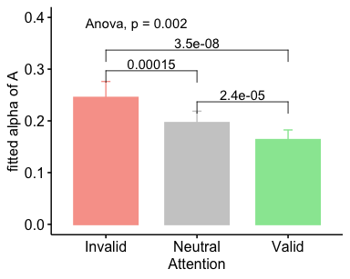
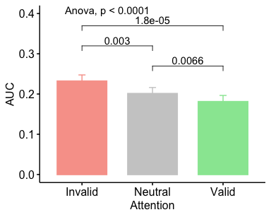
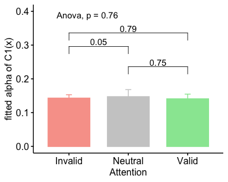
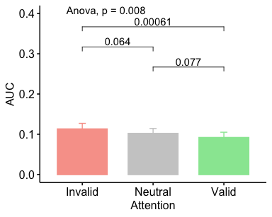
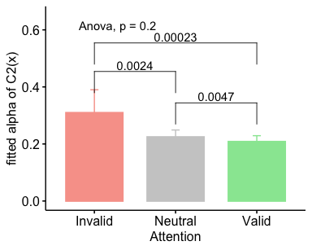

TWCF Expt 1 Stats BU
================
Karen Tian

## TWCF 1.1 Cue Tex Det Analysis

• [alphaA](#alphaa)

C1 p(saw figure | figure present) v A p(correct discrimination)  
• [AUC](#auc-of-c1va)  
• [alpha](#fitted-alpha-of-C1)

C2 p(saw shape | figure present) v A p(correct discrimination)  
• [AUC](#auc-ofc2va)  
•
[alpha](#fitted-alpha-of-C2)

### alphaA

<table class="kable_wrapper">

<tbody>

<tr>

<td>

<table>

<thead>

<tr>

<th style="text-align:left;">

Effect

</th>

<th style="text-align:right;">

DFn

</th>

<th style="text-align:right;">

DFd

</th>

<th style="text-align:right;">

SSn

</th>

<th style="text-align:right;">

SSd

</th>

<th style="text-align:right;">

F

</th>

<th style="text-align:right;">

p

</th>

<th style="text-align:left;">

p\<.05

</th>

<th style="text-align:right;">

ges

</th>

</tr>

</thead>

<tbody>

<tr>

<td style="text-align:left;">

(Intercept)

</td>

<td style="text-align:right;">

1

</td>

<td style="text-align:right;">

28

</td>

<td style="text-align:right;">

3.6549688

</td>

<td style="text-align:right;">

1.1876782

</td>

<td style="text-align:right;">

86.1673889

</td>

<td style="text-align:right;">

0.0000000

</td>

<td style="text-align:left;">

  - 
    
    </td>
    
    <td style="text-align:right;">
    
    0.7033191
    
    </td>
    
    </tr>
    
    <tr>
    
    <td style="text-align:left;">
    
    site
    
    </td>
    
    <td style="text-align:right;">
    
    1
    
    </td>
    
    <td style="text-align:right;">
    
    28
    
    </td>
    
    <td style="text-align:right;">
    
    0.0550586
    
    </td>
    
    <td style="text-align:right;">
    
    1.1876782
    
    </td>
    
    <td style="text-align:right;">
    
    1.2980299
    
    </td>
    
    <td style="text-align:right;">
    
    0.2642268
    
    </td>
    
    <td style="text-align:left;">
    
    </td>
    
    <td style="text-align:right;">
    
    0.0344799
    
    </td>
    
    </tr>
    
    <tr>
    
    <td style="text-align:left;">
    
    att
    
    </td>
    
    <td style="text-align:right;">
    
    2
    
    </td>
    
    <td style="text-align:right;">
    
    56
    
    </td>
    
    <td style="text-align:right;">
    
    0.1010821
    
    </td>
    
    <td style="text-align:right;">
    
    0.3540961
    
    </td>
    
    <td style="text-align:right;">
    
    7.9930277
    
    </td>
    
    <td style="text-align:right;">
    
    0.0008837
    
    </td>
    
    <td style="text-align:left;">
    
      - 
        
        </td>
        
        <td style="text-align:right;">
        
        0.0615283
        
        </td>
        
        </tr>
        
        <tr>
        
        <td style="text-align:left;">
        
        site:att
        
        </td>
        
        <td style="text-align:right;">
        
        2
        
        </td>
        
        <td style="text-align:right;">
        
        56
        
        </td>
        
        <td style="text-align:right;">
        
        0.0066442
        
        </td>
        
        <td style="text-align:right;">
        
        0.3540961
        
        </td>
        
        <td style="text-align:right;">
        
        0.5253898
        
        </td>
        
        <td style="text-align:right;">
        
        0.5942106
        
        </td>
        
        <td style="text-align:left;">
        
        </td>
        
        <td style="text-align:right;">
        
        0.0042910
        
        </td>
        
        </tr>
        
        </tbody>
        
        </table>

</td>

<td>

<table>

<thead>

<tr>

<th style="text-align:left;">

</th>

<th style="text-align:left;">

Effect

</th>

<th style="text-align:right;">

W

</th>

<th style="text-align:right;">

p

</th>

<th style="text-align:left;">

p\<.05

</th>

</tr>

</thead>

<tbody>

<tr>

<td style="text-align:left;">

3

</td>

<td style="text-align:left;">

att

</td>

<td style="text-align:right;">

0.7236877

</td>

<td style="text-align:right;">

0.012704

</td>

<td style="text-align:left;">

  - 
    
    </td>
    
    </tr>
    
    <tr>
    
    <td style="text-align:left;">
    
    4
    
    </td>
    
    <td style="text-align:left;">
    
    site:att
    
    </td>
    
    <td style="text-align:right;">
    
    0.7236877
    
    </td>
    
    <td style="text-align:right;">
    
    0.012704
    
    </td>
    
    <td style="text-align:left;">
    
      - 
        
        </td>
        
        </tr>
        
        </tbody>
        
        </table>

</td>

<td>

<table>

<thead>

<tr>

<th style="text-align:left;">

</th>

<th style="text-align:left;">

Effect

</th>

<th style="text-align:right;">

GGe

</th>

<th style="text-align:right;">

p\[GG\]

</th>

<th style="text-align:left;">

p\[GG\]\<.05

</th>

<th style="text-align:right;">

HFe

</th>

<th style="text-align:right;">

p\[HF\]

</th>

<th style="text-align:left;">

p\[HF\]\<.05

</th>

</tr>

</thead>

<tbody>

<tr>

<td style="text-align:left;">

3

</td>

<td style="text-align:left;">

att

</td>

<td style="text-align:right;">

0.7835073

</td>

<td style="text-align:right;">

0.0023508

</td>

<td style="text-align:left;">

  - 
    
    </td>
    
    <td style="text-align:right;">
    
    0.8217653
    
    </td>
    
    <td style="text-align:right;">
    
    0.0019763
    
    </td>
    
    <td style="text-align:left;">
    
      - 
        
        </td>
        
        </tr>
        
        <tr>
        
        <td style="text-align:left;">
        
        4
        
        </td>
        
        <td style="text-align:left;">
        
        site:att
        
        </td>
        
        <td style="text-align:right;">
        
        0.7835073
        
        </td>
        
        <td style="text-align:right;">
        
        0.5515507
        
        </td>
        
        <td style="text-align:left;">
        
        </td>
        
        <td style="text-align:right;">
        
        0.8217653
        
        </td>
        
        <td style="text-align:right;">
        
        0.5598461
        
        </td>
        
        <td style="text-align:left;">
        
        </td>
        
        </tr>
        
        </tbody>
        
        </table>

</td>

</tr>

</tbody>

</table>

<table>

<thead>

<tr>

<th style="text-align:left;">

att

</th>

<th style="text-align:right;">

mean

</th>

<th style="text-align:right;">

sd

</th>

<th style="text-align:right;">

sem

</th>

</tr>

</thead>

<tbody>

<tr>

<td style="text-align:left;">

\-1

</td>

<td style="text-align:right;">

0.2449536

</td>

<td style="text-align:right;">

0.1709618

</td>

<td style="text-align:right;">

0.0312132

</td>

</tr>

<tr>

<td style="text-align:left;">

0

</td>

<td style="text-align:right;">

0.1962341

</td>

<td style="text-align:right;">

0.1229493

</td>

<td style="text-align:right;">

0.0224474

</td>

</tr>

<tr>

<td style="text-align:left;">

1

</td>

<td style="text-align:right;">

0.1633757

</td>

<td style="text-align:right;">

0.1046321

</td>

<td style="text-align:right;">

0.0191031

</td>

</tr>

</tbody>

</table>

    ## [1] FALSE

### AUC of C1vA

<table class="kable_wrapper">

<tbody>

<tr>

<td>

<table>

<thead>

<tr>

<th style="text-align:left;">

Effect

</th>

<th style="text-align:right;">

DFn

</th>

<th style="text-align:right;">

DFd

</th>

<th style="text-align:right;">

SSn

</th>

<th style="text-align:right;">

SSd

</th>

<th style="text-align:right;">

F

</th>

<th style="text-align:right;">

p

</th>

<th style="text-align:left;">

p\<.05

</th>

<th style="text-align:right;">

ges

</th>

</tr>

</thead>

<tbody>

<tr>

<td style="text-align:left;">

(Intercept)

</td>

<td style="text-align:right;">

1

</td>

<td style="text-align:right;">

28

</td>

<td style="text-align:right;">

3.7696494

</td>

<td style="text-align:right;">

0.5110291

</td>

<td style="text-align:right;">

206.544379

</td>

<td style="text-align:right;">

0.0000000

</td>

<td style="text-align:left;">

  - 
    
    </td>
    
    <td style="text-align:right;">
    
    0.8664165
    
    </td>
    
    </tr>
    
    <tr>
    
    <td style="text-align:left;">
    
    site
    
    </td>
    
    <td style="text-align:right;">
    
    1
    
    </td>
    
    <td style="text-align:right;">
    
    28
    
    </td>
    
    <td style="text-align:right;">
    
    0.0322862
    
    </td>
    
    <td style="text-align:right;">
    
    0.5110291
    
    </td>
    
    <td style="text-align:right;">
    
    1.769005
    
    </td>
    
    <td style="text-align:right;">
    
    0.1942384
    
    </td>
    
    <td style="text-align:left;">
    
    </td>
    
    <td style="text-align:right;">
    
    0.0526272
    
    </td>
    
    </tr>
    
    <tr>
    
    <td style="text-align:left;">
    
    att
    
    </td>
    
    <td style="text-align:right;">
    
    2
    
    </td>
    
    <td style="text-align:right;">
    
    56
    
    </td>
    
    <td style="text-align:right;">
    
    0.0396851
    
    </td>
    
    <td style="text-align:right;">
    
    0.0701729
    
    </td>
    
    <td style="text-align:right;">
    
    15.834915
    
    </td>
    
    <td style="text-align:right;">
    
    0.0000035
    
    </td>
    
    <td style="text-align:left;">
    
      - 
        
        </td>
        
        <td style="text-align:right;">
        
        0.0639167
        
        </td>
        
        </tr>
        
        <tr>
        
        <td style="text-align:left;">
        
        site:att
        
        </td>
        
        <td style="text-align:right;">
        
        2
        
        </td>
        
        <td style="text-align:right;">
        
        56
        
        </td>
        
        <td style="text-align:right;">
        
        0.0025910
        
        </td>
        
        <td style="text-align:right;">
        
        0.0701729
        
        </td>
        
        <td style="text-align:right;">
        
        1.033832
        
        </td>
        
        <td style="text-align:right;">
        
        0.3623286
        
        </td>
        
        <td style="text-align:left;">
        
        </td>
        
        <td style="text-align:right;">
        
        0.0044382
        
        </td>
        
        </tr>
        
        </tbody>
        
        </table>

</td>

<td>

<table>

<thead>

<tr>

<th style="text-align:left;">

</th>

<th style="text-align:left;">

Effect

</th>

<th style="text-align:right;">

W

</th>

<th style="text-align:right;">

p

</th>

<th style="text-align:left;">

p\<.05

</th>

</tr>

</thead>

<tbody>

<tr>

<td style="text-align:left;">

3

</td>

<td style="text-align:left;">

att

</td>

<td style="text-align:right;">

0.9842141

</td>

<td style="text-align:right;">

0.8066951

</td>

<td style="text-align:left;">

</td>

</tr>

<tr>

<td style="text-align:left;">

4

</td>

<td style="text-align:left;">

site:att

</td>

<td style="text-align:right;">

0.9842141

</td>

<td style="text-align:right;">

0.8066951

</td>

<td style="text-align:left;">

</td>

</tr>

</tbody>

</table>

</td>

<td>

<table>

<thead>

<tr>

<th style="text-align:left;">

</th>

<th style="text-align:left;">

Effect

</th>

<th style="text-align:right;">

GGe

</th>

<th style="text-align:right;">

p\[GG\]

</th>

<th style="text-align:left;">

p\[GG\]\<.05

</th>

<th style="text-align:right;">

HFe

</th>

<th style="text-align:right;">

p\[HF\]

</th>

<th style="text-align:left;">

p\[HF\]\<.05

</th>

</tr>

</thead>

<tbody>

<tr>

<td style="text-align:left;">

3

</td>

<td style="text-align:left;">

att

</td>

<td style="text-align:right;">

0.9844594

</td>

<td style="text-align:right;">

0.0000041

</td>

<td style="text-align:left;">

  - 
    
    </td>
    
    <td style="text-align:right;">
    
    1.058324
    
    </td>
    
    <td style="text-align:right;">
    
    0.0000035
    
    </td>
    
    <td style="text-align:left;">
    
      - 
        
        </td>
        
        </tr>
        
        <tr>
        
        <td style="text-align:left;">
        
        4
        
        </td>
        
        <td style="text-align:left;">
        
        site:att
        
        </td>
        
        <td style="text-align:right;">
        
        0.9844594
        
        </td>
        
        <td style="text-align:right;">
        
        0.3614771
        
        </td>
        
        <td style="text-align:left;">
        
        </td>
        
        <td style="text-align:right;">
        
        1.058324
        
        </td>
        
        <td style="text-align:right;">
        
        0.3623286
        
        </td>
        
        <td style="text-align:left;">
        
        </td>
        
        </tr>
        
        </tbody>
        
        </table>

</td>

</tr>

</tbody>

</table>

<table>

<thead>

<tr>

<th style="text-align:left;">

att

</th>

<th style="text-align:right;">

mean

</th>

<th style="text-align:right;">

sd

</th>

<th style="text-align:right;">

sem

</th>

</tr>

</thead>

<tbody>

<tr>

<td style="text-align:left;">

\-1

</td>

<td style="text-align:right;">

0.2320212

</td>

<td style="text-align:right;">

0.0842665

</td>

<td style="text-align:right;">

0.0153849

</td>

</tr>

<tr>

<td style="text-align:left;">

0

</td>

<td style="text-align:right;">

0.2009701

</td>

<td style="text-align:right;">

0.0832015

</td>

<td style="text-align:right;">

0.0151905

</td>

</tr>

<tr>

<td style="text-align:left;">

1

</td>

<td style="text-align:right;">

0.1809834

</td>

<td style="text-align:right;">

0.0849751

</td>

<td style="text-align:right;">

0.0155143

</td>

</tr>

</tbody>

</table>

    ## [1] FALSE

### fitted alpha of C1

<table class="kable_wrapper">

<tbody>

<tr>

<td>

<table>

<thead>

<tr>

<th style="text-align:left;">

Effect

</th>

<th style="text-align:right;">

DFn

</th>

<th style="text-align:right;">

DFd

</th>

<th style="text-align:right;">

SSn

</th>

<th style="text-align:right;">

SSd

</th>

<th style="text-align:right;">

F

</th>

<th style="text-align:right;">

p

</th>

<th style="text-align:left;">

p\<.05

</th>

<th style="text-align:right;">

ges

</th>

</tr>

</thead>

<tbody>

<tr>

<td style="text-align:left;">

(Intercept)

</td>

<td style="text-align:right;">

1

</td>

<td style="text-align:right;">

28

</td>

<td style="text-align:right;">

1.8479899

</td>

<td style="text-align:right;">

0.5441363

</td>

<td style="text-align:right;">

95.0932968

</td>

<td style="text-align:right;">

0.0000000

</td>

<td style="text-align:left;">

  - 
    
    </td>
    
    <td style="text-align:right;">
    
    0.7392059
    
    </td>
    
    </tr>
    
    <tr>
    
    <td style="text-align:left;">
    
    site
    
    </td>
    
    <td style="text-align:right;">
    
    1
    
    </td>
    
    <td style="text-align:right;">
    
    28
    
    </td>
    
    <td style="text-align:right;">
    
    0.0080193
    
    </td>
    
    <td style="text-align:right;">
    
    0.5441363
    
    </td>
    
    <td style="text-align:right;">
    
    0.4126543
    
    </td>
    
    <td style="text-align:right;">
    
    0.5258507
    
    </td>
    
    <td style="text-align:left;">
    
    </td>
    
    <td style="text-align:right;">
    
    0.0121505
    
    </td>
    
    </tr>
    
    <tr>
    
    <td style="text-align:left;">
    
    att
    
    </td>
    
    <td style="text-align:right;">
    
    2
    
    </td>
    
    <td style="text-align:right;">
    
    56
    
    </td>
    
    <td style="text-align:right;">
    
    0.0006283
    
    </td>
    
    <td style="text-align:right;">
    
    0.1078400
    
    </td>
    
    <td style="text-align:right;">
    
    0.1631297
    
    </td>
    
    <td style="text-align:right;">
    
    0.8498832
    
    </td>
    
    <td style="text-align:left;">
    
    </td>
    
    <td style="text-align:right;">
    
    0.0009627
    
    </td>
    
    </tr>
    
    <tr>
    
    <td style="text-align:left;">
    
    site:att
    
    </td>
    
    <td style="text-align:right;">
    
    2
    
    </td>
    
    <td style="text-align:right;">
    
    56
    
    </td>
    
    <td style="text-align:right;">
    
    0.0033344
    
    </td>
    
    <td style="text-align:right;">
    
    0.1078400
    
    </td>
    
    <td style="text-align:right;">
    
    0.8657552
    
    </td>
    
    <td style="text-align:right;">
    
    0.4262879
    
    </td>
    
    <td style="text-align:left;">
    
    </td>
    
    <td style="text-align:right;">
    
    0.0050883
    
    </td>
    
    </tr>
    
    </tbody>
    
    </table>

</td>

<td>

<table>

<thead>

<tr>

<th style="text-align:left;">

</th>

<th style="text-align:left;">

Effect

</th>

<th style="text-align:right;">

W

</th>

<th style="text-align:right;">

p

</th>

<th style="text-align:left;">

p\<.05

</th>

</tr>

</thead>

<tbody>

<tr>

<td style="text-align:left;">

3

</td>

<td style="text-align:left;">

att

</td>

<td style="text-align:right;">

0.5046342

</td>

<td style="text-align:right;">

9.78e-05

</td>

<td style="text-align:left;">

  - 
    
    </td>
    
    </tr>
    
    <tr>
    
    <td style="text-align:left;">
    
    4
    
    </td>
    
    <td style="text-align:left;">
    
    site:att
    
    </td>
    
    <td style="text-align:right;">
    
    0.5046342
    
    </td>
    
    <td style="text-align:right;">
    
    9.78e-05
    
    </td>
    
    <td style="text-align:left;">
    
      - 
        
        </td>
        
        </tr>
        
        </tbody>
        
        </table>

</td>

<td>

<table>

<thead>

<tr>

<th style="text-align:left;">

</th>

<th style="text-align:left;">

Effect

</th>

<th style="text-align:right;">

GGe

</th>

<th style="text-align:right;">

p\[GG\]

</th>

<th style="text-align:left;">

p\[GG\]\<.05

</th>

<th style="text-align:right;">

HFe

</th>

<th style="text-align:right;">

p\[HF\]

</th>

<th style="text-align:left;">

p\[HF\]\<.05

</th>

</tr>

</thead>

<tbody>

<tr>

<td style="text-align:left;">

3

</td>

<td style="text-align:left;">

att

</td>

<td style="text-align:right;">

0.6687327

</td>

<td style="text-align:right;">

0.7607432

</td>

<td style="text-align:left;">

</td>

<td style="text-align:right;">

0.6898537

</td>

<td style="text-align:right;">

0.7681124

</td>

<td style="text-align:left;">

</td>

</tr>

<tr>

<td style="text-align:left;">

4

</td>

<td style="text-align:left;">

site:att

</td>

<td style="text-align:right;">

0.6687327

</td>

<td style="text-align:right;">

0.3886498

</td>

<td style="text-align:left;">

</td>

<td style="text-align:right;">

0.6898537

</td>

<td style="text-align:right;">

0.3916371

</td>

<td style="text-align:left;">

</td>

</tr>

</tbody>

</table>

</td>

</tr>

</tbody>

</table>

<table>

<thead>

<tr>

<th style="text-align:left;">

att

</th>

<th style="text-align:right;">

mean

</th>

<th style="text-align:right;">

sd

</th>

<th style="text-align:right;">

sem

</th>

</tr>

</thead>

<tbody>

<tr>

<td style="text-align:left;">

\-1

</td>

<td style="text-align:right;">

0.1425528

</td>

<td style="text-align:right;">

0.0567913

</td>

<td style="text-align:right;">

0.0103686

</td>

</tr>

<tr>

<td style="text-align:left;">

0

</td>

<td style="text-align:right;">

0.1468365

</td>

<td style="text-align:right;">

0.1164458

</td>

<td style="text-align:right;">

0.0212600

</td>

</tr>

<tr>

<td style="text-align:left;">

1

</td>

<td style="text-align:right;">

0.1404932

</td>

<td style="text-align:right;">

0.0780294

</td>

<td style="text-align:right;">

0.0142461

</td>

</tr>

</tbody>

</table>

    ## [1] FALSE

### AUC of C2vA

<table class="kable_wrapper">

<tbody>

<tr>

<td>

<table>

<thead>

<tr>

<th style="text-align:left;">

Effect

</th>

<th style="text-align:right;">

DFn

</th>

<th style="text-align:right;">

DFd

</th>

<th style="text-align:right;">

SSn

</th>

<th style="text-align:right;">

SSd

</th>

<th style="text-align:right;">

F

</th>

<th style="text-align:right;">

p

</th>

<th style="text-align:left;">

p\<.05

</th>

<th style="text-align:right;">

ges

</th>

</tr>

</thead>

<tbody>

<tr>

<td style="text-align:left;">

(Intercept)

</td>

<td style="text-align:right;">

1

</td>

<td style="text-align:right;">

28

</td>

<td style="text-align:right;">

0.9374372

</td>

<td style="text-align:right;">

0.4156040

</td>

<td style="text-align:right;">

63.1568502

</td>

<td style="text-align:right;">

0.0000000

</td>

<td style="text-align:left;">

  - 
    
    </td>
    
    <td style="text-align:right;">
    
    0.6748068
    
    </td>
    
    </tr>
    
    <tr>
    
    <td style="text-align:left;">
    
    site
    
    </td>
    
    <td style="text-align:right;">
    
    1
    
    </td>
    
    <td style="text-align:right;">
    
    28
    
    </td>
    
    <td style="text-align:right;">
    
    0.0169581
    
    </td>
    
    <td style="text-align:right;">
    
    0.4156040
    
    </td>
    
    <td style="text-align:right;">
    
    1.1424964
    
    </td>
    
    <td style="text-align:right;">
    
    0.2942541
    
    </td>
    
    <td style="text-align:left;">
    
    </td>
    
    <td style="text-align:right;">
    
    0.0361800
    
    </td>
    
    </tr>
    
    <tr>
    
    <td style="text-align:left;">
    
    att
    
    </td>
    
    <td style="text-align:right;">
    
    2
    
    </td>
    
    <td style="text-align:right;">
    
    56
    
    </td>
    
    <td style="text-align:right;">
    
    0.0068061
    
    </td>
    
    <td style="text-align:right;">
    
    0.0361522
    
    </td>
    
    <td style="text-align:right;">
    
    5.2713306
    
    </td>
    
    <td style="text-align:right;">
    
    0.0079884
    
    </td>
    
    <td style="text-align:left;">
    
      - 
        
        </td>
        
        <td style="text-align:right;">
        
        0.0148422
        
        </td>
        
        </tr>
        
        <tr>
        
        <td style="text-align:left;">
        
        site:att
        
        </td>
        
        <td style="text-align:right;">
        
        2
        
        </td>
        
        <td style="text-align:right;">
        
        56
        
        </td>
        
        <td style="text-align:right;">
        
        0.0009275
        
        </td>
        
        <td style="text-align:right;">
        
        0.0361522
        
        </td>
        
        <td style="text-align:right;">
        
        0.7183556
        
        </td>
        
        <td style="text-align:right;">
        
        0.4919908
        
        </td>
        
        <td style="text-align:left;">
        
        </td>
        
        <td style="text-align:right;">
        
        0.0020489
        
        </td>
        
        </tr>
        
        </tbody>
        
        </table>

</td>

<td>

<table>

<thead>

<tr>

<th style="text-align:left;">

</th>

<th style="text-align:left;">

Effect

</th>

<th style="text-align:right;">

W

</th>

<th style="text-align:right;">

p

</th>

<th style="text-align:left;">

p\<.05

</th>

</tr>

</thead>

<tbody>

<tr>

<td style="text-align:left;">

3

</td>

<td style="text-align:left;">

att

</td>

<td style="text-align:right;">

0.8788922

</td>

<td style="text-align:right;">

0.1750373

</td>

<td style="text-align:left;">

</td>

</tr>

<tr>

<td style="text-align:left;">

4

</td>

<td style="text-align:left;">

site:att

</td>

<td style="text-align:right;">

0.8788922

</td>

<td style="text-align:right;">

0.1750373

</td>

<td style="text-align:left;">

</td>

</tr>

</tbody>

</table>

</td>

<td>

<table>

<thead>

<tr>

<th style="text-align:left;">

</th>

<th style="text-align:left;">

Effect

</th>

<th style="text-align:right;">

GGe

</th>

<th style="text-align:right;">

p\[GG\]

</th>

<th style="text-align:left;">

p\[GG\]\<.05

</th>

<th style="text-align:right;">

HFe

</th>

<th style="text-align:right;">

p\[HF\]

</th>

<th style="text-align:left;">

p\[HF\]\<.05

</th>

</tr>

</thead>

<tbody>

<tr>

<td style="text-align:left;">

3

</td>

<td style="text-align:left;">

att

</td>

<td style="text-align:right;">

0.8919749

</td>

<td style="text-align:right;">

0.0105699

</td>

<td style="text-align:left;">

  - 
    
    </td>
    
    <td style="text-align:right;">
    
    0.9485514
    
    </td>
    
    <td style="text-align:right;">
    
    0.0091267
    
    </td>
    
    <td style="text-align:left;">
    
      - 
        
        </td>
        
        </tr>
        
        <tr>
        
        <td style="text-align:left;">
        
        4
        
        </td>
        
        <td style="text-align:left;">
        
        site:att
        
        </td>
        
        <td style="text-align:right;">
        
        0.8919749
        
        </td>
        
        <td style="text-align:right;">
        
        0.4774684
        
        </td>
        
        <td style="text-align:left;">
        
        </td>
        
        <td style="text-align:right;">
        
        0.9485514
        
        </td>
        
        <td style="text-align:right;">
        
        0.4852794
        
        </td>
        
        <td style="text-align:left;">
        
        </td>
        
        </tr>
        
        </tbody>
        
        </table>

</td>

</tr>

</tbody>

</table>

<table>

<thead>

<tr>

<th style="text-align:left;">

att

</th>

<th style="text-align:right;">

mean

</th>

<th style="text-align:right;">

sd

</th>

<th style="text-align:right;">

sem

</th>

</tr>

</thead>

<tbody>

<tr>

<td style="text-align:left;">

\-1

</td>

<td style="text-align:right;">

0.1128707

</td>

<td style="text-align:right;">

0.0777618

</td>

<td style="text-align:right;">

0.0141973

</td>

</tr>

<tr>

<td style="text-align:left;">

0

</td>

<td style="text-align:right;">

0.1017279

</td>

<td style="text-align:right;">

0.0688585

</td>

<td style="text-align:right;">

0.0125718

</td>

</tr>

<tr>

<td style="text-align:left;">

1

</td>

<td style="text-align:right;">

0.0915773

</td>

<td style="text-align:right;">

0.0735266

</td>

<td style="text-align:right;">

0.0134241

</td>

</tr>

</tbody>

</table>

    ## [1] FALSE

### fitted alpha of C2

<table class="kable_wrapper">

<tbody>

<tr>

<td>

<table>

<thead>

<tr>

<th style="text-align:left;">

Effect

</th>

<th style="text-align:right;">

DFn

</th>

<th style="text-align:right;">

DFd

</th>

<th style="text-align:right;">

SSn

</th>

<th style="text-align:right;">

SSd

</th>

<th style="text-align:right;">

F

</th>

<th style="text-align:right;">

p

</th>

<th style="text-align:left;">

p\<.05

</th>

<th style="text-align:right;">

ges

</th>

</tr>

</thead>

<tbody>

<tr>

<td style="text-align:left;">

(Intercept)

</td>

<td style="text-align:right;">

1

</td>

<td style="text-align:right;">

28

</td>

<td style="text-align:right;">

5.5104945

</td>

<td style="text-align:right;">

3.467822

</td>

<td style="text-align:right;">

44.4930122

</td>

<td style="text-align:right;">

0.0000003

</td>

<td style="text-align:left;">

  - 
    
    </td>
    
    <td style="text-align:right;">
    
    0.4632618
    
    </td>
    
    </tr>
    
    <tr>
    
    <td style="text-align:left;">
    
    site
    
    </td>
    
    <td style="text-align:right;">
    
    1
    
    </td>
    
    <td style="text-align:right;">
    
    28
    
    </td>
    
    <td style="text-align:right;">
    
    0.0049426
    
    </td>
    
    <td style="text-align:right;">
    
    3.467822
    
    </td>
    
    <td style="text-align:right;">
    
    0.0399076
    
    </td>
    
    <td style="text-align:right;">
    
    0.8431051
    
    </td>
    
    <td style="text-align:left;">
    
    </td>
    
    <td style="text-align:right;">
    
    0.0007736
    
    </td>
    
    </tr>
    
    <tr>
    
    <td style="text-align:left;">
    
    att
    
    </td>
    
    <td style="text-align:right;">
    
    2
    
    </td>
    
    <td style="text-align:right;">
    
    56
    
    </td>
    
    <td style="text-align:right;">
    
    0.1775800
    
    </td>
    
    <td style="text-align:right;">
    
    2.916674
    
    </td>
    
    <td style="text-align:right;">
    
    1.7047637
    
    </td>
    
    <td style="text-align:right;">
    
    0.1911147
    
    </td>
    
    <td style="text-align:left;">
    
    </td>
    
    <td style="text-align:right;">
    
    0.0270616
    
    </td>
    
    </tr>
    
    <tr>
    
    <td style="text-align:left;">
    
    site:att
    
    </td>
    
    <td style="text-align:right;">
    
    2
    
    </td>
    
    <td style="text-align:right;">
    
    56
    
    </td>
    
    <td style="text-align:right;">
    
    0.1481814
    
    </td>
    
    <td style="text-align:right;">
    
    2.916674
    
    </td>
    
    <td style="text-align:right;">
    
    1.4225381
    
    </td>
    
    <td style="text-align:right;">
    
    0.2496785
    
    </td>
    
    <td style="text-align:left;">
    
    </td>
    
    <td style="text-align:right;">
    
    0.0226831
    
    </td>
    
    </tr>
    
    </tbody>
    
    </table>

</td>

<td>

<table>

<thead>

<tr>

<th style="text-align:left;">

</th>

<th style="text-align:left;">

Effect

</th>

<th style="text-align:right;">

W

</th>

<th style="text-align:right;">

p

</th>

<th style="text-align:left;">

p\<.05

</th>

</tr>

</thead>

<tbody>

<tr>

<td style="text-align:left;">

3

</td>

<td style="text-align:left;">

att

</td>

<td style="text-align:right;">

0.0231087

</td>

<td style="text-align:right;">

0

</td>

<td style="text-align:left;">

  - 
    
    </td>
    
    </tr>
    
    <tr>
    
    <td style="text-align:left;">
    
    4
    
    </td>
    
    <td style="text-align:left;">
    
    site:att
    
    </td>
    
    <td style="text-align:right;">
    
    0.0231087
    
    </td>
    
    <td style="text-align:right;">
    
    0
    
    </td>
    
    <td style="text-align:left;">
    
      - 
        
        </td>
        
        </tr>
        
        </tbody>
        
        </table>

</td>

<td>

<table>

<thead>

<tr>

<th style="text-align:left;">

</th>

<th style="text-align:left;">

Effect

</th>

<th style="text-align:right;">

GGe

</th>

<th style="text-align:right;">

p\[GG\]

</th>

<th style="text-align:left;">

p\[GG\]\<.05

</th>

<th style="text-align:right;">

HFe

</th>

<th style="text-align:right;">

p\[HF\]

</th>

<th style="text-align:left;">

p\[HF\]\<.05

</th>

</tr>

</thead>

<tbody>

<tr>

<td style="text-align:left;">

3

</td>

<td style="text-align:left;">

att

</td>

<td style="text-align:right;">

0.5058447

</td>

<td style="text-align:right;">

0.2023243

</td>

<td style="text-align:left;">

</td>

<td style="text-align:right;">

0.5064969

</td>

<td style="text-align:right;">

0.2023274

</td>

<td style="text-align:left;">

</td>

</tr>

<tr>

<td style="text-align:left;">

4

</td>

<td style="text-align:left;">

site:att

</td>

<td style="text-align:right;">

0.5058447

</td>

<td style="text-align:right;">

0.2433022

</td>

<td style="text-align:left;">

</td>

<td style="text-align:right;">

0.5064969

</td>

<td style="text-align:right;">

0.2433358

</td>

<td style="text-align:left;">

</td>

</tr>

</tbody>

</table>

</td>

</tr>

</tbody>

</table>

<table>

<thead>

<tr>

<th style="text-align:left;">

att

</th>

<th style="text-align:right;">

mean

</th>

<th style="text-align:right;">

sd

</th>

<th style="text-align:right;">

sem

</th>

</tr>

</thead>

<tbody>

<tr>

<td style="text-align:left;">

\-1

</td>

<td style="text-align:right;">

0.3095501

</td>

<td style="text-align:right;">

0.4410647

</td>

<td style="text-align:right;">

0.0805270

</td>

</tr>

<tr>

<td style="text-align:left;">

0

</td>

<td style="text-align:right;">

0.2245518

</td>

<td style="text-align:right;">

0.1340051

</td>

<td style="text-align:right;">

0.0244659

</td>

</tr>

<tr>

<td style="text-align:left;">

1

</td>

<td style="text-align:right;">

0.2082252

</td>

<td style="text-align:right;">

0.1137531

</td>

<td style="text-align:right;">

0.0207684

</td>

</tr>

</tbody>

</table>

    ## [1] FALSE

