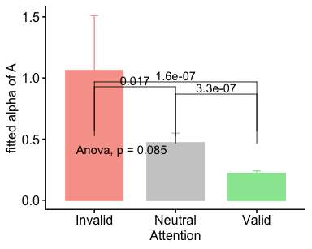
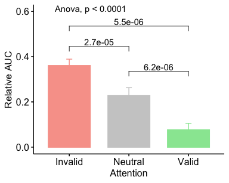

TWCF Expt 1.2 Stats BU
================
Karen Tian

## TWCF 1.2 Cue Tex Discrimination Analyses

• [alphaA](#alphaa)

C p(ref stronger) v A p(correct discrimination)  
• [AUC](#auc-of-cva)  
• [Relative AUC](#relative-auc-of-cva)  
•
[alpha](#fitted-alpha-of-C1)

### alphaA

<table class="kable_wrapper">

<tbody>

<tr>

<td>

<table>

<thead>

<tr>

<th style="text-align:left;">

Effect

</th>

<th style="text-align:right;">

DFn

</th>

<th style="text-align:right;">

DFd

</th>

<th style="text-align:right;">

SSn

</th>

<th style="text-align:right;">

SSd

</th>

<th style="text-align:right;">

F

</th>

<th style="text-align:right;">

p

</th>

<th style="text-align:left;">

p\<.05

</th>

<th style="text-align:right;">

ges

</th>

</tr>

</thead>

<tbody>

<tr>

<td style="text-align:left;">

(Intercept)

</td>

<td style="text-align:right;">

1

</td>

<td style="text-align:right;">

27

</td>

<td style="text-align:right;">

29.4933342

</td>

<td style="text-align:right;">

74.83654

</td>

<td style="text-align:right;">

10.6407909

</td>

<td style="text-align:right;">

0.0029945

</td>

<td style="text-align:left;">

  - 
    
    </td>
    
    <td style="text-align:right;">
    
    0.1492168
    
    </td>
    
    </tr>
    
    <tr>
    
    <td style="text-align:left;">
    
    site
    
    </td>
    
    <td style="text-align:right;">
    
    1
    
    </td>
    
    <td style="text-align:right;">
    
    27
    
    </td>
    
    <td style="text-align:right;">
    
    0.6623209
    
    </td>
    
    <td style="text-align:right;">
    
    74.83654
    
    </td>
    
    <td style="text-align:right;">
    
    0.2389563
    
    </td>
    
    <td style="text-align:right;">
    
    0.6289082
    
    </td>
    
    <td style="text-align:left;">
    
    </td>
    
    <td style="text-align:right;">
    
    0.0039232
    
    </td>
    
    </tr>
    
    <tr>
    
    <td style="text-align:left;">
    
    att
    
    </td>
    
    <td style="text-align:right;">
    
    2
    
    </td>
    
    <td style="text-align:right;">
    
    54
    
    </td>
    
    <td style="text-align:right;">
    
    10.8182937
    
    </td>
    
    <td style="text-align:right;">
    
    93.32435
    
    </td>
    
    <td style="text-align:right;">
    
    3.1298789
    
    </td>
    
    <td style="text-align:right;">
    
    0.0517478
    
    </td>
    
    <td style="text-align:left;">
    
    </td>
    
    <td style="text-align:right;">
    
    0.0604444
    
    </td>
    
    </tr>
    
    <tr>
    
    <td style="text-align:left;">
    
    site:att
    
    </td>
    
    <td style="text-align:right;">
    
    2
    
    </td>
    
    <td style="text-align:right;">
    
    54
    
    </td>
    
    <td style="text-align:right;">
    
    2.1089219
    
    </td>
    
    <td style="text-align:right;">
    
    93.32435
    
    </td>
    
    <td style="text-align:right;">
    
    0.6101397
    
    </td>
    
    <td style="text-align:right;">
    
    0.5469773
    
    </td>
    
    <td style="text-align:left;">
    
    </td>
    
    <td style="text-align:right;">
    
    0.0123858
    
    </td>
    
    </tr>
    
    </tbody>
    
    </table>

</td>

<td>

<table>

<thead>

<tr>

<th style="text-align:left;">

</th>

<th style="text-align:left;">

Effect

</th>

<th style="text-align:right;">

W

</th>

<th style="text-align:right;">

p

</th>

<th style="text-align:left;">

p\<.05

</th>

</tr>

</thead>

<tbody>

<tr>

<td style="text-align:left;">

3

</td>

<td style="text-align:left;">

att

</td>

<td style="text-align:right;">

0.0178007

</td>

<td style="text-align:right;">

0

</td>

<td style="text-align:left;">

  - 
    
    </td>
    
    </tr>
    
    <tr>
    
    <td style="text-align:left;">
    
    4
    
    </td>
    
    <td style="text-align:left;">
    
    site:att
    
    </td>
    
    <td style="text-align:right;">
    
    0.0178007
    
    </td>
    
    <td style="text-align:right;">
    
    0
    
    </td>
    
    <td style="text-align:left;">
    
      - 
        
        </td>
        
        </tr>
        
        </tbody>
        
        </table>

</td>

<td>

<table>

<thead>

<tr>

<th style="text-align:left;">

</th>

<th style="text-align:left;">

Effect

</th>

<th style="text-align:right;">

GGe

</th>

<th style="text-align:right;">

p\[GG\]

</th>

<th style="text-align:left;">

p\[GG\]\<.05

</th>

<th style="text-align:right;">

HFe

</th>

<th style="text-align:right;">

p\[HF\]

</th>

<th style="text-align:left;">

p\[HF\]\<.05

</th>

</tr>

</thead>

<tbody>

<tr>

<td style="text-align:left;">

3

</td>

<td style="text-align:left;">

att

</td>

<td style="text-align:right;">

0.5044901

</td>

<td style="text-align:right;">

0.0877712

</td>

<td style="text-align:left;">

</td>

<td style="text-align:right;">

0.50501

</td>

<td style="text-align:right;">

0.0877255

</td>

<td style="text-align:left;">

</td>

</tr>

<tr>

<td style="text-align:left;">

4

</td>

<td style="text-align:left;">

site:att

</td>

<td style="text-align:right;">

0.5044901

</td>

<td style="text-align:right;">

0.4428683

</td>

<td style="text-align:left;">

</td>

<td style="text-align:right;">

0.50501

</td>

<td style="text-align:right;">

0.4430225

</td>

<td style="text-align:left;">

</td>

</tr>

</tbody>

</table>

</td>

</tr>

</tbody>

</table>

    ## [1] FALSE

### AUC of CvA

<table class="kable_wrapper">

<tbody>

<tr>

<td>

<table>

<thead>

<tr>

<th style="text-align:left;">

</th>

<th style="text-align:left;">

Effect

</th>

<th style="text-align:right;">

DFn

</th>

<th style="text-align:right;">

DFd

</th>

<th style="text-align:right;">

F

</th>

<th style="text-align:right;">

p

</th>

<th style="text-align:left;">

p\<.05

</th>

<th style="text-align:right;">

ges

</th>

</tr>

</thead>

<tbody>

<tr>

<td style="text-align:left;">

2

</td>

<td style="text-align:left;">

site

</td>

<td style="text-align:right;">

1

</td>

<td style="text-align:right;">

27

</td>

<td style="text-align:right;">

0.352942

</td>

<td style="text-align:right;">

0.5573979

</td>

<td style="text-align:left;">

</td>

<td style="text-align:right;">

0.0079234

</td>

</tr>

<tr>

<td style="text-align:left;">

3

</td>

<td style="text-align:left;">

att

</td>

<td style="text-align:right;">

2

</td>

<td style="text-align:right;">

54

</td>

<td style="text-align:right;">

40.141679

</td>

<td style="text-align:right;">

0.0000000

</td>

<td style="text-align:left;">

  - 
    
    </td>
    
    <td style="text-align:right;">
    
    0.3664336
    
    </td>
    
    </tr>
    
    <tr>
    
    <td style="text-align:left;">
    
    4
    
    </td>
    
    <td style="text-align:left;">
    
    site:att
    
    </td>
    
    <td style="text-align:right;">
    
    2
    
    </td>
    
    <td style="text-align:right;">
    
    54
    
    </td>
    
    <td style="text-align:right;">
    
    1.080368
    
    </td>
    
    <td style="text-align:right;">
    
    0.3466940
    
    </td>
    
    <td style="text-align:left;">
    
    </td>
    
    <td style="text-align:right;">
    
    0.0153275
    
    </td>
    
    </tr>
    
    </tbody>
    
    </table>

</td>

<td>

<table>

<thead>

<tr>

<th style="text-align:left;">

</th>

<th style="text-align:left;">

Effect

</th>

<th style="text-align:right;">

W

</th>

<th style="text-align:right;">

p

</th>

<th style="text-align:left;">

p\<.05

</th>

</tr>

</thead>

<tbody>

<tr>

<td style="text-align:left;">

3

</td>

<td style="text-align:left;">

att

</td>

<td style="text-align:right;">

0.861946

</td>

<td style="text-align:right;">

0.1449576

</td>

<td style="text-align:left;">

</td>

</tr>

<tr>

<td style="text-align:left;">

4

</td>

<td style="text-align:left;">

site:att

</td>

<td style="text-align:right;">

0.861946

</td>

<td style="text-align:right;">

0.1449576

</td>

<td style="text-align:left;">

</td>

</tr>

</tbody>

</table>

</td>

<td>

<table>

<thead>

<tr>

<th style="text-align:left;">

</th>

<th style="text-align:left;">

Effect

</th>

<th style="text-align:right;">

GGe

</th>

<th style="text-align:right;">

p\[GG\]

</th>

<th style="text-align:left;">

p\[GG\]\<.05

</th>

<th style="text-align:right;">

HFe

</th>

<th style="text-align:right;">

p\[HF\]

</th>

<th style="text-align:left;">

p\[HF\]\<.05

</th>

</tr>

</thead>

<tbody>

<tr>

<td style="text-align:left;">

3

</td>

<td style="text-align:left;">

att

</td>

<td style="text-align:right;">

0.878693

</td>

<td style="text-align:right;">

0.0000000

</td>

<td style="text-align:left;">

  - 
    
    </td>
    
    <td style="text-align:right;">
    
    0.9350618
    
    </td>
    
    <td style="text-align:right;">
    
    0.0000000
    
    </td>
    
    <td style="text-align:left;">
    
      - 
        
        </td>
        
        </tr>
        
        <tr>
        
        <td style="text-align:left;">
        
        4
        
        </td>
        
        <td style="text-align:left;">
        
        site:att
        
        </td>
        
        <td style="text-align:right;">
        
        0.878693
        
        </td>
        
        <td style="text-align:right;">
        
        0.3406116
        
        </td>
        
        <td style="text-align:left;">
        
        </td>
        
        <td style="text-align:right;">
        
        0.9350618
        
        </td>
        
        <td style="text-align:right;">
        
        0.3436049
        
        </td>
        
        <td style="text-align:left;">
        
        </td>
        
        </tr>
        
        </tbody>
        
        </table>

</td>

</tr>

</tbody>

</table>

    ## [1] FALSE

### Relative AUC of CvA

<table class="kable_wrapper">

<tbody>

<tr>

<td>

<table>

<thead>

<tr>

<th style="text-align:left;">

</th>

<th style="text-align:left;">

Effect

</th>

<th style="text-align:right;">

DFn

</th>

<th style="text-align:right;">

DFd

</th>

<th style="text-align:right;">

F

</th>

<th style="text-align:right;">

p

</th>

<th style="text-align:left;">

p\<.05

</th>

<th style="text-align:right;">

ges

</th>

</tr>

</thead>

<tbody>

<tr>

<td style="text-align:left;">

2

</td>

<td style="text-align:left;">

site

</td>

<td style="text-align:right;">

1

</td>

<td style="text-align:right;">

27

</td>

<td style="text-align:right;">

2.9355107

</td>

<td style="text-align:right;">

0.0981127

</td>

<td style="text-align:left;">

</td>

<td style="text-align:right;">

0.0735556

</td>

</tr>

<tr>

<td style="text-align:left;">

3

</td>

<td style="text-align:left;">

att

</td>

<td style="text-align:right;">

2

</td>

<td style="text-align:right;">

54

</td>

<td style="text-align:right;">

54.6297378

</td>

<td style="text-align:right;">

0.0000000

</td>

<td style="text-align:left;">

  - 
    
    </td>
    
    <td style="text-align:right;">
    
    0.3530750
    
    </td>
    
    </tr>
    
    <tr>
    
    <td style="text-align:left;">
    
    4
    
    </td>
    
    <td style="text-align:left;">
    
    site:att
    
    </td>
    
    <td style="text-align:right;">
    
    2
    
    </td>
    
    <td style="text-align:right;">
    
    54
    
    </td>
    
    <td style="text-align:right;">
    
    0.7806647
    
    </td>
    
    <td style="text-align:right;">
    
    0.4632021
    
    </td>
    
    <td style="text-align:left;">
    
    </td>
    
    <td style="text-align:right;">
    
    0.0077388
    
    </td>
    
    </tr>
    
    </tbody>
    
    </table>

</td>

<td>

<table>

<thead>

<tr>

<th style="text-align:left;">

</th>

<th style="text-align:left;">

Effect

</th>

<th style="text-align:right;">

W

</th>

<th style="text-align:right;">

p

</th>

<th style="text-align:left;">

p\<.05

</th>

</tr>

</thead>

<tbody>

<tr>

<td style="text-align:left;">

3

</td>

<td style="text-align:left;">

att

</td>

<td style="text-align:right;">

0.867242

</td>

<td style="text-align:right;">

0.1569726

</td>

<td style="text-align:left;">

</td>

</tr>

<tr>

<td style="text-align:left;">

4

</td>

<td style="text-align:left;">

site:att

</td>

<td style="text-align:right;">

0.867242

</td>

<td style="text-align:right;">

0.1569726

</td>

<td style="text-align:left;">

</td>

</tr>

</tbody>

</table>

</td>

<td>

<table>

<thead>

<tr>

<th style="text-align:left;">

</th>

<th style="text-align:left;">

Effect

</th>

<th style="text-align:right;">

GGe

</th>

<th style="text-align:right;">

p\[GG\]

</th>

<th style="text-align:left;">

p\[GG\]\<.05

</th>

<th style="text-align:right;">

HFe

</th>

<th style="text-align:right;">

p\[HF\]

</th>

<th style="text-align:left;">

p\[HF\]\<.05

</th>

</tr>

</thead>

<tbody>

<tr>

<td style="text-align:left;">

3

</td>

<td style="text-align:left;">

att

</td>

<td style="text-align:right;">

0.8828011

</td>

<td style="text-align:right;">

0.0000000

</td>

<td style="text-align:left;">

  - 
    
    </td>
    
    <td style="text-align:right;">
    
    0.9399246
    
    </td>
    
    <td style="text-align:right;">
    
    0.0000000
    
    </td>
    
    <td style="text-align:left;">
    
      - 
        
        </td>
        
        </tr>
        
        <tr>
        
        <td style="text-align:left;">
        
        4
        
        </td>
        
        <td style="text-align:left;">
        
        site:att
        
        </td>
        
        <td style="text-align:right;">
        
        0.8828011
        
        </td>
        
        <td style="text-align:right;">
        
        0.4492921
        
        </td>
        
        <td style="text-align:left;">
        
        </td>
        
        <td style="text-align:right;">
        
        0.9399246
        
        </td>
        
        <td style="text-align:right;">
        
        0.4562976
        
        </td>
        
        <td style="text-align:left;">
        
        </td>
        
        </tr>
        
        </tbody>
        
        </table>

</td>

</tr>

</tbody>

</table>

    ## [1] FALSE

### fitted alpha of C

<table class="kable_wrapper">

<tbody>

<tr>

<td>

<table>

<thead>

<tr>

<th style="text-align:left;">

</th>

<th style="text-align:left;">

Effect

</th>

<th style="text-align:right;">

DFn

</th>

<th style="text-align:right;">

DFd

</th>

<th style="text-align:right;">

F

</th>

<th style="text-align:right;">

p

</th>

<th style="text-align:left;">

p\<.05

</th>

<th style="text-align:right;">

ges

</th>

</tr>

</thead>

<tbody>

<tr>

<td style="text-align:left;">

2

</td>

<td style="text-align:left;">

att

</td>

<td style="text-align:right;">

2

</td>

<td style="text-align:right;">

56

</td>

<td style="text-align:right;">

0.725062

</td>

<td style="text-align:right;">

0.4887847

</td>

<td style="text-align:left;">

</td>

<td style="text-align:right;">

0.0157375

</td>

</tr>

</tbody>

</table>

</td>

<td>

<table>

<thead>

<tr>

<th style="text-align:left;">

</th>

<th style="text-align:left;">

Effect

</th>

<th style="text-align:right;">

W

</th>

<th style="text-align:right;">

p

</th>

<th style="text-align:left;">

p\<.05

</th>

</tr>

</thead>

<tbody>

<tr>

<td style="text-align:left;">

2

</td>

<td style="text-align:left;">

att

</td>

<td style="text-align:right;">

0.1273749

</td>

<td style="text-align:right;">

0

</td>

<td style="text-align:left;">

  - 
    
    </td>
    
    </tr>
    
    </tbody>
    
    </table>

</td>

<td>

<table>

<thead>

<tr>

<th style="text-align:left;">

</th>

<th style="text-align:left;">

Effect

</th>

<th style="text-align:right;">

GGe

</th>

<th style="text-align:right;">

p\[GG\]

</th>

<th style="text-align:left;">

p\[GG\]\<.05

</th>

<th style="text-align:right;">

HFe

</th>

<th style="text-align:right;">

p\[HF\]

</th>

<th style="text-align:left;">

p\[HF\]\<.05

</th>

</tr>

</thead>

<tbody>

<tr>

<td style="text-align:left;">

2

</td>

<td style="text-align:left;">

att

</td>

<td style="text-align:right;">

0.5340097

</td>

<td style="text-align:right;">

0.4100035

</td>

<td style="text-align:left;">

</td>

<td style="text-align:right;">

0.537884

</td>

<td style="text-align:right;">

0.4109141

</td>

<td style="text-align:left;">

</td>

</tr>

</tbody>

</table>

</td>

</tr>

</tbody>

</table>

    ## [1] FALSE

