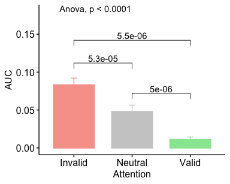
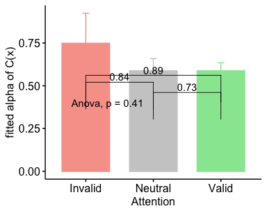

TWCF Expt 1.2 Stats BU
================
Karen Tian

## TWCF 1.2 Cue Tex Discrimination Analyses

• [alphaA](#alphaa)

C p(ref stronger) v A p(correct discrimination)  
• [AUC](#auc-of-c1va)  
•
[alpha](#fitted-alpha-of-C1)

### alphaA

<table class="kable_wrapper">

<tbody>

<tr>

<td>

<table>

<thead>

<tr>

<th style="text-align:left;">

</th>

<th style="text-align:left;">

Effect

</th>

<th style="text-align:right;">

DFn

</th>

<th style="text-align:right;">

DFd

</th>

<th style="text-align:right;">

F

</th>

<th style="text-align:right;">

p

</th>

<th style="text-align:left;">

p\<.05

</th>

<th style="text-align:right;">

ges

</th>

</tr>

</thead>

<tbody>

<tr>

<td style="text-align:left;">

2

</td>

<td style="text-align:left;">

site

</td>

<td style="text-align:right;">

1

</td>

<td style="text-align:right;">

27

</td>

<td style="text-align:right;">

0.9283012

</td>

<td style="text-align:right;">

0.3438553

</td>

<td style="text-align:left;">

</td>

<td style="text-align:right;">

0.0113180

</td>

</tr>

<tr>

<td style="text-align:left;">

3

</td>

<td style="text-align:left;">

att

</td>

<td style="text-align:right;">

2

</td>

<td style="text-align:right;">

54

</td>

<td style="text-align:right;">

0.9845902

</td>

<td style="text-align:right;">

0.3801981

</td>

<td style="text-align:left;">

</td>

<td style="text-align:right;">

0.0237469

</td>

</tr>

<tr>

<td style="text-align:left;">

4

</td>

<td style="text-align:left;">

site:att

</td>

<td style="text-align:right;">

2

</td>

<td style="text-align:right;">

54

</td>

<td style="text-align:right;">

0.9380318

</td>

<td style="text-align:right;">

0.3976810

</td>

<td style="text-align:left;">

</td>

<td style="text-align:right;">

0.0226495

</td>

</tr>

</tbody>

</table>

</td>

<td>

<table>

<thead>

<tr>

<th style="text-align:left;">

</th>

<th style="text-align:left;">

Effect

</th>

<th style="text-align:right;">

W

</th>

<th style="text-align:right;">

p

</th>

<th style="text-align:left;">

p\<.05

</th>

</tr>

</thead>

<tbody>

<tr>

<td style="text-align:left;">

3

</td>

<td style="text-align:left;">

att

</td>

<td style="text-align:right;">

0.0003821

</td>

<td style="text-align:right;">

0

</td>

<td style="text-align:left;">

  - 
    
    </td>
    
    </tr>
    
    <tr>
    
    <td style="text-align:left;">
    
    4
    
    </td>
    
    <td style="text-align:left;">
    
    site:att
    
    </td>
    
    <td style="text-align:right;">
    
    0.0003821
    
    </td>
    
    <td style="text-align:right;">
    
    0
    
    </td>
    
    <td style="text-align:left;">
    
      - 
        
        </td>
        
        </tr>
        
        </tbody>
        
        </table>

</td>

<td>

<table>

<thead>

<tr>

<th style="text-align:left;">

</th>

<th style="text-align:left;">

Effect

</th>

<th style="text-align:right;">

GGe

</th>

<th style="text-align:right;">

p\[GG\]

</th>

<th style="text-align:left;">

p\[GG\]\<.05

</th>

<th style="text-align:right;">

HFe

</th>

<th style="text-align:right;">

p\[HF\]

</th>

<th style="text-align:left;">

p\[HF\]\<.05

</th>

</tr>

</thead>

<tbody>

<tr>

<td style="text-align:left;">

3

</td>

<td style="text-align:left;">

att

</td>

<td style="text-align:right;">

0.5000955

</td>

<td style="text-align:right;">

0.3298935

</td>

<td style="text-align:left;">

</td>

<td style="text-align:right;">

0.5001066

</td>

<td style="text-align:right;">

0.3298952

</td>

<td style="text-align:left;">

</td>

</tr>

<tr>

<td style="text-align:left;">

4

</td>

<td style="text-align:left;">

site:att

</td>

<td style="text-align:right;">

0.5000955

</td>

<td style="text-align:right;">

0.3413977

</td>

<td style="text-align:left;">

</td>

<td style="text-align:right;">

0.5001066

</td>

<td style="text-align:right;">

0.3413997

</td>

<td style="text-align:left;">

</td>

</tr>

</tbody>

</table>

</td>

</tr>

</tbody>

</table>

    ## [1] FALSE

### AUC of CvA

<table class="kable_wrapper">

<tbody>

<tr>

<td>

<table>

<thead>

<tr>

<th style="text-align:left;">

</th>

<th style="text-align:left;">

Effect

</th>

<th style="text-align:right;">

DFn

</th>

<th style="text-align:right;">

DFd

</th>

<th style="text-align:right;">

F

</th>

<th style="text-align:right;">

p

</th>

<th style="text-align:left;">

p\<.05

</th>

<th style="text-align:right;">

ges

</th>

</tr>

</thead>

<tbody>

<tr>

<td style="text-align:left;">

2

</td>

<td style="text-align:left;">

site

</td>

<td style="text-align:right;">

1

</td>

<td style="text-align:right;">

27

</td>

<td style="text-align:right;">

0.5376783

</td>

<td style="text-align:right;">

0.4697157

</td>

<td style="text-align:left;">

</td>

<td style="text-align:right;">

0.0112825

</td>

</tr>

<tr>

<td style="text-align:left;">

3

</td>

<td style="text-align:left;">

att

</td>

<td style="text-align:right;">

2

</td>

<td style="text-align:right;">

54

</td>

<td style="text-align:right;">

43.6277036

</td>

<td style="text-align:right;">

0.0000000

</td>

<td style="text-align:left;">

  - 
    
    </td>
    
    <td style="text-align:right;">
    
    0.4082556
    
    </td>
    
    </tr>
    
    <tr>
    
    <td style="text-align:left;">
    
    4
    
    </td>
    
    <td style="text-align:left;">
    
    site:att
    
    </td>
    
    <td style="text-align:right;">
    
    2
    
    </td>
    
    <td style="text-align:right;">
    
    54
    
    </td>
    
    <td style="text-align:right;">
    
    0.9803801
    
    </td>
    
    <td style="text-align:right;">
    
    0.3817457
    
    </td>
    
    <td style="text-align:left;">
    
    </td>
    
    <td style="text-align:right;">
    
    0.0152668
    
    </td>
    
    </tr>
    
    </tbody>
    
    </table>

</td>

<td>

<table>

<thead>

<tr>

<th style="text-align:left;">

</th>

<th style="text-align:left;">

Effect

</th>

<th style="text-align:right;">

W

</th>

<th style="text-align:right;">

p

</th>

<th style="text-align:left;">

p\<.05

</th>

</tr>

</thead>

<tbody>

<tr>

<td style="text-align:left;">

3

</td>

<td style="text-align:left;">

att

</td>

<td style="text-align:right;">

0.8996062

</td>

<td style="text-align:right;">

0.2527447

</td>

<td style="text-align:left;">

</td>

</tr>

<tr>

<td style="text-align:left;">

4

</td>

<td style="text-align:left;">

site:att

</td>

<td style="text-align:right;">

0.8996062

</td>

<td style="text-align:right;">

0.2527447

</td>

<td style="text-align:left;">

</td>

</tr>

</tbody>

</table>

</td>

<td>

<table>

<thead>

<tr>

<th style="text-align:left;">

</th>

<th style="text-align:left;">

Effect

</th>

<th style="text-align:right;">

GGe

</th>

<th style="text-align:right;">

p\[GG\]

</th>

<th style="text-align:left;">

p\[GG\]\<.05

</th>

<th style="text-align:right;">

HFe

</th>

<th style="text-align:right;">

p\[HF\]

</th>

<th style="text-align:left;">

p\[HF\]\<.05

</th>

</tr>

</thead>

<tbody>

<tr>

<td style="text-align:left;">

3

</td>

<td style="text-align:left;">

att

</td>

<td style="text-align:right;">

0.9087656

</td>

<td style="text-align:right;">

0.0000000

</td>

<td style="text-align:left;">

  - 
    
    </td>
    
    <td style="text-align:right;">
    
    0.9707323
    
    </td>
    
    <td style="text-align:right;">
    
    0.0000000
    
    </td>
    
    <td style="text-align:left;">
    
      - 
        
        </td>
        
        </tr>
        
        <tr>
        
        <td style="text-align:left;">
        
        4
        
        </td>
        
        <td style="text-align:left;">
        
        site:att
        
        </td>
        
        <td style="text-align:right;">
        
        0.9087656
        
        </td>
        
        <td style="text-align:right;">
        
        0.3754076
        
        </td>
        
        <td style="text-align:left;">
        
        </td>
        
        <td style="text-align:right;">
        
        0.9707323
        
        </td>
        
        <td style="text-align:right;">
        
        0.3798013
        
        </td>
        
        <td style="text-align:left;">
        
        </td>
        
        </tr>
        
        </tbody>
        
        </table>

</td>

</tr>

</tbody>

</table>

    ## [1] FALSE

### fitted alpha of C

<table class="kable_wrapper">

<tbody>

<tr>

<td>

<table>

<thead>

<tr>

<th style="text-align:left;">

</th>

<th style="text-align:left;">

Effect

</th>

<th style="text-align:right;">

DFn

</th>

<th style="text-align:right;">

DFd

</th>

<th style="text-align:right;">

F

</th>

<th style="text-align:right;">

p

</th>

<th style="text-align:left;">

p\<.05

</th>

<th style="text-align:right;">

ges

</th>

</tr>

</thead>

<tbody>

<tr>

<td style="text-align:left;">

2

</td>

<td style="text-align:left;">

att

</td>

<td style="text-align:right;">

2

</td>

<td style="text-align:right;">

56

</td>

<td style="text-align:right;">

0.599084

</td>

<td style="text-align:right;">

0.5527967

</td>

<td style="text-align:left;">

</td>

<td style="text-align:right;">

0.0137911

</td>

</tr>

</tbody>

</table>

</td>

<td>

<table>

<thead>

<tr>

<th style="text-align:left;">

</th>

<th style="text-align:left;">

Effect

</th>

<th style="text-align:right;">

W

</th>

<th style="text-align:right;">

p

</th>

<th style="text-align:left;">

p\<.05

</th>

</tr>

</thead>

<tbody>

<tr>

<td style="text-align:left;">

2

</td>

<td style="text-align:left;">

att

</td>

<td style="text-align:right;">

0.0919831

</td>

<td style="text-align:right;">

0

</td>

<td style="text-align:left;">

  - 
    
    </td>
    
    </tr>
    
    </tbody>
    
    </table>

</td>

<td>

<table>

<thead>

<tr>

<th style="text-align:left;">

</th>

<th style="text-align:left;">

Effect

</th>

<th style="text-align:right;">

GGe

</th>

<th style="text-align:right;">

p\[GG\]

</th>

<th style="text-align:left;">

p\[GG\]\<.05

</th>

<th style="text-align:right;">

HFe

</th>

<th style="text-align:right;">

p\[HF\]

</th>

<th style="text-align:left;">

p\[HF\]\<.05

</th>

</tr>

</thead>

<tbody>

<tr>

<td style="text-align:left;">

2

</td>

<td style="text-align:left;">

att

</td>

<td style="text-align:right;">

0.5241044

</td>

<td style="text-align:right;">

0.4525877

</td>

<td style="text-align:left;">

</td>

<td style="text-align:right;">

0.5268306

</td>

<td style="text-align:right;">

0.4533793

</td>

<td style="text-align:left;">

</td>

</tr>

</tbody>

</table>

</td>

</tr>

</tbody>

</table>

    ## [1] FALSE

